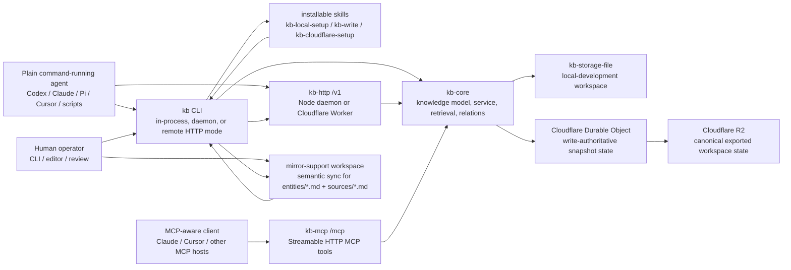

# `emmassist/kb`


Cloudflare-first compounding knowledge base for agents, operator runtimes, and workspace-scoped institutional memory.

## Quick Start

If another coding agent wants a working KB in a fresh repo, this is the shortest supported path:

```bash
npm install @emmassist-co/kb-cli --@emmassist-co:registry=https://npm.pkg.github.com

export KB_ROOT_DIR="$PWD/.kb"

npx kb inspect
npx kb schema record
npx kb help

npx skills add ./node_modules/@emmassist-co/kb-cli/skills/kb-local-setup
npx skills add ./node_modules/@emmassist-co/kb-cli/skills/kb-write
```

`kb-local` remains a backward-compatible alias for existing agents and scripts, but new docs prefer `kb`.

If that agent needs the canonical shared deployment instead of a local file-backed KB:

```bash
export KB_BASE_URL=https://YOUR-KB-HOST
export KB_API_TOKEN=replace-me-with-a-secret

npx kb search --json '{"query":"billing"}'
```

For the full install and deployment path, see:

- [docs/consumer-quickstart.md](./docs/consumer-quickstart.md)
- [docs/cloudflare-agent-setup.md](./docs/cloudflare-agent-setup.md)
- [CONTRIBUTING.md](./CONTRIBUTING.md)
- [SECURITY.md](./SECURITY.md)
- [CODE_OF_CONDUCT.md](./CODE_OF_CONDUCT.md)
- [docs/audits/2026-06-11-open-source-readiness.md](./docs/audits/2026-06-11-open-source-readiness.md)
- [docs/audits/2026-06-11-agent-native-audit.md](./docs/audits/2026-06-11-agent-native-audit.md)

`kb` is the source of truth for the packages and operating model behind a durable knowledge base that gets better over time:

- `kb-core` defines the backend-neutral knowledge model and service layer
- `kb-storage-cloudflare` persists canonical state in Cloudflare-native storage
- `kb-http` exposes the canonical JSON/HTTP contract for local and deployed hosts
- `kb-cli` gives operators and local agents a single command surface
- `kb-flue-adapter` plugs the KB into Flue runtimes
- `kb-autoresearch`, `kb-verify`, and `eval/` enforce compounding quality rather than one-off retrieval demos

## Public Package Set

The staged open-source package set is:

- `@emmassist-co/kb-core`
- `@emmassist-co/kb-storage-file`
- `@emmassist-co/kb-storage-cloudflare`
- `@emmassist-co/kb-http`
- `@emmassist-co/kb-mcp`
- `@emmassist-co/kb-cli`
- `@emmassist-co/kb-flue-adapter`

These packages form the Cloudflare-first product spine for public consumers, including the Flue runtime command surface.

Not yet in the staged public package set:

- `@emmassist-co/kb-autoresearch`
  Still private while its product surface, packaging contract, and runtime assumptions are narrowed.

## Product Direction

The repo is optimized around one product claim:

> every useful interaction should make the workspace knowledge base better, and the deployed Cloudflare surface should be the primary production shape.

That means:

- durable truth lives outside the chat transcript
- evidence, corrections, and links are first-class writes
- local file-backed use is for development, testing, and portability
- deployed workspace-scoped Cloudflare runtimes are the default production target

See:

- [STRATEGY.md](./STRATEGY.md)
- [docs/product/knowledge-base.md](./docs/product/knowledge-base.md)
- [docs/product/cloudflare-first-compounding-kb.md](./docs/product/cloudflare-first-compounding-kb.md)
- [docs/cloudflare-agent-setup.md](./docs/cloudflare-agent-setup.md)

## Architecture

Current package boundaries already reflect the intended shape:

- `packages/kb-core`: knowledge types, markdown/source parsing, retrieval helpers, service orchestration
- `packages/kb-storage-file`: local file-backed store for development and local agent workspaces
- `packages/kb-storage-cloudflare`: canonical R2-backed state and Cloudflare runtime adapters
- `packages/kb-http`: canonical `GET`/`POST`/`PUT`/`DELETE` contract with both Node and Worker hosts
- `packages/kb-mcp`: Streamable HTTP MCP adapter over the same workspace-scoped Worker runtime and auth model
- `packages/kb-cli`: local operator CLI, daemon mode, HTTP client mode, and installable skills
- `packages/kb-flue-adapter`: published Flue runtime adapter with a structural command contract that survives Flue SDK export changes
- `packages/kb-autoresearch`: private package and repo-owned research tooling surface, not a staged public install target

For the storage-adapter seam and backend-extension guide, see [docs/architecture/kb-storage-adapters.md](./docs/architecture/kb-storage-adapters.md).

## Should An Agent Use KB?

Use KB when you need durable, inspectable workspace memory shared by a human and multiple agents. It is strongest for facts, decisions, sources, relation edges, corrections, and operational notes that should survive beyond one chat session.

KB is a good fit when:

- one agent records a decision and another agent needs to find it later
- a human wants to correct or review memory instead of trusting hidden embeddings
- local agents need a simple folder-backed start and a remote shared surface later
- MCP-aware clients and command-running agents need the same memory contract
- source evidence, relation edges, and freshness metadata matter

KB is not trying to be:

- a chat app or IDE extension
- a generic vector database
- a replacement for an application database
- a full personal-brain product with every ingest channel built in
- proof of broad semantic memory beyond the measured retrieval and relation surfaces

### Trust Model

KB earns trust by keeping memory explicit:

- **Durable state:** entities, sources, events, drafts, and links persist outside the agent transcript.
- **Evidence-first writes:** agents can capture sources and cite source IDs instead of writing unsupported claims.
- **Human correction path:** humans can edit supported mirror files or ask agents to record corrections; stale facts can be superseded instead of silently overwritten.
- **Graph edges are explicit:** agents can use `relate` for deliberate edges, while extraction-derived links remain evidence-bearing and replaceable by origin.
- **Inspectable health:** `inspect`, `doctor`, `health`, validation, and conflict commands expose state before agents rely on it.
- **Recovery boundaries:** local folders are portable, remote hosts can be reverified, and mirror-support workflows can repair divergence, but KB does not pretend bad writes are impossible.

### Human + Multi-Agent Workflow

A normal shared-memory loop looks like this:

1. A human tells Codex, "We decided Stripe owns invoice payments."
2. Codex records a structured entity update and source/evidence note through `kb record` or `kb remember`.
3. Claude Code later searches `invoice payments` through `/mcp` and finds the same KB state.
4. Pi adds an external source with `capture-source` or a `remember` payload that cites the URL.
5. The human spots stale wording in a workspace mirror, edits `entities/*.md`, and runs semantic validation/sync.
6. Future agents search first, cite the current KB state, and add corrections instead of rebuilding context from chat history.

### Agent Operating Protocol

Agents using KB should follow these rules:

- Search KB before answering factual questions about the workspace.
- Use `remember` for facts, corrections, sources, and narrative evidence capture.
- Use `record` for structured entity profiles and durable current truth.
- Use `relate` for explicit edges between existing entities.
- Use `annotate` for timeline/provenance notes, not relation edges.
- Capture external sources when a claim depends on outside evidence.
- Avoid dumping raw chat logs; summarize the durable fact, decision, or correction.
- Ask the human before rewriting canonical truth when the change is ambiguous or destructive.
- Run `inspect` or `doctor` when the active backend or workspace role is unclear.

## Agent-First Architecture Map

KB is agent-first because the normal user is an agent or an operator supervising agents, not a human clicking through a CRUD app. The core design principles are:

- **One durable truth surface:** memory lives in workspace-scoped KB state, not in one chat transcript, terminal scrollback, or agent-specific scratchpad.
- **One contract, many transports:** local CLI, local daemon HTTP, deployed `/v1` HTTP, and deployed `/mcp` all route to the same `kb-core` service semantics instead of creating separate memories.
- **Cloudflare is production, local is support:** local file-backed workspaces are for development and portability; canonical production runs on a workspace-scoped Cloudflare Worker with Durable Object state and R2 export.
- **Agents write structured evidence:** normal agent writes go through `remember`, `record`, `relate`, `annotate`, and source-capture contracts so corrections, provenance, and edges compound over time.
- **Plain agents stay plain:** Codex, Claude Code, Pi, Cursor, shell scripts, and other agents do not need a custom SDK. If they can run commands, they can use `kb`; if they support MCP, they can point at `/mcp`; if they are deployed, they can call `/v1` over HTTP.



How the same architecture shows up in practice:

| Actor / environment | Recommended path | What happens |
| --- | --- | --- |
| Plain local Codex / Claude / Pi / Cursor session | `npm install @emmassist-co/kb-cli --@emmassist-co:registry=https://npm.pkg.github.com`, set `KB_ROOT_DIR`, run `npx kb ...` | The agent uses the CLI directly against a local file-backed KB. |
| Multiple local tools on one machine | `npx kb serve --port 3001`, then `KB_BASE_URL=http://127.0.0.1:3001 npx kb ...` | A Node daemon exposes the same `/v1` contract locally. |
| Deployed/serverless agent or remote operator | `KB_BASE_URL=https://YOUR-KB-HOST` + `KB_API_TOKEN`, then `npx kb ...` or direct HTTP | The caller talks to the canonical Worker-hosted KB over `/v1`. |
| MCP-aware clients | configure `POST https://YOUR-KB-HOST/mcp` with the same bearer token | The MCP surface exposes the scoped KB tool catalog over the same workspace runtime. |
| Command-running agents that support skills | `npx skills add ./node_modules/@emmassist-co/kb-cli/skills/kb-write` after package install | The agent gets normal CLI write discipline without cloning the full KB repo. |
| Human editing canonical knowledge | pull a mirror, edit `entities/*.md` / `sources/*.md`, run semantic sync | The daemon compiles safe markdown edits back into canonical KB mutations. |
| Cloudflare deployment bootstrap | `npx kb cloudflare deploy` then `npx kb cloudflare verify` | The CLI creates/verifies the Worker, Durable Object binding, R2 bucket, `/v1`, `/mcp`, and shared bearer auth. |

Important boundary: KB does **not** claim to own every chat bridge or agent runtime. It owns the durable memory contract and the package/CLI/MCP surfaces that agents can use from those runtimes. Product-specific chat bridges, OAuth callback products, and customer webhook flows should stay outside this repo unless they are explicitly rehomed here.

## Setup And Lifecycle Paths

| Stage | Command shape | Use when |
| --- | --- | --- |
| Local folder memory | `KB_ROOT_DIR=$PWD/.kb npx kb inspect` | One local agent needs durable memory in the current repo or workspace. |
| Local shared daemon | `npx kb serve --port 3001` then `KB_BASE_URL=http://127.0.0.1:3001` | Multiple local tools should share one local `/v1` contract. |
| Protected remote HTTP | `KB_BASE_URL=https://YOUR-KB-HOST` + `KB_API_TOKEN` | Remote agents or serverless code need the canonical workspace memory. |
| MCP client | `POST https://YOUR-KB-HOST/mcp` with the same bearer token | Claude, Cursor, or another MCP-aware host should use KB tools directly. |
| Cloudflare bootstrap | `npx kb cloudflare deploy --workspace-id my-workspace` | An operator wants the canonical Worker, Durable Object, R2, `/v1`, and `/mcp` surface. |
| Human mirror support | `KB_BACKEND=r2-mirror npx kb sync pull` | A human needs file-based review, validation, or conflict repair. |

Local-to-remote migration is intentionally boring: start with `KB_ROOT_DIR` for a folder-backed workspace, then point the same CLI and agents at `KB_BASE_URL` when a canonical Cloudflare host exists. The normal write verbs stay the same. Mirror mode is for support and human review; it is not a second production architecture.

## Multi-Writer And Recovery Boundaries

KB supports multiple agents using the same contract, but it does not hide operational reality:

- Normal entity writes use short-lived entity locks where the active store supports them.
- Extracted relation links are replaced by origin, which keeps repeated extraction idempotent instead of piling up duplicate edges.
- Explicit `relate` edges are deliberate writes between existing entities.
- Mirror workflows can surface conflicts and support human resolution before applying canonical mutations.
- `doctor`, `health`, `validate-mirror`, and conflict commands are the repair path when state looks wrong.
- If an agent writes bad memory, prefer a correction, source-backed update, freshness review, or supersession over silent deletion.
- If the remote host is unavailable, local file mode can continue as a local-development surface, but agents should not treat it as automatically synchronized canonical state.

## Cloudflare-First Deployment Shape

Production should bias toward:

- one deployment per workspace, customer, or agent boundary
- Worker-hosted `kb-http` surface
- Worker-hosted `kb-mcp` surface on the same workspace runtime
- canonical workspace state in Cloudflare-backed storage
- one shared-secret auth model across `/v1` and `/mcp` in v1
- automated verification against the deployed HTTP contract

Local daemon and file-backed flows remain important, but they support the production architecture instead of defining it.

For human authoring on top of a canonical Cloudflare deployment, the supported path is a workspace mirror plus semantic sync: humans edit `entities/*.md` and `sources/*.md`, the daemon compiles those edits into canonical KB mutations, and the mirror refreshes from canonical state after success. See `docs/operations/kb-obsidian-semantic-sync.md`.

## Verification

Core repo checks:

```bash
npm run build:public
npm run typecheck
npm test
npm run test:bench
./node_modules/.bin/tsx scripts/kb-verify.ts --mode all
npm run smoke:kb-mcp
```

Protected Cloudflare host recheck:

```bash
KB_BASE_URL=https://YOUR-KB-HOST \
KB_API_TOKEN=replace-me-with-a-secret \
npx kb cloudflare verify
```

Open-source readiness:

```bash
python3 path/to/os_ready_audit.py --root "$PWD"
```

## Benchmark Standard

Benchmarks are a first-class release surface for `kb`, not optional supporting detail.

The public bar for `kb` is not "some tests pass." The eval stack has three distinct jobs:

- `admin-world-v3` is the product-core retrieval benchmark.
  We optimize on `admin-world-v3 dev` and confirm on `admin-world-v3 holdout`.
  The current corpus carries `288 retrieval queries`, including `72 holdout queries`, across `9 relation families`.
- `gbrain-evals-upstream` is the external-reference retrieval benchmark.
  In this repo, that means the literal upstream `gbrain-evals` harness run side-by-side against real `gbrain` and our KB on the public `world-v1` benchmark.
  Local benchmark JSON reports both fixed-denominator `precisionAtK` (`hits / requested top-k slots`) and GBrain-compatible `returnedPrecisionAtK` (`hits / returned_docs`).
  If the runner, corpus, query set, or metric semantics differ, it is not an apples-to-apples GBrain comparison.
- `gbrain-evals` synthetic heldout is the anti-overfitting diagnostic rail.
  It uses the local adapter snapshot runner on the vendored synthetic query set and exists to reject benchmark-shaped wins that do not survive wording or answer-surface variation.
- `gbrain-world` is a faster local diagnostic rail.
  It uses the vendored `world-v1` corpus and the public relational contract, but it is not the final external claim.
- `relation-paraphrase-v1` and `relation-transfer-v1` are anti-cheat generalization rails.
  They guard against public-template overfitting by testing paraphrased relation questions, prose-only extraction, and non-GBrain-domain relation transfer.
- relation extraction assumptions are being pushed into workspace-configurable rule data in `packages/kb-core/src/relation-rules.json`.
  Page priors now declare their page families and allowed source surfaces in config rather than relying only on imperative guards in core code.
- `core-six` is the deterministic floor-raising suite.
  It covers retrieval, temporal behavior, identity, provenance, contradictions, and fuzzy recall without model-judge noise.

Current public benchmark posture:

| Rail | Role | Size | Fixed P@5 | Returned P@5 | Fixed ceiling | R@5 | MRR@5 | nDCG@5 | Status |
| --- | --- | ---: | ---: | ---: | ---: | ---: | ---: | ---: | --- |
| `core-six` | deterministic floor | `72 retrieval + 28 non-retrieval` | `30.6%` | `33.8%` | `31.7%` | `96.5%` | `89.7%` | `87.3%` | `pass` |
| `admin-world-v3 dev` | product-core optimize rail | `216 queries` | `40.0%` | `90.3%` | `42.0%` | `95.6%` | `98.7%` | `91.4%` | `floor reached` |
| `admin-world-v3 holdout` | product-core confirm rail | `72 queries` | `40.6%` | `90.9%` | `42.2%` | `96.5%` | `100.0%` | `93.0%` | `floor reached` |
| `gbrain-evals-upstream` | strict public external rail | `145 queries` | `n/a` | `76.6%` | `n/a` | `99.5%` | `n/a` | `n/a` | `real gbrain side-by-side` |
| `gbrain-evals` synthetic heldout | anti-overfitting rail | `47 queries` | `20.0%` | `32.4%` | `23.4%` | `87.2%` | `75.0%` | `76.7%` | `held-out diagnostic` |
| `gbrain-world` | local diagnostic rail | `145 queries` | `36.0%` | `76.7%` | `36.0%` | `100.0%` | `100.0%` | `100.0%` | `diagnostic only` |
| `relation-paraphrase-v1` | anti-cheat paraphrase rail | `4 queries` | `45.0%` | `87.5%` | `45.0%` | `100.0%` | `100.0%` | `100.0%` | `guardrail pass` |
| `relation-transfer-v1` | prose-only transfer rail | `4 queries` | `20.0%` | `87.5%` | `20.0%` | `100.0%` | `100.0%` | `100.0%` | `guardrail pass` |

External reference, kept separate from our measured score:

| System | Returned-denominator P@5 | R@5 |
| --- | ---: | ---: |
| `GBrain` official GitHub README headline / real upstream adapter on the same run | `49.1%` | `97.9%` |
| `kb-upstream` on the same real upstream run | `76.6%` | `99.5%` |

Fairness and anti-cheat status for this comparison:

- The headline comparison uses the same upstream `gbrain-evals` runner, the same `240` page corpus, the same `145` public queries, the same top-k, and the same returned-denominator scorer.
- KB's scoring path is benchmark-metadata-blind: query `id`, `tier`, `tags`, `author`, `known_failure_modes`, `_facts`, gold labels, and relevant labels do not affect retrieval order.
- `packages/kb-core/src` is guarded against GBrain-specific markers, benchmark slugs, `_facts`, query IDs, gold labels, and relevant-label shortcuts.
- GBrain references are allowed only in eval/docs/tests and loader code that builds diagnostic corpora or gold labels, not in package runtime retrieval.
- This is a fair claim about the public GBrain relation benchmark. It is not a claim that KB is broadly better than GBrain across synthesis, ingestion, vector/reranker search, or every memory workflow.

- Latest deterministic scorecard: [`docs/benchmarks/kb-scorecard-latest.md`](./docs/benchmarks/kb-scorecard-latest.md)
  Current result: `core-six` passes `100%` of categories.
- Latest external-reference snapshot: `npm run eval:kb:gbrain-evals-upstream`
  Default command compares both systems on the real upstream harness.
  Current real side-by-side result: `gbrain returned-denominator P@5 49.1%, R@5 97.9%` versus `kb-upstream returned-denominator P@5 76.6%, R@5 99.5%`.
  For machine-only KB scoring, use `npm run eval:kb:gbrain-evals-upstream:kb`.
  The same-harness result now shows KB ahead on recall and `correctInTopK`, while keeping precision labels tied to the upstream `hits / returned_docs` definition.
- Latest held-out anti-overfitting snapshot: `KB_GBRAIN_QUERY_SET=synthetic KB_GBRAIN_COMPACT=true node --import tsx/esm scripts/run-gbrain-evals-kb-adapter.ts`
  Current measured held-out result: fixed `P@5 20.0%`, returned-denominator `P@5 32.4%`, fixed ceiling `23.4%`, `R@5 87.2%`, `MRR 75.0%`, `nDCG 76.7%`.
  The latest kept change fixed the previously isolated `relationship-depth` miss without moving the real upstream rail.
- Latest local diagnostic snapshot: `npm run eval:kb:gbrain-world`
  Current measured KB score on the repo-local diagnostic rail: fixed `P@5 36.0%`, returned-denominator `P@5 76.7%`, fixed ceiling `36.0%`, `R@5 100.0%`, `MRR 100.0%`, `nDCG 100.0%`.
- Latest anti-cheat generalization snapshots: `npm run eval:kb:relation-paraphrase` and `npm run eval:kb:relation-transfer`
  Current measured KB scores: paraphrase rail fixed `P@5 45.0%`, returned-denominator `P@5 87.5%`, `R@5 100.0%`; prose-only transfer rail fixed `P@5 20.0%`, returned-denominator `P@5 87.5%`, `R@5 100.0%`.
  These rails are required before describing the GBrain posture as evidence of product-general relation quality.

That means the repo is not claiming "we beat GBrain." It is claiming:

- the eval surface is explicit and public
- the product-core benchmark is separated from the external-reference benchmark
- the deterministic KB quality floor is visible and repeatable
- the external benchmark is the literal upstream GBrain harness with real `gbrain` and `kb-upstream` scored in the same runner
- the external-reference gap is measurable in the README instead of hidden in internal notes

Release policy:

- optimize on `admin-world-v3 dev`
- confirm on `admin-world-v3 holdout`
- block regressions on `core-six dev` and `core-six holdout`
- require both `admin-world-v3 dev` and `admin-world-v3 holdout` to run in CI verification
- run the literal upstream `gbrain-evals` harness as the public external reference rail
- keep the synthetic held-out rail green enough to avoid accepting benchmark-shaped regressions
- keep `gbrain-world` as a faster local diagnostic rail, not the final external claim
- keep `relation-paraphrase-v1`, `relation-transfer-v1`, and `npm run check:kb:anti-cheat` green before making product-general relation-quality claims
- after any major KB change, rerun the benchmark rails and refresh the published benchmark snapshot in this README and `docs/benchmarks/kb-scorecard-latest.*`

Major changes that should trigger a benchmark refresh include:

- retrieval or ranking logic changes
- graph extraction or relation-model changes
- storage, indexing, or sync changes that affect KB answer quality
- benchmark corpus or benchmark runner changes
- major CLI or HTTP behavior changes that alter the KB contract

See:

- [docs/operations/kb-benchmark.md](./docs/operations/kb-benchmark.md)
- [docs/benchmarks/kb-scorecard-latest.md](./docs/benchmarks/kb-scorecard-latest.md)
