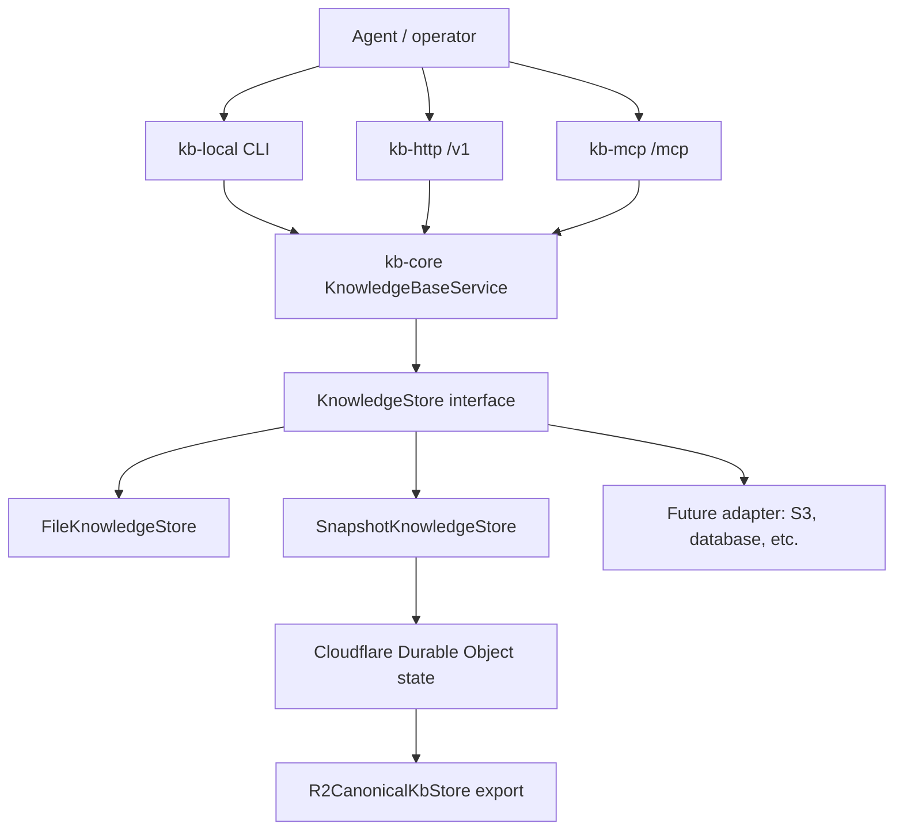

# KB Storage Adapters

KB storage adapters sit below `kb-core`. They persist workspace memory; they do not own retrieval, relation extraction, HTTP routing, MCP tools, or agent protocol.

## Layer Map



## The Storage Seam

The adapter seam is `KnowledgeStore` in `packages/kb-core/src/store.ts`. `KnowledgeBaseService` depends on that interface for persistence and keeps the higher-level behavior in `kb-core`:

- store `mode()` metadata so callers can distinguish local, remote, mirror-support, and canonical-production roles
- markdown entity documents
- markdown source documents
- entity registry entries
- event append/list/replace
- entity drafts
- graph links, replaced by origin
- short-lived entity locks

A storage adapter must implement these methods faithfully. It should not implement its own retrieval ranking, relation parsing, HTTP routes, MCP tool catalog, benchmark logic, or agent rules. Those all live above storage.

## Existing Implementations

| Implementation | Location | Role |
| --- | --- | --- |
| `FileKnowledgeStore` | `packages/kb-storage-file/src/file-store.ts` | Local filesystem adapter for `kb-local` in-process development and local agent workspaces. |
| `SnapshotKnowledgeStore` | `packages/kb-core/src/snapshot-store.ts` | In-memory snapshot adapter used by runtime wrappers that need to apply mutations then persist a whole or delta snapshot. |
| `KnowledgeBaseStateMethods` | `packages/kb-storage-cloudflare/src/state-cloudflare-do.ts` | Cloudflare Durable Object wrapper that uses `SnapshotKnowledgeStore` as the write-authoritative runtime state, then exports canonical state asynchronously. |
| `R2CanonicalKbStore` | `packages/kb-storage-cloudflare/src/r2-store.ts` | Object-store canonical export/import layout for Cloudflare R2. It is the production snapshot export, not a peer mutable workspace. |

## What The Service Expects

A correct adapter preserves these semantics:

- **Entity and source markdown are canonical document bodies.** `get*`, `list*`, `put*`, and `delete*` must round-trip markdown exactly enough for parse/render tests to pass.
- **Registry entries are replace-by-entity-id.** `putEntityRegistryEntry` should upsert by `entityId`; `deleteEntityRegistryEntry` removes that entry.
- **Events are append-friendly but replaceable.** Normal writes append events; repair/rebuild flows may replace the full list.
- **Drafts are keyed by entity id.** Drafts are support state for entity consolidation and human review.
- **Links are replaced by origin.** `replaceLinksForOrigin({ kind, id }, links)` removes prior links for that origin and writes the next set, which keeps extracted graph edges idempotent.
- **Locks are short-lived coordination hints.** `acquireEntityLock(entityId, ttlMs)` returns `null` when another live lock exists and returns a tokened lock otherwise. `releaseEntityLock` must only release a matching token.

## Object Layout Pattern

The Cloudflare R2 canonical export uses a simple object layout under a workspace prefix:

```text
<root>/<workspace>/meta/version.json
<root>/<workspace>/entities/<entity-id>.md
<root>/<workspace>/sources/<source-id>.md
<root>/<workspace>/registry/<entity-id>.json
<root>/<workspace>/drafts/<entity-id>.json
<root>/<workspace>/events/<event-id>.json
<root>/<workspace>/links/<origin-kind>/<origin-id>/<link-id>.json
```

A new object-store adapter can reuse this shape, but the important contract is the `KnowledgeStore` behavior, not this exact prefix layout. If the adapter uses a different layout, it should still provide deterministic listing, rebuild, export, and recovery behavior.

## Building An S3-Style Adapter

An S3 adapter would likely be a new package such as `packages/kb-storage-s3`. The implementation work is mostly storage semantics, not KB product logic.

### Required design choices

- **Package surface:** export an `S3KnowledgeStore` or an S3 canonical snapshot helper, depending on whether writes go directly to S3 or through a write-authoritative runtime snapshot.
- **Write authority:** decide whether S3 is directly mutable or only the canonical export behind another write authority. Direct-to-object-store writes need stronger lock and consistency handling.
- **Key layout:** choose a prefix format for workspace root, entities, sources, registry, drafts, events, links, and metadata/version objects.
- **Listing and pagination:** implement full-prefix listing across continuation tokens and sort results deterministically.
- **Consistency posture:** document what happens after writes, deletes, and list operations. If the object store can produce stale lists, prefer a snapshot/version manifest pattern.
- **Locks:** use conditional writes, a lock object with token + expiry, or another coordination primitive. Do not use best-effort lock deletion without token checks.
- **Atomicity and idempotency:** make `replaceLinksForOrigin` safe to retry and avoid duplicate links or partial origin replacement where possible.
- **Versioning/rebuild:** include a metadata object equivalent to `meta/version.json` so repair and restore flows can reason about exported state.
- **Credentials:** accept an injected client or credentials through runtime configuration. Do not bake secrets into generated source files.

### Suggested implementation checklist

1. Create package metadata and exports for `@emmassist-co/kb-storage-s3`.
2. Implement the `KnowledgeStore` interface or a snapshot-backed store wrapper.
3. Add unit tests using a fake S3 client that exercises read/write/list/delete pagination and failure paths.
4. Add integration-shaped tests through `KnowledgeBaseService` to prove record, remember, search, relation extraction, drafts, and events work through the adapter.
5. Add lock tests for live lock rejection, expiry takeover, and token-checked release.
6. Add docs explaining whether the adapter is production canonical, local support, or an export target.
7. Wire CLI/runtime selection only after the package is stable; do not add a new backend flag before verification exists.

## What Not To Put In A Storage Adapter

Do not duplicate or fork:

- retrieval ranking or lexical search
- relation extraction rules
- `remember`, `record`, `relate`, or `annotate` semantics
- `/v1` route handling
- `/mcp` tool registration
- benchmark loaders or scorer logic
- agent operating rules

If a new backend needs different operational behavior, adapt at the runtime wrapper layer and keep `KnowledgeBaseService` semantics shared.

## Verification For New Adapters

At minimum, run:

```bash
npm run typecheck
npm test
```

A new adapter should also have focused tests equivalent to the existing file/cloudflare storage coverage and at least one service-level smoke that writes, searches, relates, exports, and restores through the adapter.
