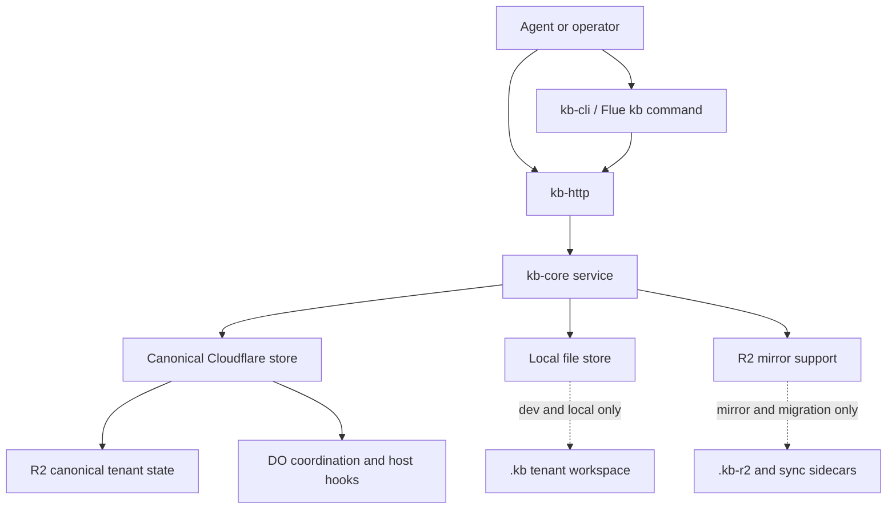

# feat: close kb agent-native architecture gaps

## Summary

Close the main agent-native gaps in `kb` by making Cloudflare-backed tenant state the explicit production source of truth, promoting events/relations/drafts to first-class surfaces, tightening agent runtime instructions and context, and aligning documented behavior with the repo's real owned surfaces.

---

## Problem Frame

The current repo already claims a Cloudflare-first compounding knowledge base, but the implementation still behaves like a toolkit with multiple competing workspaces and uneven surface ownership. The audit showed three structural failures:

- shared workspace is ambiguous because local file mode, R2 mirror mode, and Cloudflare-backed production mode can all act like primary state depending on configuration
- events, relations, and drafts exist in `kb-core` but are not first-class CRUD surfaces in the public CLI/runtime/API contract
- runtime behavior is enforced mostly by code and docs, not by a concise agent-facing instruction and context contract

The result is a repo that is strong on core CRUD parity for canonical entities, but weak on production-state singularity, secondary-entity completeness, and agent-native runtime behavior.

---

## Requirements

### Canonical Production Workspace

- R1. The plan must establish one explicit production source of truth for tenant KB state: Cloudflare-backed state behind `kb-http` and `kb-storage-cloudflare`.
- R2. Local file-backed and R2 mirror modes must remain available, but they must be treated and surfaced as development, debugging, migration, or support paths rather than equal production backends.
- R3. Runtime and operator surfaces must expose enough state to prevent accidental writes to the wrong tenant or backend, including backend mode, tenant identity, and whether the surface is canonical.

### First-Class KB Surfaces

- R4. Events, relations, and drafts must become first-class public surfaces with explicit CRUD/read models where appropriate, instead of being reachable only through side effects, `export`, or internal service methods.
- R5. Public surface shape must stay consistent across `kb-core`, `kb-http`, `kb-cli`, and the Flue `kb` command, with no HTTP-only capability left undocumented or unreachable from the agent-facing command plane unless deliberately internal.
- R6. Post-write visibility must improve so a caller can see the effect of a mutation without inventing an extra bespoke read path.

### Agent-Native Runtime Behavior

- R7. The repo must define an explicit runtime instruction contract for agents using KB surfaces: when to search, when to query relations, when to write back, how to handle uncertainty, and how to distinguish canonical knowledge from transient session state.
- R8. Runtime prompt/context assembly must include compact live state relevant to KB operation, not only static docs or broad benchmark summaries.
- R9. Documentation must advertise only repo-owned runtime/deployment surfaces, or the repo must implement the advertised surfaces.

### Verification And Trust

- R10. Tests must cover cross-surface parity for the owned KB contract: CLI, HTTP, Flue runtime, and Cloudflare-oriented capability metadata.
- R11. Tests must cover shared-workspace edge cases, including wrong-backend ambiguity, tenant-boundary clarity, and second-class entity behavior after promotion to first-class surfaces.
- R12. The plan must preserve the current strategy direction: Cloudflare-first runtime, compounding knowledge model, operational adoption, and verification as a product feature.

---

## Scope Boundaries

### In Scope

- clarifying and enforcing canonical production state ownership inside this repo
- public-surface work for events, relations, drafts, and related mutation/read behavior
- KB runtime instruction/context work for agent-native operation
- doc/runtime parity cleanup for surfaces this repo claims to own
- verification upgrades for parity, CRUD completeness, and post-write visibility

### Deferred to Follow-Up Work

- richer real-time collaboration infrastructure beyond what the KB contract itself needs, such as a full event bus or generalized app-wide live-sync platform
- broader retrieval/ranking redesign in `kb-core` beyond changes required to support the promoted public surfaces
- larger `kb-autoresearch` productization beyond making its prompt/instruction assets first-class where needed

### Outside This Product's Identity

- generic multi-tenant control-plane work
- repo-external OAuth, Telegram webhook, or non-KB administrative runtime flows unless they are intentionally rehomed into `kb`
- converting `kb` into a general chat application or dashboard product

---

## High-Level Technical Design

The plan should converge the repo onto one production contract with support surfaces around it:

Target operating rules:

1. canonical production reads and writes flow through `kb-http` + Cloudflare-backed state
2. local file and mirror modes remain explicit support surfaces, never silent production peers
3. KB instructions and capability metadata are generated from the same owned contract the code exposes
4. mutation surfaces return enough structured state for immediate follow-up visibility and parity testing

---

## Key Technical Decisions

- KTD1. Cloudflare-backed state is the only canonical production workspace.
  Local file and R2 mirror modes stay supported, but are explicitly modeled as non-canonical support paths. This matches [STRATEGY.md](STRATEGY.md), [README.md](README.md), and [docs/product/cloudflare-first-compounding-kb.md](docs/product/cloudflare-first-compounding-kb.md) instead of inventing a second production story.

- KTD2. Promote missing public surfaces from existing `kb-core` capabilities instead of inventing parallel abstractions.
  `captureSource`, `appendEvent`, `updateEntityDraft`, draft storage, and link/event persistence already exist in `kb-core` and store implementations. The plan should elevate those seams into explicit public contracts before adding new storage concepts.

- KTD3. Fix ownership drift in docs by aligning docs to owned surfaces unless there is a deliberate implementation commitment.
  The current deployment model doc advertises OAuth/chat runtime behaviors that are not implemented in this repo. The default fix is to narrow docs to repo-owned KB behavior unless the team explicitly wants to move those runtime flows into `kb`.

- KTD4. Agent-native behavior should be enforced by a compact runtime instruction asset plus capability/context injection, not by philosophical docs alone.
  The repo already says "runtime over prompt theater." The missing work is not a giant prompt rewrite; it is a small owned instruction contract and context envelope that sits adjacent to the command/API surfaces.

- KTD5. Start with hydrated mutation responses and explicit capability/status metadata before adding a heavier real-time update system.
  The audit found weak post-write visibility, but the first pass should improve write responses and sync/status models before introducing a generalized streaming architecture.

- KTD6. Follow the repo's strongest cross-cutting planning precedent: typed core changes first, then surface widening where tests prove it is required.
  [docs/superpowers/plans/2026-05-11-kb-provenance-supersession-freshness.md](docs/superpowers/plans/2026-05-11-kb-provenance-supersession-freshness.md) is the best local model for sequencing this work.

---

## System-Wide Impact

- `kb-core` becomes the explicit home of second-class entity behavior that is currently only partially surfaced.
- `kb-http` becomes the clearest statement of the owned production contract and capability metadata.
- `kb-cli` and the Flue adapter become thinner mirrors of the owned contract, with fewer hidden HTTP-only or support-only behaviors.
- `kb-storage-cloudflare` must better separate canonical production storage concerns from host-specific coupling and support-path concerns.
- Docs and verification become part of the implementation itself, because parity drift is one of the core failures being fixed.

---

## Risks & Dependencies

- Host-coupling debt in `kb-storage-cloudflare` and `kb-flue-adapter` may force interface extraction before some surface work can land cleanly.
- Existing host-oriented tests under `tests/legacy/` may blur package-level acceptance boundaries; the plan must be careful not to anchor all verification on legacy host integration fixtures.
- If docs are corrected before behavior is clarified, the repo may temporarily under-describe capabilities. If behavior is widened before docs are corrected, parity drift persists. The plan should sequence these together.
- Promoting events/relations/drafts to first-class surfaces can unintentionally expose low-value or unstable semantics unless the contract is defined narrowly.

---

## Sources & Research

- Strategy and product direction:
  - [STRATEGY.md](STRATEGY.md)
  - [README.md](README.md)
  - [docs/product/cloudflare-first-compounding-kb.md](docs/product/cloudflare-first-compounding-kb.md)
  - [docs/product/knowledge-base.md](docs/product/knowledge-base.md)
- Runtime and agent philosophy:
  - [docs/product/agent-philosophy.md](docs/product/agent-philosophy.md)
  - [docs/operations/harness.md](docs/operations/harness.md)
- Extraction and ownership debt:
  - [docs/migration-status.md](docs/migration-status.md)
  - [docs/product/deployment-model.md](docs/product/deployment-model.md)
- Core implementation seams:
  - [packages/kb-core/src/service.ts](packages/kb-core/src/service.ts)
  - [packages/kb-core/src/store.ts](packages/kb-core/src/store.ts)
  - [packages/kb-http/src/server.ts](packages/kb-http/src/server.ts)
  - [packages/kb-cli/src/index.ts](packages/kb-cli/src/index.ts)
  - [packages/kb-flue-adapter/src/command.ts](packages/kb-flue-adapter/src/command.ts)
  - [packages/kb-storage-file/src/file-store.ts](packages/kb-storage-file/src/file-store.ts)
  - [packages/kb-storage-cloudflare/src/r2-store.ts](packages/kb-storage-cloudflare/src/r2-store.ts)
- Existing test and planning precedent:
  - [tests/kb-cli.test.ts](tests/kb-cli.test.ts)
  - [tests/kb-http.test.ts](tests/kb-http.test.ts)
  - [tests/legacy/kb-application.integration.ts](tests/legacy/kb-application.integration.ts)
  - [docs/superpowers/plans/2026-05-11-kb-provenance-supersession-freshness.md](docs/superpowers/plans/2026-05-11-kb-provenance-supersession-freshness.md)

---

## Implementation Units

### U1. Define the canonical production workspace contract

- **Goal:** Make Cloudflare-backed tenant state the explicit production source of truth and make non-canonical support modes impossible to confuse with production.
- **Requirements:** R1, R2, R3, R12
- **Dependencies:** none
- **Files:** `packages/kb-core/src/types.ts`, `packages/kb-http/src/types.ts`, `packages/kb-http/src/server.ts`, `packages/kb-cli/src/index.ts`, `packages/kb-cli/src/daemon.ts`, `packages/kb-cli/src/sync.ts`, `packages/kb-storage-cloudflare/README.md`, `packages/kb-http/README.md`, `tests/kb-cli.test.ts`, `tests/kb-http.test.ts`
- **Approach:** Introduce a consistent capability/status model that names backend kind, tenant scope, and canonicality across HTTP and CLI/runtime inspection surfaces. Keep file and mirror modes working, but require those modes to self-identify as support surfaces. Define how `kb-http` reports canonical Cloudflare state vs local/file or mirror transports.
- **Patterns to follow:** Existing `capabilities` envelope in `packages/kb-http/src/server.ts`; transport resolution in `packages/kb-cli/src/index.ts`; extraction guidance in `docs/migration-status.md`.
- **Test scenarios:**
  - HTTP capabilities for a canonical host return backend, tenant, and canonicality fields expected by clients.
  - Local file mode inspection returns explicit non-canonical status instead of appearing equivalent to canonical production state.
  - Mirror-mode inspection/status includes enough metadata to distinguish support-state from canonical state.
  - Wrong-backend configuration produces a clear error or explicit non-canonical status instead of silently acting production-like.
  - Tenant identity remains visible in capability/status responses for all supported transports.
- **Verification:** An implementer can inspect any KB surface and immediately tell whether it is canonical production state, which tenant it targets, and whether it is a support-only mode.

### U2. Extract and clarify Cloudflare state ownership

- **Goal:** Reduce host-coupling in Cloudflare-backed KB state so canonical production storage and coordination belong clearly to `kb`, while host-specific hooks stay injectable.
- **Requirements:** R1, R2, R10, R12
- **Dependencies:** U1
- **Files:** `packages/kb-storage-cloudflare/src/index.ts`, `packages/kb-storage-cloudflare/src/r2-store.ts`, `packages/kb-storage-cloudflare/src/state-cloudflare-do.ts`, `packages/kb-flue-adapter/src/command.ts`, `docs/migration-status.md`, `packages/kb-storage-cloudflare/README.md`, `tests/legacy/kb-application.integration.ts`
- **Approach:** Separate KB-owned Cloudflare state behavior from host-specific orchestration assumptions. Treat R2 as the durable source of truth and define Durable Object responsibilities as coordination/cache/lock hooks rather than a competing root-state model. Update extraction-status docs to match the refactored ownership boundary.
- **Execution note:** Start with characterization coverage around existing Cloudflare runtime expectations before moving interfaces.
- **Patterns to follow:** `docs/migration-status.md` already identifies the intended split; `R2CanonicalKbStore` in `packages/kb-storage-cloudflare/src/r2-store.ts` is the canonical storage precedent.
- **Test scenarios:**
  - Cloudflare-backed runtime still serves canonical reads/writes through the same owned KB contract after host hooks are extracted.
  - Missing required Cloudflare bindings still fail fast with clear ownership-oriented errors.
  - DO-backed coordination does not become a second durable source of truth after extraction.
  - Existing Cloudflare integration behavior remains intact for the package-owned contract even if host-specific logic is injected.
- **Verification:** The package boundary clearly expresses what `kb` owns in Cloudflare and what a consuming host must provide, without ambiguous shared ownership of durable state.

### U3. Promote events, relations, and drafts to first-class public surfaces

- **Goal:** Give events, relations, and drafts explicit public contracts across core service, HTTP, CLI, and runtime surfaces.
- **Requirements:** R4, R5, R11, R12
- **Dependencies:** U1
- **Files:** `packages/kb-core/src/service.ts`, `packages/kb-core/src/store.ts`, `packages/kb-core/src/types.ts`, `packages/kb-http/src/server.ts`, `packages/kb-http/README.md`, `packages/kb-cli/src/index.ts`, `packages/kb-flue-adapter/src/command.ts`, `packages/kb-cli/skills/kb-write/SKILL.md`, `tests/kb-cli.test.ts`, `tests/kb-http.test.ts`, `tests/legacy/kb-application.integration.ts`
- **Approach:** Promote existing internal seams (`captureSource`, `appendEvent`, draft access, relation persistence) into explicit user/agent-facing operations. Define narrow CRUD/read models that make second-class state inspectable and manageable without requiring `export` or internal knowledge. Keep the contract small and typed rather than exposing every internal helper directly.
- **Execution note:** Implement new surface tests first, then widen CLI/HTTP/runtime commands only where the failing tests require it.
- **Patterns to follow:** Public write-path patterns in `packages/kb-cli/src/index.ts` and `packages/kb-http/src/server.ts`; prior cross-surface sequencing in `docs/superpowers/plans/2026-05-11-kb-provenance-supersession-freshness.md`.
- **Test scenarios:**
  - Events can be created, listed/read, and removed or replaced through explicit public surfaces without relying on `export`.
  - Drafts can be listed/read/updated/deleted without requiring implicit `captureSource` side effects.
  - Relations can be created, listed/read, updated or replaced, and removed through explicit contract surfaces rather than only `links`/`traverse` plus internal origin replacement.
  - Existing entity and source behaviors remain backward compatible where the repo already documents them.
  - HTTP, CLI, and Flue `kb` surfaces expose the same second-class entity behaviors with no transport-only gaps.
- **Verification:** A user or agent can manage all durable KB state classes through documented public surfaces without falling back to `export`, hidden service methods, or raw storage knowledge.

### U4. Add a compact runtime instruction and context contract

- **Goal:** Turn KB behavior expectations into an explicit agent-facing runtime contract with bounded live context.
- **Requirements:** R7, R8, R10, R12
- **Dependencies:** U1, U3
- **Files:** `packages/kb-cli/skills/kb-write/SKILL.md`, `packages/kb-cli/skills/kb-local-setup/SKILL.md`, `docs/product/agent-philosophy.md`, `docs/operations/harness.md`, `packages/kb-autoresearch/src/prompt.ts`, `packages/kb-autoresearch/src/types.ts`, `tests/kb-cli-docs.test.ts`, `tests/kb-autoresearch.test.ts`, `tests/legacy/kb-application.integration.ts`
- **Approach:** Define one compact runtime instruction asset or contract that tells an agent when to use `search`, `query-relations`, `remember`, `record`, `relate`, and `annotate`, how to treat uncertainty and provenance, and how to distinguish canonical knowledge from transient state. Pair it with a bounded context model: active backend/canonicality, tenant scope, available KB capabilities, and compact recent state where relevant.
- **Patterns to follow:** Existing bounded autoresearch prompt assembly in `packages/kb-autoresearch/src/prompt.ts`; runtime-skill and harness philosophy in `docs/product/agent-philosophy.md` and `docs/operations/harness.md`.
- **Test scenarios:**
  - Runtime/skill docs expose explicit rules for search vs relation query vs write-back behavior.
  - Agent prompt/context assembly includes backend/canonicality/capability state without broad hidden-context assumptions.
  - Missing or stale runtime instruction assets are detected by tests rather than drifting silently.
  - Bounded context continues to avoid giant artifact loading while surfacing the KB-specific state an agent needs.
- **Verification:** Repo-owned runtime instructions and context assembly make KB behavior legible and enforceable without relying on broad philosophical docs alone.

### U5. Tighten documented-vs-implemented parity for owned surfaces

- **Goal:** Remove or implement surface claims so docs, scripts, help output, and route tables all describe the same owned product contract.
- **Requirements:** R5, R9, R10, R12
- **Dependencies:** U1, U3, U4
- **Files:** `README.md`, `docs/product/deployment-model.md`, `docs/product/knowledge-base.md`, `packages/kb-http/README.md`, `packages/kb-cli/README.md`, `packages/kb-cli/src/index.ts`, `package.json`, `tests/kb-cli.test.ts`, `tests/kb-http.test.ts`
- **Approach:** Audit and correct claims about onboarding/deploy/runtime flows that do not belong to `kb`. Add parity checks that compare documented commands/routes/scripts against owned code surfaces. If any non-KB surface is intentionally retained in docs, it must be clearly marked as external/consumer-owned rather than repo-owned.
- **Patterns to follow:** Help-text contract tests in `tests/kb-cli.test.ts`; route documentation in `packages/kb-http/README.md`; current deployment drift in `docs/product/deployment-model.md`.
- **Test scenarios:**
  - CLI help, HTTP README, and route table agree on the owned public surface.
  - `package.json` scripts and product docs no longer advertise missing onboarding/deploy flows as repo-owned behavior.
  - Parity tests fail when a documented command or route disappears or when an implemented public route is undocumented.
  - Repo docs distinguish KB-owned behavior from consuming-host behavior cleanly.
- **Verification:** A reader can trust that repo docs describe only surfaces `kb` actually owns and tests will catch future drift.

### U6. Improve post-write visibility and sync-state feedback

- **Goal:** Make mutations and background state changes visible enough for agent/native consumers without requiring a full real-time platform redesign.
- **Requirements:** R6, R10, R11
- **Dependencies:** U1, U3
- **Files:** `packages/kb-core/src/service.ts`, `packages/kb-http/src/server.ts`, `packages/kb-http/src/types.ts`, `packages/kb-cli/src/index.ts`, `packages/kb-cli/src/sync.ts`, `packages/kb-cli/src/sync-daemon.ts`, `packages/kb-flue-adapter/src/command.ts`, `tests/kb-http.test.ts`, `tests/kb-cli.test.ts`, `tests/kb-r2-sync.test.ts`
- **Approach:** Enrich mutation responses and sync-status models so callers can see what changed and whether background support flows are healthy. Start with structured mutation envelopes and richer sync/status reads; treat event streaming as optional only if the narrower shape still leaves a material visibility gap.
- **Patterns to follow:** Existing mutation envelopes in KB writes; compact/expanded sync summaries in `packages/kb-cli/src/sync.ts` and `tests/kb-cli.test.ts`.
- **Test scenarios:**
  - Write operations return enough changed-state detail for a caller to refresh visible state without bespoke follow-up logic.
  - Delete operations preserve explicit removed-state metadata.
  - Sync status can expose drift/conflict information in a first-class way without requiring filesystem spelunking.
  - Long-running support operations expose structured health/result information even when logs remain opt-in.
- **Verification:** A user or agent can tell what a mutation or sync operation did from the structured response surface, not from implicit side effects or hidden files.

### U7. Rebuild verification around the owned agent-native contract

- **Goal:** Make the new contract durable through package-level and cross-surface tests, while reducing dependence on legacy host-coupled fixtures.
- **Requirements:** R10, R11, R12
- **Dependencies:** U1, U2, U3, U4, U5, U6
- **Files:** `tests/kb-cli.test.ts`, `tests/kb-http.test.ts`, `tests/kb-r2-sync.test.ts`, `tests/kb-cli-docs.test.ts`, `tests/kb-autoresearch.test.ts`, `tests/legacy/kb-application.integration.ts`, `docs/operations/kb-benchmark.md`, `docs/operations/harness.md`
- **Approach:** Define package-level parity tests as the primary guardrail for owned KB behavior, then keep only the host-level integration coverage that validates true cross-host seams. Add explicit verification for canonicality metadata, promoted second-class entities, instruction/context assets, and doc/runtime parity.
- **Execution note:** Start by characterizing the existing passing package-level tests before deleting or narrowing any legacy integration coverage.
- **Patterns to follow:** Existing CLI/help/schema contract tests; current daemon/sync summary tests; legacy runtime integration tests only where a host seam is still intentional.
- **Test scenarios:**
  - Package-level tests cover canonicality metadata, second-class entity public surfaces, and doc/runtime parity.
  - Legacy host integration tests are either narrowed to real host seams or replaced by package-owned coverage.
  - Harness docs and verification docs reflect the final owned contract and verification layers.
  - Regression tests catch future drift in backend identity, surface ownership, and promoted CRUD behavior.
- **Verification:** The repo can prove its agent-native contract from package-owned tests first, with legacy host fixtures reserved only for genuine host seams.

---

## Documentation / Operational Notes

- Update product docs and package READMEs in the same sequence as surface changes; do not leave a phase where docs knowingly advertise non-owned behavior.
- Keep Cloudflare-first positioning consistent across README, strategy, and package docs.
- Preserve operator usefulness of support surfaces (`sync`, `daemon`, local file mode), but label them clearly as support paths.

---

## Open Questions

- Should first-class relation CRUD expose explicit relation IDs as public stable handles, or should replacement/deletion stay origin-scoped in the first pass?
- Does the team want a minimal mutation event feed in this phase, or is enriched response/status modeling enough for the first pass?
- For deployment-model docs, should non-KB administrative runtime flows move out of this repo entirely, or remain as clearly external consumer examples?
