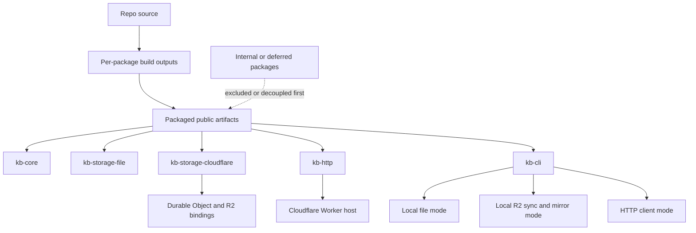
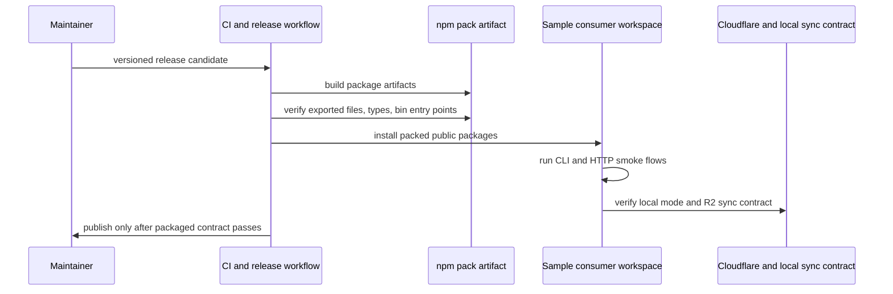

# feat: harden kb for open-source package release

## Summary

Take `kb` from a Cloudflare-first repo with internal GitHub Packages distribution to a credible public open-source package surface. The plan focuses on a staged public package set, built JS and type artifacts, a public consumer install story, and publish verification that proves the Cloudflare-native KB plus local R2 sync work cleanly for outsiders.

---

## Problem Frame

`kb` already has a coherent product story: canonical Cloudflare-backed production state, a CLI and HTTP contract, and local R2 sync as a support path. The blocking issue is not the product claim. It is the distribution surface.

Today the repo still behaves like an internal monorepo:

- package docs and tests assume GitHub Packages and `GITHUB_PACKAGES_TOKEN`
- package exports point at raw `src/*.ts` files instead of built JS artifacts
- the published CLI path shells back through `tsx` at runtime
- some packages are still intentionally private or host-coupled
- CI and publish automation are built around GitHub Packages rather than a public npm-quality release contract

That gap makes `kb` look stronger in-repo than it will feel to an outside consumer. The public release path needs to narrow the supported package set, harden the build outputs, make local + Cloudflare install flows trustworthy, and verify the local R2 sync story as a real product surface rather than internal tooling.

---

## Requirements

### Public Package Contract

- R1. The repo must define an explicit public release target: which packages are public now, which remain internal or deferred, and what the product-level install entry point is for a new consumer.
- R2. Publicly released packages must install from a normal public package registry flow without requiring GitHub Packages tokens or internal registry configuration.
- R3. Public packages must expose stable built JS entry points and type declarations instead of relying on raw workspace TypeScript source files at consumer runtime.
- R4. Public package metadata must be complete and consistent for open-source consumption, including repository/homepage/bugs/license/discoverability fields where appropriate.

### Cloudflare-Native Product Story

- R5. The release surface must preserve the repo's Cloudflare-first positioning: `kb-http` plus Cloudflare-backed persistence remain the canonical production path.
- R6. The local file-backed and local R2 sync flows must stay supported, but they must be documented as development, migration, inspection, or support surfaces rather than an equal production architecture.
- R7. The local R2 sync workflow must be public-consumer quality: clear contract, safe drift/conflict semantics, and docs/tests that match the supported CLI behavior.

### Supported Package Set And Boundaries

- R8. Packages that still depend on host-specific `administrative` wiring or other internal assumptions must either be decoupled before public release or explicitly excluded from the initial public package set.
- R9. The plan must preserve clean ownership boundaries between backend-neutral semantics, Cloudflare-specific runtime/storage, CLI/operator tooling, and any host-specific integration layers.
- R10. The plan must avoid turning this release into a full architecture rewrite; only coupling that blocks credible public packaging should be pulled into the active work.

### Verification And Release Trust

- R11. CI and release automation must verify the built package artifacts that consumers will actually install, not just in-workspace TypeScript source behavior.
- R12. The plan must add package-level verification for public install, packaged CLI execution, and the documented Cloudflare/local sync contracts.
- R13. Release docs must state migration expectations for existing internal consumers and clearly separate staged public readiness from later follow-up work.

---

## Scope Boundaries

### In Scope

- defining the initial public package set and package-level ownership boundaries
- converting public packages from source-first workspace exports to built artifact distribution
- hardening the CLI packaging story, including the public local and R2 sync paths
- replacing the GitHub-Packages-only consumer install story with a public open-source install story
- release workflow, package metadata, and verification changes needed for credible public npm-style distribution

### Deferred to Follow-Up Work

- broader agent-native runtime polish that is already covered by `docs/plans/2026-06-07-001-feat-kb-agent-native-gaps-plan.md`
- full public productization of `kb-autoresearch`
- broader retrieval, ranking, or knowledge-model redesign beyond what public packaging directly requires
- a larger control plane, hosted dashboard, or multi-tenant management surface

### Outside This Product's Identity

- turning `kb` into a general chat application or workflow orchestrator
- repo-external administrative runtime flows that belong in a consuming host
- publishing every internal helper package just because it exists in the monorepo

---

## High-Level Technical Design

The public release path should narrow the package surface and add a real artifact boundary between source and what consumers install:

Release validation should also shift from "workspace tests pass" to "packaged consumer contract works":

---

## Key Technical Decisions

- KTD1. Release a staged public package set instead of forcing every current package public at once.
  `kb-core`, `kb-storage-file`, `kb-storage-cloudflare`, `kb-http`, and `kb-cli` already form the product spine. `kb-flue-adapter` and `kb-autoresearch` should only join the public set after their host-coupling or private-product assumptions are removed.

- KTD2. Move public packages to built artifact distribution before widening release scope.
  A public package that exports `src/*.ts` and depends on runtime `tsx` behavior is not a credible outside-consumer contract even if workspace tests pass. Build outputs, typed entry points, and pack-level verification are the first hardening layer.

- KTD3. Keep local R2 sync as a `kb-cli` capability rather than splitting it into a separate public package right now.
  The user-facing product claim is "Cloudflare-native KB that also works locally via R2 sync," not "a standalone sync library." The public contract should stay centered on the CLI until a separate sync package would create clear leverage.

- KTD4. Treat GitHub Packages behavior as migration debt, not a second permanent public install path.
  The current docs and tests are useful evidence of internal publish behavior, but the public release plan should normalize around one outsider-quality install path rather than carrying token-gated and public flows as equal first-class stories.

- KTD5. Separate package-boundary cleanup from architecture cleanup.
  If a package cannot be released without host-specific code, either decouple just enough to make it public or keep it out of the initial public surface. Do not let unresolved host coupling expand this work into a full repo redesign.

- KTD6. Verify what consumers install, not just what contributors run in the workspace.
  Package-level `npm pack` style validation, packaged CLI smoke coverage, and a sample consumer install loop should become part of release trust. Workspace-only success is necessary but insufficient for public release.

---

## Alternative Approaches Considered

- Keep GitHub Packages as the primary distribution channel and only improve docs.
  Rejected because it preserves the biggest outside-consumer friction and keeps the repo feeling internal.

- Publish every package immediately, including `kb-flue-adapter` and `kb-autoresearch`.
  Rejected because the repo's own extraction status still flags coupling and private-product assumptions. A staged public set is more honest and easier to verify.

- Treat the open-source story as repo-only and avoid package release hardening.
  Rejected because the user's question is specifically about publishing `kb` as a package surface. Repo visibility alone does not validate consumer installability.

---

## System-Wide Impact

- `package.json`, package manifests, and CI/release workflows become part of the product contract rather than release afterthoughts.
- `kb-cli` becomes the most visible public entry point, so its packaged bin, docs, and R2 sync semantics carry more weight than they do in the current internal-only story.
- `kb-http` and `kb-storage-cloudflare` remain the production architecture anchor, but their public docs and install guidance need to be strong enough for external adopters.
- The monorepo will have a sharper distinction between public product packages and internal/deferred packages.

---

## Risks & Dependencies

- Public package naming and registry scope may require migration decisions that affect existing internal consumers.
- Moving to built artifacts can expose hidden workspace assumptions around path aliases, TypeScript resolution, or cross-package imports.
- CLI packaging changes can regress local developer ergonomics if the repo does not keep a clean contributor workflow alongside the public artifact workflow.
- R2 sync is safety-sensitive; weak packaged verification could ship a contract that looks clean in docs but fails under real conflict or drift cases.
- Existing CI only proves a narrow workspace path. Package-level verification will likely uncover issues that are currently masked by monorepo execution.

---

## Sources & Research

- Product and strategy:
  - `README.md`
  - `STRATEGY.md`
  - `docs/product/cloudflare-first-compounding-kb.md`
- Packaging and extraction state:
  - `docs/migration-status.md`
  - `docs/consumer-quickstart.md`
  - `.github/workflows/ci.yml`
  - `.github/workflows/publish.yml`
- Package manifests and public docs:
  - `package.json`
  - `tsconfig.json`
  - `packages/kb-core/package.json`
  - `packages/kb-storage-file/package.json`
  - `packages/kb-storage-cloudflare/package.json`
  - `packages/kb-http/package.json`
  - `packages/kb-cli/package.json`
  - `packages/kb-flue-adapter/package.json`
  - `packages/kb-autoresearch/package.json`
  - `packages/kb-cli/README.md`
  - `packages/kb-http/README.md`
  - `packages/kb-storage-cloudflare/README.md`
- Current verification and sync behavior:
  - `tests/kb-cli.test.ts`
  - `tests/kb-cli-docs.test.ts`
  - `tests/kb-r2-sync.test.ts`
  - `packages/kb-cli/src/r2-sync-lib.js`
  - `packages/kb-cli/bin/kb-local.mjs`
- External packaging references:
  - https://docs.npmjs.com/files/package.json/
  - https://docs.npmjs.com/cli/publish/
  - https://nodejs.org/api/packages.html

---

## Implementation Units

### U1. Define the initial public package set and release boundary

- **Goal:** Decide which packages are public now, which are deferred, and what the product-level install story centers on.
- **Requirements:** R1, R5, R8, R9, R10, R13
- **Dependencies:** none
- **Files:** `README.md`, `docs/migration-status.md`, `package.json`, `packages/kb-cli/package.json`, `packages/kb-core/package.json`, `packages/kb-storage-file/package.json`, `packages/kb-storage-cloudflare/package.json`, `packages/kb-http/package.json`, `packages/kb-flue-adapter/package.json`, `packages/kb-autoresearch/package.json`, `tests/kb-cli-docs.test.ts`
- **Approach:** Make the staged public set explicit in repo docs and manifest policy. Confirm that the public spine is the core/storage/http/cli package family and treat host-coupled or intentionally private packages as excluded until they are decoupled. Add metadata and docs that reflect the supported public surface rather than implying everything in `packages/` is equally public.
- **Patterns to follow:** The extraction-status split already documented in `docs/migration-status.md`; package ownership rules in `AGENTS.md`.
- **Test scenarios:**
  - Public-consumer docs and package-facing tests describe only the staged public package set.
  - Deferred packages are clearly marked private or non-public without leaving contradictory publish instructions in the repo.
  - Repo-level positioning still describes `kb` as a Cloudflare-first product rather than a generic package bundle.
- **Verification:** A new maintainer can tell, from manifests and docs alone, which packages are meant for public release and which remain internal or deferred.

### U2. Convert public packages to built JS and type artifact distribution

- **Goal:** Replace source-first package exports with consumer-ready built outputs and stable type surfaces.
- **Requirements:** R2, R3, R4, R11
- **Dependencies:** U1
- **Files:** `package.json`, `tsconfig.json`, `packages/kb-core/package.json`, `packages/kb-storage-file/package.json`, `packages/kb-storage-cloudflare/package.json`, `packages/kb-http/package.json`, `packages/kb-cli/package.json`, `packages/kb-flue-adapter/package.json`, package-local build config files if introduced, `tests/kb-cli.test.ts`, `tests/kb-cli-docs.test.ts`
- **Approach:** Add a per-package build/output contract that emits JS and declaration artifacts for the staged public set. Update `files`, `exports`, `main`, `types`, and bin entry definitions to point at packaged outputs rather than workspace source. Keep contributor ergonomics intact, but make packaged artifacts the release contract.
- **Execution note:** Start with a failing pack-level contract test or dry-run verification so the artifact shape is proven before changing multiple manifests.
- **Patterns to follow:** Current `exports` and `files` fields in package manifests; official npm and Node package entry-point guidance.
- **Test scenarios:**
  - Each staged public package packs only the intended built files, manifest metadata, README, and license material.
  - Importing the packaged main entry point and declared subpaths works without TypeScript source files present.
  - Type declarations resolve for public entry points from a clean consumer install.
  - No public package requires `tsx` or workspace path aliases at consumer runtime.
- **Verification:** A packed artifact from each public package can be installed into a clean sample consumer and used through its documented entry points without workspace source access.

### U3. Harden the public CLI and local R2 sync contract

- **Goal:** Make `kb-cli` a credible public install surface for local file mode, HTTP mode, and local R2 sync support.
- **Requirements:** R2, R6, R7, R11, R12
- **Dependencies:** U2
- **Files:** `packages/kb-cli/package.json`, `packages/kb-cli/bin/kb-local.mjs`, `packages/kb-cli/README.md`, `packages/kb-cli/src/r2-sync-lib.js`, `scripts/kb-r2-sync.ts`, `docs/consumer-quickstart.md`, `docs/operations/kb-r2-sync.md`, `tests/kb-cli.test.ts`, `tests/kb-cli-docs.test.ts`, `tests/kb-r2-sync.test.ts`
- **Approach:** Remove runtime assumptions that are acceptable in-workspace but weak for a public CLI, especially the `tsx`-backed published bin path. Bring the R2 sync contract fully under KB-owned packaging guidance, align public docs to the supported commands and safety rules, and ensure the CLI's packaged behavior matches the product claim for local inspection and Cloudflare-linked sync.
- **Patterns to follow:** Existing local mode and sync planning logic in `packages/kb-cli/src/r2-sync-lib.js`; current CLI contract tests in `tests/kb-cli.test.ts`.
- **Test scenarios:**
  - Packaged `kb-local` executes documented inspect, local record/search, and HTTP client flows from a clean consumer install.
  - Packaged sync status, pull, and push flows preserve the documented manifest, drift, and conflict semantics.
  - Public docs distinguish canonical Cloudflare production state from local support modes while still showing the R2 sync workflow clearly.
  - CLI docs no longer require GitHub registry auth for normal public consumers.
- **Verification:** A fresh consumer can install `kb-cli`, run local KB flows, and understand the R2 sync contract without internal repo knowledge or source-level workarounds.

### U4. Replace the internal-only consumer install story with a public one

- **Goal:** Rewrite the docs, tests, and package metadata so the public install path is normal, discoverable, and aligned with the staged release set.
- **Requirements:** R2, R4, R5, R6, R12, R13
- **Dependencies:** U1, U2, U3
- **Files:** `README.md`, `docs/consumer-quickstart.md`, `packages/kb-cli/README.md`, `packages/kb-core/README.md`, `packages/kb-http/README.md`, `packages/kb-storage-cloudflare/README.md`, `packages/kb-storage-file/README.md`, `packages/kb-cli/skills/kb-local-setup/SKILL.md`, `tests/kb-cli-docs.test.ts`
- **Approach:** Rewrite the consumer-facing docs around one outsider-quality install path, one staged public package set, and one clear product story: Cloudflare-native production path with local support modes. Replace GitHub-Packages-only language, clarify who should start with `kb-cli` versus lower-level packages, and keep the local R2 sync workflow in the public quickstart where it strengthens the product claim.
- **Patterns to follow:** Current repo-level positioning in `README.md` and `STRATEGY.md`; doc contract assertions already present in `tests/kb-cli-docs.test.ts`.
- **Test scenarios:**
  - Quickstart and package READMEs all point to the same public install flow and no longer drift on registry/auth requirements.
  - Lower-level package READMEs describe their role in the Cloudflare-first architecture without overstating end-user entry points.
  - Skill/setup docs remain usable for local-agent consumers after the registry and packaging story changes.
  - Public docs still explain local R2 sync as a support path rather than a second production architecture.
- **Verification:** An outside engineer can read the repo and package docs and know how to install, where to start, and how the local and Cloudflare modes relate without encountering contradictory registry or ownership guidance.

### U5. Add package-level CI and release verification for real consumer artifacts

- **Goal:** Shift trust from workspace-only verification to package-level release verification and publish gates.
- **Requirements:** R11, R12, R13
- **Dependencies:** U2, U3, U4
- **Files:** `.github/workflows/ci.yml`, `.github/workflows/publish.yml`, `package.json`, release helper scripts if introduced under `scripts/`, `tests/kb-cli.test.ts`, `tests/kb-cli-docs.test.ts`, `tests/kb-r2-sync.test.ts`
- **Approach:** Extend CI and publish flow to build artifacts, run pack-level checks, install staged public packages into a clean sample consumer path, and smoke-test the documented CLI/HTTP/sync contracts. Update publish automation away from GitHub-Packages-only assumptions and make dry-run or candidate verification part of the release gate.
- **Execution note:** Add characterization coverage around the current publish workflow before changing registry and access assumptions so release regression is visible.
- **Patterns to follow:** Existing CI split between typecheck, focused tests, and smoke verification; npm publish and package metadata guidance from official docs.
- **Test scenarios:**
  - CI fails if a public package manifest points at missing built files or source-only exports.
  - Release verification installs packed artifacts in a clean consumer workspace and runs the documented smoke flows successfully.
  - Publish configuration and workflow no longer assume restricted GitHub Packages access for the staged public package set.
  - R2 sync smoke or contract verification runs against packaged CLI artifacts rather than only workspace source.
- **Verification:** A release candidate proves the exact artifacts a consumer would install, and publish automation blocks public release when artifact-level checks fail.

### U6. Decouple or quarantine the remaining blockers to the public release set

- **Goal:** Resolve the coupling that would otherwise weaken the public package claim, without expanding into a full repo redesign.
- **Requirements:** R8, R9, R10, R13
- **Dependencies:** U1, U2, U5
- **Files:** `docs/migration-status.md`, `packages/kb-flue-adapter/README.md`, `packages/kb-flue-adapter/package.json`, `packages/kb-autoresearch/package.json`, `tests/legacy/kb-application.integration.ts`, any package-boundary docs or manifest flags needed to enforce the staged release set
- **Approach:** For each remaining blocker, choose one of two outcomes: decouple enough to make the package honestly public, or leave it outside the staged release set and document that boundary. Clean up legacy tests and package metadata so internal host assumptions do not leak into the public release story.
- **Patterns to follow:** The explicit coupling inventory already captured in `docs/migration-status.md`; repo guidance to keep package ownership in the canonical packages rather than downstream copies.
- **Test scenarios:**
  - Legacy or host-specific integration tests no longer masquerade as proof that a deferred package is public-ready.
  - Deferred packages are excluded from the staged publish set cleanly, with no accidental release path left in automation.
  - Any package promoted into the public set has its host-specific assumptions replaced with explicit interfaces or docs.
- **Verification:** The repo can describe the public release set honestly without hidden coupling debt contradicting the package story.

---

## Operational / Rollout Notes

- Keep the initial public release scoped to the staged package set even if internal workflows continue using deferred packages.
- Treat the first public release as a migration event for docs, CI, and downstream consumer expectations, not as a simple registry switch.
- Preserve one explicit downstream smoke path from a clean external-style consumer after the first public release lands.

---

## Success Metrics

- A clean consumer can install the staged public package set without token-gated registry configuration.
- Packaged `kb-cli` smoke flows succeed in local mode and documented sync mode from packed artifacts.
- CI fails on broken artifact exports before publish.
- Repo and package docs tell one consistent Cloudflare-first story with a clear local R2 sync support path.
