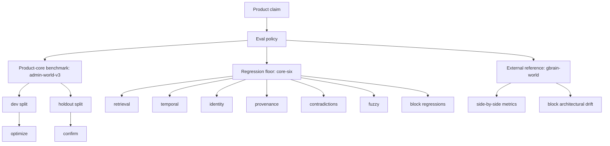
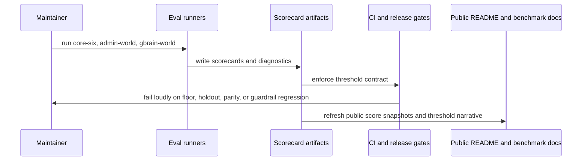

# feat: harden kb evals toward a gbrain-grade public quality bar

## Summary

Raise `kb` from "open-source ready with visible benchmarks" to a stronger public quality bar by deepening the eval stack around product-critical failure modes, making the external-reference gap to `gbrain-world` explicit and governed, and turning benchmark policy into a real release contract rather than README copy.

---

## Problem Frame

`kb` already has the right evaluation shape:

- `admin-world-v3` is the product-core retrieval benchmark
- `gbrain-world` is the external-reference benchmark
- `core-six` is the deterministic quality floor

That is a good public story, but it is not yet a strong enough quality bar to justify "near GBrain" confidence.

The current gaps are not in eval philosophy. They are in depth and enforcement:

- the deterministic non-retrieval categories are too small to feel durable
  `temporal=3`, `identity=5`, `provenance=4`, `contradictions=2`, `fuzzy=4`
- the public scorecard is mostly a category pass/fail artifact, not a governed threshold contract
- the product-core benchmark policy exists in `kb-autoresearch` and ops docs, but the repository does not yet treat it as a broader release gate
- the public benchmark story is still retrieval-heavy, while the KB product claim also depends on correction reuse, provenance discipline, temporal truth, contradiction handling, and deployed-surface parity
- `gbrain-world` is visible, but the repo does not yet define what "good enough relative to that reference" means in a way that can fail loudly

The plan should harden the eval system around the actual Cloudflare-first KB product claim:

- durable truth beats chat-memory shortcuts
- corrections and evidence are reused safely
- retrieval stays explainable
- contradictory or stale truth does not collapse into false certainty
- local, HTTP, and Cloudflare-facing surfaces stay behaviorally aligned where the contract says they should

This is not a "copy GBrain" plan. It is a "build a stronger product-grade KB eval stack, while keeping the external reference gap visible and honest" plan.

---

## Requirements

### Public Eval Bar

- R1. The repo must define a clearer public eval contract for `kb` that distinguishes product-core quality, deterministic regression protection, and external-reference comparison.
- R2. Public README and benchmark docs must describe that contract without overclaiming parity or hiding the external-reference gap.
- R3. Score visibility must be based on fresh artifacts and declared threshold policy, not ad hoc benchmark snapshots.

### Dataset Depth

- R4. The deterministic `core-six` suite must expand substantially in depth for non-retrieval categories so category passes carry real confidence.
- R5. `admin-world-v3` must grow harder dev and holdout coverage for relation ambiguity, stale truth, provenance, and correction-sensitive cases that reflect the KB product's real failure modes.
- R6. `gbrain-world` must remain an external-reference rail rather than becoming the whole eval program.

### Failure-Class Coverage

- R7. The eval system must cover more than ranking quality; it must also test contradiction handling, uncertainty preservation, provenance discipline, correction reuse, temporal truth, and ambiguous identity handling.
- R8. The plan must add explicit negative or refusal-style coverage where the right outcome is uncertainty, not a confident answer.
- R9. The plan must extend beyond in-memory or local-only retrieval checks when the product contract depends on HTTP or deployed-surface parity.

### Gating And Automation

- R10. CI and maintainer workflows must have explicit eval gates for the strengthened public contract rather than relying on documentation plus optional benchmark runs.
- R11. `kb-autoresearch` benchmark policy and repo-level release policy must stay aligned so optimization targets and release gates do not drift apart.
- R12. Benchmark outputs must preserve machine-readable artifacts that can drive docs, CI decisions, and future regression analysis.

### Scope Control

- R13. The work must strengthen `kb`'s eval stack without turning this into a broad model-benchmarking framework or an end-to-end agent harness rewrite.
- R14. The plan must keep the Cloudflare-first KB product claim central; benchmark expansion that does not improve trust in that product claim should stay out of scope.

---

## Scope Boundaries

### In Scope

- expanding and rebalancing the current `core-six`, `admin-world-v3`, and `gbrain-world` benchmark surfaces
- adding stronger threshold governance and scorecard structure
- wiring repo-level eval and release gates around the strengthened benchmark policy
- adding public README and docs language that exposes the eval bar, current scores, and target discipline honestly
- adding parity or contract checks where the KB surface promises the same behavior across local and HTTP-oriented paths

### Deferred to Follow-Up Work

- full end-to-end agent workflow evaluation beyond the KB subsystem
- model-as-judge grading or LLM evaluator pipelines
- a generalized benchmark SaaS or dashboard product around these corpora
- broader retrieval/ranking redesign in `kb-core` unless a benchmark hardening unit explicitly requires supporting metadata or diagnostic hooks

### Outside This Product's Identity

- claiming "we beat GBrain" as a product goal
- cloning the entire GBrain eval stack or corpus generation machinery
- benchmarking unrelated runtime surfaces that are not part of the KB quality claim

---

## High-Level Technical Design

The strengthened eval system should separate three concerns clearly:

The main hardening shift is from "benchmark runs exist" to "benchmark policy governs what can ship":

The key architectural distinction is that the suites do different jobs:

- `admin-world-v3` is where optimization pressure belongs
- `core-six` is where failure-class regression pressure belongs
- `gbrain-world` is where external-reference honesty belongs

The plan should deepen each one without collapsing them into a single overloaded metric.

---

## Key Technical Decisions

- KTD1. Keep `gbrain-world` as an external-reference rail, not the primary optimize target.
  The repo should be comparable to GBrain where useful, but the product cannot outsource its quality definition to an upstream fictional benchmark.

- KTD2. Expand the deterministic floor before inflating the public headline.
  The smallest non-retrieval categories are currently too thin to justify strong public trust claims, even if they are all green.

- KTD3. Treat negative behavior as a first-class eval target.
  False certainty, overclaiming, historical-truth confusion, and unsafe ambiguity resolution are more damaging to a KB than small ranking dips.

- KTD4. Make threshold governance explicit and repo-owned.
  A public benchmark story without declared floors becomes marketing. The repo should define what must stay green, what is allowed to improve slowly, and what is an external comparison only.

- KTD5. Add parity checks only where the contract actually promises parity.
  The goal is not to force every execution path to behave identically, but to ensure local, HTTP, and Cloudflare-oriented surfaces agree on the parts of the KB contract that public consumers rely on.

- KTD6. Keep `kb-autoresearch` and repo-release benchmark policy aligned from one source of truth.
  Screening, acceptance, and guardrail targets already exist in `packages/kb-autoresearch/src/config.ts`; repo-level gates should reinforce that policy rather than invent a competing one.

---

## Alternative Approaches Considered

- Just add more deterministic cases to `core-six`.
  Rejected because the public quality story also depends on product-core benchmark governance and external-reference discipline, not only fixture depth.

- Promote `gbrain-world` to the main release gate.
  Rejected because it would bias the product toward an external fictional benchmark instead of the Cloudflare-first KB failure modes that matter most.

- Keep the current eval system and only improve README wording.
  Rejected because the user concern is about true quality bar, not presentation polish.

---

## System-Wide Impact

- `eval/data/` becomes more obviously product-governed and release-critical.
- `eval/runner/` and scorecard artifacts become part of the public contract, not just internal measurement helpers.
- `kb-autoresearch` benchmark policy becomes more important as a reusable source of truth for optimization versus guardrail decisions.
- README and benchmark docs become less snapshot-oriented and more threshold-oriented.
- CI will likely become slower or more segmented, so gating strategy has to be deliberate about dev versus holdout versus guardrail cost.

---

## Risks & Dependencies

- Expanding deterministic suites too quickly can create bulky low-signal fixtures that are expensive to maintain but easy to ignore.
- Harder `admin-world` holdouts can expose real retrieval or reasoning gaps in `kb-core`, which may force follow-up implementation beyond pure eval work.
- If public thresholds are set before category depth is healthy, the repo can end up with fragile red CI that people stop trusting.
- Parity checks can sprawl if the plan does not keep them constrained to documented contract surfaces.
- Scorecard publication can drift from the actual gate configuration if docs and CI do not read from the same benchmark policy assumptions.

---

## Sources & Research

- Product and strategy:
  - `STRATEGY.md`
  - `README.md`
- Benchmark policy and operator guidance:
  - `docs/operations/kb-benchmark.md`
  - `docs/operations/harness.md`
  - `packages/kb-autoresearch/src/config.ts`
- Current benchmark artifacts:
  - `docs/benchmarks/kb-scorecard-latest.md`
  - `docs/benchmarks/kb-scorecard-latest.json`
- Runner and artifact plumbing:
  - `eval/runner/kb-eval.ts`
  - `eval/runner/kb-benchmark.ts`
  - `eval/runner/shared.ts`
  - `eval/runner/types.ts`
- Dataset surfaces:
  - `eval/data/core-six/core-six.json`
  - `eval/data/core-six-dev/core-six.json`
  - `eval/data/core-six-holdout/core-six.json`
  - `eval/data/admin-world-v3/admin-world.json`
  - `eval/data/gbrain-world-v1/README.md`
- Current benchmark coverage and diagnostics:
  - `tests/kb-benchmark.test.ts`
  - `tests/kb-cli-docs.test.ts`
  - `tests/kb-autoresearch.test.ts`

---

## Implementation Units

### U1. Define the public eval contract and benchmark threshold policy

- **Goal:** Turn the current benchmark philosophy into an explicit repo-level contract covering optimize targets, release floors, external-reference expectations, and public score visibility.
- **Requirements:** R1, R2, R3, R10, R11, R12, R14
- **Dependencies:** none
- **Files:** `README.md`, `STRATEGY.md`, `docs/operations/kb-benchmark.md`, `docs/operations/harness.md`, `packages/kb-autoresearch/src/config.ts`, `eval/runner/types.ts`, `eval/runner/kb-benchmark.ts`, `eval/runner/kb-eval.ts`, `tests/kb-cli-docs.test.ts`, `tests/kb-autoresearch.test.ts`, `tests/kb-benchmark.test.ts`
- **Approach:** Define one benchmark policy vocabulary for the repo: what gets optimized, what gets confirmed on holdout, what blocks regressions, and what remains a public comparison rail. Extend scorecard and benchmark result structures where needed so threshold outcomes and benchmark tier semantics are machine-readable instead of prose-only.
- **Patterns to follow:** Existing `benchmarkPolicy` in `packages/kb-autoresearch/src/config.ts`; gate and metadata structures already present in `eval/runner/types.ts`.
- **Test scenarios:**
  - Repo docs and tests reflect the same benchmark roles for `admin-world-v3`, `core-six`, and `gbrain-world`.
  - Benchmark result structures can represent the release policy without lossy README-only translation.
  - `kb-autoresearch` benchmark policy and repo-owned benchmark docs stay aligned on optimize, acceptance, and guardrail roles.
  - Public docs avoid "beat GBrain" language while still exposing a measurable external-reference bar.
- **Verification:** Maintainers can point to one consistent, test-backed benchmark contract that governs both optimization and public release claims.

### U2. Deepen the deterministic `core-six` regression floor

- **Goal:** Expand the small non-retrieval categories into a more credible deterministic regression suite for product-critical failure modes.
- **Requirements:** R4, R7, R8, R12, R14
- **Dependencies:** U1
- **Files:** `eval/data/core-six/core-six.json`, `eval/data/core-six-dev/core-six.json`, `eval/data/core-six-holdout/core-six.json`, `eval/runner/cat2-temporal.ts`, `eval/runner/cat3-identity.ts`, `eval/runner/cat4-provenance.ts`, `eval/runner/cat5-contradictions.ts`, `eval/runner/cat6-fuzzy.ts`, `eval/runner/kb-eval.ts`, `eval/runner/shared.ts`, `tests/kb-benchmark.test.ts`, new or expanded category-specific tests under `tests/`
- **Approach:** Grow each deterministic category toward a materially larger sample size with deliberate coverage of stale truth, alias collision, unsupported claim refusal, contradiction winner selection, historical-versus-current confusion, and fuzzy retrieval explainability. Keep the suite local, deterministic, and fast enough to stay trusted.
- **Execution note:** Add characterization-style fixture coverage category by category so regressions in the current scoring logic are visible before thresholds are tightened.
- **Patterns to follow:** Existing `core-six` dataset split structure; current category runner shape in `eval/runner/cat2-temporal.ts` through `cat6-fuzzy.ts`.
- **Test scenarios:**
  - Temporal cases include current-versus-historical winner selection, explicit time-sliced truth, and "cannot answer safely" cases where current evidence is absent.
  - Identity cases include alias collision, sibling distractors, and safe ambiguity preservation instead of aggressive merge behavior.
  - Provenance cases include exact evidence hits, citation mismatch rejection, unsupported-claim refusal, and "source exists but does not support the answer" handling.
  - Contradiction cases include conflicting evidence where the correct outcome is uncertainty, not just correct winner selection.
  - Fuzzy cases include lexical variation that still requires explainable matched fields and confidence calibration.
  - Expanded fixtures keep deterministic scoring stable across repeated local runs.
- **Verification:** A green `core-six` scorecard now reflects meaningful depth across all categories, not just retrieval plus a handful of synthetic checks.

### U3. Strengthen `admin-world-v3` as the product-core benchmark

- **Goal:** Make `admin-world-v3` a harder and more trustworthy optimize/holdout benchmark for KB retrieval behavior that matters in real product use.
- **Requirements:** R5, R7, R8, R10, R11, R14
- **Dependencies:** U1
- **Files:** `eval/data/admin-world-v3/admin-world.json`, `eval/runner/loaders.ts`, `eval/runner/cat1-retrieval.ts`, `eval/runner/kb-benchmark.ts`, `eval/runner/types.ts`, `tests/kb-benchmark.test.ts`
- **Approach:** Expand `admin-world-v3` with harder dev and holdout cases for relation ambiguity, alias-heavy phrasing, stale/historical truth, wrong-type distractors, provenance-sensitive questions, and correction-shaped retrieval expectations. Tighten metadata so family-level coverage, holdout density, and failure classes are measurable.
- **Patterns to follow:** Existing derived-query and metadata pattern in `tests/kb-benchmark.test.ts`; family and hardness reporting already emitted by `eval/runner/kb-benchmark.ts`.
- **Test scenarios:**
  - Dev and holdout splits remain deterministic, disjoint, and non-empty after dataset expansion.
  - New benchmark families expose ambiguity, temporal drift, and distractor density in metadata rather than burying them in raw text.
  - Harder holdout cases can fail independently of dev improvements, proving the benchmark is not overfit to the optimize split.
  - Family-level gates catch regressions in the specific question families the KB product claims to handle.
  - Benchmark diagnostics surface wrong-anchor, wrong-type, and historical-over-current failures for the new harder cases.
- **Verification:** `admin-world-v3` can act as a real product-core optimize and holdout benchmark with enough case diversity that leaderboard movement means something.

### U4. Add parity and write-path trust coverage where the KB contract depends on it

- **Goal:** Extend the eval stack beyond pure retrieval ranking wherever the KB product claim depends on correction reuse, provenance preservation, or local-versus-HTTP contract parity.
- **Requirements:** R7, R8, R9, R10, R12, R14
- **Dependencies:** U1, U2, U3
- **Files:** `tests/kb-cli.test.ts`, `tests/kb-http.test.ts`, `tests/kb-storage-cloudflare.test.ts`, `tests/legacy/kb-application.integration.ts`, `docs/operations/harness.md`, `eval/runner/kb-benchmark.ts`, optional new eval helpers under `eval/runner/`
- **Approach:** Add focused eval or parity scenarios for correction reuse, provenance-preserving writes, contradiction-safe retrieval after writes, and contract-level parity between local and HTTP surfaces where the product depends on them. Keep this narrow: the goal is KB trust, not a full agent harness migration into the eval runner.
- **Execution note:** Start with failing contract tests that demonstrate local-versus-HTTP or pre-write-versus-post-write divergence before adding new parity plumbing.
- **Patterns to follow:** Existing local/HTTP parity coverage in `tests/kb-cli.test.ts` and `tests/kb-http.test.ts`; harness parity guidance in `docs/operations/harness.md`.
- **Test scenarios:**
  - A correction-style write changes subsequent retrieval in the expected direction without losing provenance or introducing false certainty.
  - Retrieval after explicit relation or annotation writes preserves contract semantics across local and HTTP-oriented surfaces.
  - Cases that should stay uncertain after conflicting writes remain uncertain rather than collapsing to a confident answer.
  - Parity checks fail when local and HTTP contract surfaces diverge on benchmark-critical behavior.
  - Cloudflare-oriented storage paths do not silently drop the evidence or relation data needed by the strengthened eval cases.
- **Verification:** The repo can demonstrate that important KB trust behaviors survive real contract surfaces, not only in local in-memory style runners.

### U5. Wire stronger gates and score artifacts into CI and maintainer workflows

- **Goal:** Make the strengthened eval contract a real repo gate with clear artifact outputs and maintainable cost boundaries.
- **Requirements:** R3, R10, R11, R12, R13
- **Dependencies:** U1, U2, U3, U4
- **Files:** `package.json`, `.github/workflows/ci.yml`, `.github/workflows/publish.yml`, `docs/benchmarks/kb-scorecard-latest.md`, `docs/benchmarks/kb-scorecard-latest.json`, `eval/runner/shared.ts`, `tests/kb-benchmark.test.ts`, `tests/kb-cli-docs.test.ts`
- **Approach:** Add explicit commands and workflow structure for fast regression floors versus heavier external-reference or holdout checks. Ensure scorecards and benchmark diagnostics are fresh, machine-readable, and suitable for public README references. Keep expensive checks segmented so the repo does not end up with an ignored wall of red or slow CI.
- **Patterns to follow:** Existing scorecard artifact writing in `eval/runner/shared.ts`; current CI and publish verification split in `.github/workflows/ci.yml` and `.github/workflows/publish.yml`.
- **Test scenarios:**
  - Fast deterministic regression checks can run in ordinary CI without requiring the heaviest benchmark mode every time.
  - Heavier holdout or `gbrain-world` checks still have an explicit maintainer or release path and fail on declared guardrail regressions.
  - Scorecard artifacts are regenerated from the strengthened suite shape without breaking existing docs consumers.
  - CI fails clearly when threshold policy is violated, not only when a runner crashes.
- **Verification:** Maintainers can point to explicit commands and workflow gates that protect the public eval bar without conflating all benchmark costs into one unmanageable step.

### U6. Expose the stronger eval bar in public docs without overclaiming

- **Goal:** Make the README and benchmark docs show a stronger, more honest public quality bar once the underlying eval contract is real.
- **Requirements:** R1, R2, R3, R6, R10, R12
- **Dependencies:** U1, U2, U3, U5
- **Files:** `README.md`, `docs/operations/kb-benchmark.md`, `docs/benchmarks/kb-scorecard-latest.md`, `docs/benchmarks/kb-scorecard-latest.json`, `tests/kb-cli-docs.test.ts`
- **Approach:** Update the public docs from "visible benchmark posture" to "declared eval standard with target roles, thresholds, and latest artifact references." Keep the external-reference gap visible, describe the benchmark stack by job, and show what green actually means.
- **Patterns to follow:** Existing README eval section; benchmark artifact references already used in the repo.
- **Test scenarios:**
  - README distinguishes product-core benchmark, deterministic floor, and external-reference rail using the same policy language as the runners and CI.
  - Public docs expose current score artifacts and target thresholds without claiming unsupported parity.
  - Docs tests fail if the benchmark roles, artifact references, or public score policy disappear or drift.
  - Refreshed scorecard artifacts remain consistent with the strengthened suite and the public README snapshot.
- **Verification:** An outside reader can understand the KB quality bar, current benchmark posture, and external-reference gap from the repo alone without being misled.

---

## Deferred Implementation Notes

- Exact threshold numbers for new families and expanded categories should be set after the deeper deterministic and holdout surfaces exist; the plan should define the policy shape now and tune the numeric floors during implementation.
- If `admin-world-v3` expansion reveals structural retrieval gaps in `kb-core`, those code changes belong to follow-up implementation work and should not be smuggled into the planning artifact as if already solved.
- If parity coverage needs a separate lightweight benchmark runner for HTTP-backed execution, decide that during implementation only after the current local runner abstractions are tested against the new scenarios.

