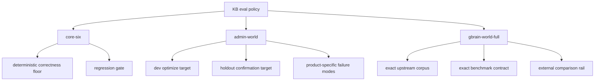
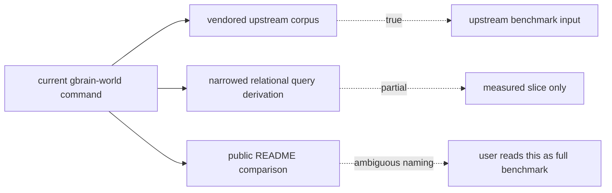
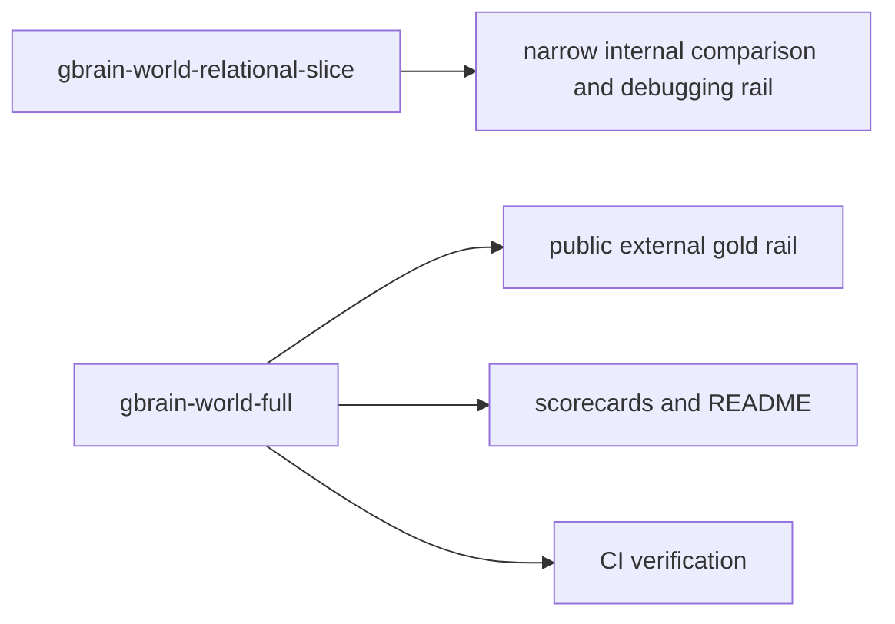

# feat: establish a strict three-rail KB eval benchmark contract

## Summary

Clarify and harden the public KB eval story around three explicit rails:

- `core-six` as the deterministic correctness floor
- `admin-world` as the product-core optimize and holdout benchmark
- `gbrain-world-full` as the external gold-standard benchmark, meaning our KB scored on the exact upstream GBrain dataset and evaluated query surface

The plan should remove the current ambiguity where `gbrain-world` mixes "upstream corpus" with "our narrowed relational slice", then wire docs, runner contracts, and CI around the stricter three-rail vocabulary.

---

## Problem Frame

The repo now has the right instinct but an unclear external-comparison contract.

Today:

- `core-six` is a deterministic local suite and does its job well as a correctness floor
- `admin-world-v3` is the product-core retrieval benchmark and now has stronger dev and holdout coverage
- `gbrain-world` uses a vendored upstream `world-v1` corpus, but the current runner only derives and scores the four primary relational families (`attended`, `works_at`, `invested_in`, `advises`) rather than the full richer dataset shape present in the corpus

That makes the README and benchmark posture directionally right but semantically muddy:

- the vendored corpus is upstream and real relative to GBrain
- our measured score on it is real
- but the current `gbrain-world` benchmark name sounds like "full GBrain benchmark" when it is actually a narrowed slice

For a public quality story, that ambiguity is a problem. The benchmark ladder needs to be obvious:

- what is our own deterministic floor
- what is our own product benchmark
- what is the external gold benchmark we want to approach

This plan is not about improving retrieval quality directly. It is about making the benchmark contract strict enough that future scores and claims are trustworthy.

---

## Requirements

### Three-Rail Benchmark Contract

- R1. The repo must define exactly three first-class public benchmark rails: `core-six`, `admin-world`, and `gbrain-world-full`.
- R2. Each rail must have a distinct job:
  - `core-six` blocks deterministic correctness regressions
  - `admin-world` drives product-core optimization and holdout confirmation
  - `gbrain-world-full` provides an external gold-standard comparison
- R3. The repo must stop presenting the current narrowed `gbrain-world` slice as if it were the full upstream benchmark.

### Strict GBrain Benchmark Semantics

- R4. `gbrain-world-full` must mean our KB scored on the exact upstream vendored `world-v1` dataset and the full evaluated query surface that the repo chooses to standardize as the GBrain benchmark contract.
- R5. The benchmark definition must pin the upstream commit and explain clearly what is imported, what is derived, and what is measured.
- R6. If the current narrowed relational benchmark remains useful, it must be renamed so it cannot be confused with the strict external rail.

### Public Clarity

- R7. README and benchmark docs must show:
  - our score on `core-six`
  - our score on `admin-world`
  - our score on `gbrain-world-full`
  - the external GBrain reference headline as a separate comparison, not our score
- R8. The docs must state plainly whether a given score is:
  - our measured score
  - an upstream reference score
  - a narrowed internal slice
- R9. The public benchmark story must stay honest about what is product-owned versus upstream-comparable.

### Runner And Artifact Contract

- R10. Runner commands, scorecard artifacts, and machine-readable outputs must encode the three-rail vocabulary explicitly.
- R11. CI and maintainer verification must run the rails intentionally rather than relying on an ambiguous `gbrain-world` command.
- R12. Existing `admin-world` and `core-six` work must remain intact while the external rail is clarified.

### Scope Control

- R13. This work must stay focused on benchmark-definition rigor, naming, runner coverage, artifact clarity, and gating.
- R14. This work must not turn into a full retrieval redesign, model-judge program, or broad end-to-end agent-eval rewrite.

---

## Scope Boundaries

### In Scope

- defining the strict three-rail eval vocabulary
- splitting or renaming the current `gbrain-world` benchmark surface as needed
- adding a strict `gbrain-world-full` benchmark contract
- updating loaders, runner semantics, docs, scorecards, and tests to reflect that contract
- adjusting CI and maintainer verification so the three rails are explicit

### Deferred to Follow-Up Work

- closing the external-reference gap by improving `kb-core` retrieval behavior
- adding new model-judged or end-to-end agent benchmarks
- building dashboards or historical benchmark trend infrastructure
- inventing a fourth benchmark rail for every adjacent surface

### Outside This Product's Identity

- claiming parity with GBrain before the strict external rail exists and is green enough to justify that language
- collapsing `admin-world` into the GBrain benchmark
- replacing deterministic KB correctness checks with only an external leaderboard-style benchmark

---

## High-Level Technical Design

The intended benchmark contract should be explicit and non-overlapping:

The current ambiguity lives at the external rail:

The planned shape separates these surfaces:

The main design decision is not just "load more queries." It is "make the benchmark names and outputs impossible to misread."

---

## Key Technical Decisions

- KTD1. Promote the three-rail model to the public contract.
  `core-six`, `admin-world`, and `gbrain-world-full` should be the only top-level benchmark names in README and release messaging.

- KTD2. Reserve `gbrain-world-full` for strict semantics only.
  The name should not be used until the runner actually evaluates the full benchmark contract the repo adopts as equivalent to the upstream GBrain benchmark.

- KTD3. Preserve the current narrowed relational benchmark only if it has a clear secondary role.
  If it remains useful for fast iteration, ablations, or graph-lift diagnostics, keep it under a distinct name such as `gbrain-world-relational-slice`. Otherwise remove it.

- KTD4. Keep the external rail separate from the product rail.
  `admin-world` remains the optimize target even after the strict GBrain rail exists. The external benchmark informs credibility; it should not define the entire product quality bar.

- KTD5. Make measured scores and reference scores structurally distinct.
  A score produced by our runner and a headline reported in the upstream GBrain materials should never occupy the same field without explicit labeling.

- KTD6. Use machine-readable benchmark identities.
  Artifacts, test assertions, and CI should operate on explicit benchmark IDs rather than README prose so contract drift is detectable.

---

## Alternative Approaches Considered

- Keep the current `gbrain-world` name and explain the nuance in README prose.
  Rejected because naming ambiguity would remain and future readers would still collapse "upstream corpus" with "full upstream benchmark."

- Replace `admin-world` with the GBrain benchmark as the main optimize target.
  Rejected because the product-specific benchmark has a different and necessary job.

- Remove the narrowed relational slice entirely.
  Not chosen by default. It may still be useful as an internal diagnostic surface, but only under a clearly subordinate name.

---

## System-Wide Impact

- `eval/runner/loaders.ts` will likely gain distinct loading paths or query-manifest generation paths for the strict external rail versus any retained slice benchmark.
- `eval/runner/kb-benchmark.ts`, `eval/runner/kb-eval.ts`, and scorecard structures will need stronger benchmark identity metadata.
- `README.md` and `docs/operations/kb-benchmark.md` will move from a loosely described benchmark stack to a stricter contract.
- `tests/kb-benchmark.test.ts` and docs tests become the guardrails that keep benchmark naming honest.
- CI and maintainer commands in `package.json` may split current eval commands into clearer public and internal variants.

---

## Risks & Dependencies

- If the full upstream GBrain benchmark contract is under-specified locally, implementation may need a short discovery step before runner changes settle.
- Renaming current commands and score outputs can break existing maintainer habits if the migration path is not explicit.
- If the strict external rail is much heavier than the current slice, CI may need a tiered verification strategy to avoid making every edit path expensive.
- Public README changes can outrun implementation if naming is updated before the actual runner semantics are correct.
- If the retained narrowed slice is not clearly justified, it can continue confusing future maintainers even under a new name.

---

## Sources & Research

- Strategy and product direction:
  - `STRATEGY.md`
  - `README.md`
- Current benchmark contract and caveats:
  - `docs/operations/kb-benchmark.md`
  - `docs/benchmarks/kb-scorecard-latest.md`
  - `docs/benchmarks/kb-scorecard-latest.json`
- Current external corpus pinning:
  - `eval/data/gbrain-world-v1/README.md`
- Current benchmark loading and query derivation:
  - `eval/runner/loaders.ts`
  - `eval/runner/kb-benchmark.ts`
  - `eval/runner/kb-eval.ts`
  - `eval/runner/shared.ts`
  - `eval/runner/types.ts`
- Current test coverage:
  - `tests/kb-benchmark.test.ts`
  - `tests/kb-cli-docs.test.ts`
- Related prior plan:
  - `docs/plans/2026-06-09-002-feat-kb-eval-hardening-plan.md`

---

## Implementation Units

### U1. Define the three-rail benchmark vocabulary and public contract

- **Goal:** Establish the explicit public meaning of `core-six`, `admin-world`, and `gbrain-world-full`, and define the role of any retained narrowed GBrain slice.
- **Requirements:** R1, R2, R3, R7, R8, R9
- **Dependencies:** none
- **Files:** `README.md`, `docs/operations/kb-benchmark.md`, `docs/benchmarks/kb-scorecard-latest.md`, `docs/benchmarks/kb-scorecard-latest.json`, `tests/kb-cli-docs.test.ts`
- **Approach:** Rewrite benchmark documentation around three named rails. Make the docs distinguish "our measured score" from "upstream reference score" and from "narrowed internal slice." If the narrowed benchmark remains, describe it as subordinate and internal-first rather than equal to the public gold rail.
- **Patterns to follow:** Existing eval policy language in `README.md`; current benchmark-role separation established in `docs/plans/2026-06-09-002-feat-kb-eval-hardening-plan.md`.
- **Test scenarios:**
  - Docs describe exactly three public rails and do not use ambiguous `gbrain-world` wording for the strict external rail.
  - Docs distinguish our measured score from the upstream GBrain reference headline.
  - Docs mention the narrowed slice only if it still exists and describe it as distinct from the full benchmark.
  - Scorecard artifacts expose the same vocabulary as the README rather than drifting into older names.
- **Verification:** A new reader can tell, from repo docs alone, what the three rails are and which one is the external gold benchmark.

### U2. Split benchmark identities between strict full GBrain and any retained narrowed slice

- **Goal:** Remove semantic overloading from the current `gbrain-world` runner path by giving the strict external rail and the narrowed slice separate benchmark identities.
- **Requirements:** R3, R4, R5, R6, R10
- **Dependencies:** U1
- **Files:** `eval/runner/loaders.ts`, `eval/runner/kb-benchmark.ts`, `eval/runner/kb-eval.ts`, `eval/runner/types.ts`, `package.json`, `tests/kb-benchmark.test.ts`
- **Approach:** Introduce explicit benchmark IDs and command surfaces for the strict external rail and the retained slice, if any. The loader/runner layer should stop assuming that one `gbrain-world` label can cover both the vendored corpus input and the specific query derivation shape. Use benchmark metadata to make the distinction visible in machine-readable outputs.
- **Patterns to follow:** Existing explicit corpus provenance and benchmark-tier metadata in `eval/runner/types.ts`; current side-by-side command structure in `eval/runner/kb-benchmark.ts`.
- **Test scenarios:**
  - Running the strict external benchmark emits a distinct benchmark identity from the narrowed slice.
  - The retained slice command, if present, cannot be mistaken in output for the strict full benchmark.
  - Machine-readable outputs include enough metadata to distinguish benchmark contract, corpus source, and score provenance.
  - Existing `admin-world` and `core-six` commands remain stable.
- **Verification:** Command output, JSON output, and scorecard artifacts all identify the benchmark unambiguously.

### U3. Implement the strict `gbrain-world-full` benchmark contract

- **Goal:** Make `gbrain-world-full` mean our KB scored on the full adopted upstream GBrain benchmark contract rather than only the current four-family relational slice.
- **Requirements:** R4, R5, R10, R11
- **Dependencies:** U2
- **Files:** `eval/data/gbrain-world-v1/README.md`, `eval/runner/loaders.ts`, `eval/runner/kb-benchmark.ts`, `tests/kb-benchmark.test.ts`, `docs/operations/kb-benchmark.md`
- **Approach:** Define what "full" means in repo-owned terms while staying faithful to the upstream benchmark. That includes the pinned corpus input, the adopted evaluated query surface, and the scoring contract. If any query derivation must remain local rather than checked in as qrels, document it precisely. If implementation reveals that the full benchmark requires a checked-in manifest rather than pure derivation, capture that in the runner/data design instead of leaving it implicit.
- **Execution note:** Start with characterization tests that encode the benchmark contract before changing loader behavior.
- **Patterns to follow:** Current vendored corpus pinning and benchmark provenance notes in `eval/data/gbrain-world-v1/README.md`.
- **Test scenarios:**
  - The strict external benchmark loads the full adopted query surface rather than the current 145-query relational subset.
  - Test coverage asserts the expected query count and family/shape mix for the strict benchmark contract.
  - Upstream corpus pin and local benchmark-contract documentation remain aligned.
  - Running the strict benchmark still produces the standard retrieval metric set (`P@k`, `Recall@k`, `MRR@k`, `nDCG@k`).
- **Verification:** The repo can point to one strict benchmark command and one benchmark definition file or derivation contract and say, without caveat, "this is our score on the full adopted GBrain benchmark."

### U4. Rewire CI, maintainer verification, and score reporting around the strict three rails

- **Goal:** Ensure maintainer flows and CI verify the benchmark ladder intentionally instead of through ambiguous legacy commands.
- **Requirements:** R10, R11, R12
- **Dependencies:** U2, U3
- **Files:** `package.json`, `.github/workflows/ci.yml`, `.github/workflows/publish.yml`, `tests/kb-benchmark.test.ts`, `tests/kb-cli-docs.test.ts`
- **Approach:** Update verification commands to run the three rails explicitly, with the external gold rail separated from the product-core benchmark. Keep CI cost proportional by deciding which rails must run on every change versus on release or heavier verification paths. Preserve the current deterministic and product-core gates while adding the stricter external rail in a way that can fail loudly when benchmark semantics drift.
- **Patterns to follow:** Existing `verify:kb:evals` command and CI wiring; recent shift to `node --import tsx/esm` command surfaces for sandbox-safe execution.
- **Test scenarios:**
  - Maintainer verification commands exercise `core-six`, `admin-world`, and `gbrain-world-full` intentionally.
  - CI config references the strict external benchmark by its explicit new identity.
  - Docs tests fail if the public benchmark ladder drifts from the actual commands.
  - Benchmark tests fail if strict and narrowed GBrain surfaces collapse back into one ambiguous identity.
- **Verification:** A maintainer can run one verification flow and see all three rails represented distinctly.

### U5. Align public score presentation with measured-vs-reference semantics

- **Goal:** Make benchmark outputs and README snapshots communicate the right comparison story: our score on the external benchmark versus the upstream GBrain reference score.
- **Requirements:** R7, R8, R9, R10
- **Dependencies:** U1, U3, U4
- **Files:** `README.md`, `docs/benchmarks/kb-scorecard-latest.md`, `docs/benchmarks/kb-scorecard-latest.json`, `eval/runner/shared.ts`, `eval/runner/kb-benchmark.ts`, `tests/kb-cli-docs.test.ts`, `tests/kb-benchmark.test.ts`
- **Approach:** Adjust human-readable and machine-readable artifacts so benchmark presentation is structurally correct. The report should make it obvious which numbers are ours, which numbers are upstream reference, and which benchmark identity produced each result. Preserve the side-by-side usefulness of the current GBrain comparison while making the labeling strict.
- **Patterns to follow:** Existing scorecard artifact generation in `eval/runner/shared.ts`; current side-by-side output in `eval/runner/kb-benchmark.ts`.
- **Test scenarios:**
  - Score artifacts label our measured external score distinctly from the upstream reference headline.
  - README score presentation matches the runner output vocabulary.
  - Side-by-side benchmark output remains understandable after the identity split.
  - No remaining public-facing doc implies that the narrowed slice is the full benchmark.
- **Verification:** Public score presentation becomes accurate enough that an external reviewer can understand the benchmark ladder without oral explanation.

---

## Deferred Implementation Questions

- Does the full adopted GBrain benchmark contract need a checked-in query manifest, or can it still be derived deterministically from the vendored corpus without ambiguity?
- Should the narrowed relational slice remain as a named diagnostic rail, or is the added maintenance cost not worth it once `gbrain-world-full` exists?
- What is the right CI cadence for `gbrain-world-full` if the full benchmark is materially heavier than the current slice?

