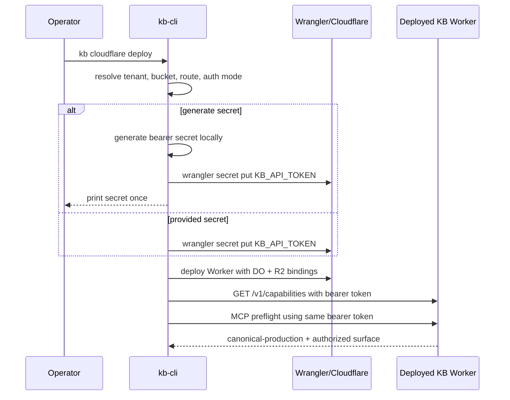

# feat: Add Cloudflare MCP surface and shared remote auth for KB

## Summary

Add a deployable MCP surface for the Cloudflare-native KB without replacing `kb-http` as the canonical production contract. The first release should share one deployed auth model across `/v1` and `/mcp`, let operators bootstrap a secret at deploy time, and let `kb-cli` connect to the protected remote KB cleanly.

---

## Problem Frame

The repo already has the production spine the product wants: Worker-hosted `kb-http`, Cloudflare-backed canonical state, and `kb-cli` as the operator surface. The missing pieces are the ones the ideation doc isolated:

- there is no MCP surface for the deployed KB
- there is no first-class remote auth contract for `kb-cli`
- the Cloudflare setup story is still manual and HTTP-only

If MCP is bolted on as a parallel product, the repo will drift away from its own deployment model. If auth is solved separately for HTTP, MCP, and CLI, the first release will hard-code contract drift into the public surface.

---

## Requirements

### Production Surface

- R1. `kb-http` remains the canonical deployed KB contract for reads, writes, inspection, and verification. MCP is an additional client surface over the same tenant-scoped runtime, not a replacement production contract.
- R2. A deployed Cloudflare KB can expose an external MCP endpoint over HTTP on the same Worker boundary as `/v1/...`, backed by the same Durable Object and canonical R2 state.
- R3. The deployed capability envelope continues to state tenant, backend, transport, canonicality, and workspace role, and the new MCP surface must not weaken that parity discipline.
- R4. Operator-only surfaces remain narrower than the normal production surface. Scope enforcement must distinguish read, write, and operator permissions across both `/v1` and `/mcp`.

### Auth And Access

- R5. The first release implements a real machine-to-machine bearer-token path for the deployed KB surface and uses the same token model for HTTP and MCP access.
- R6. The deployed auth contract must support per-scope enforcement (`kb.read`, `kb.write`, `kb.operator`) and produce consistent authorization failures (`401` for missing/invalid credentials, `403` for insufficient scope).
- R7. The first release must not pretend to implement a full OAuth authorization server for MCP. It should keep the code structure and config shape ready for a later OAuth-capable MCP mode without advertising unsupported behavior.

### CLI And Deployment

- R8. `kb-cli` can call a protected deployed KB without relying on a raw unauthenticated `KB_BASE_URL` flow. The HTTP executor must be able to send the configured bearer token on every request.
- R9. Operators can bootstrap the secret during Cloudflare setup in one of two ways: generate-and-install a new secret during deploy, or install a provided secret without generation.
- R10. The deploy/setup workflow continues to reinforce the existing product story: one Worker per tenant boundary, one DO namespace, one canonical R2 bucket, and one canonical Cloudflare-hosted KB surface.

### Verification And Release

- R11. Tests cover the new auth middleware, MCP tool routing, CLI remote auth path, and deploy/bootstrap behavior with realistic scope and failure cases.
- R12. Public docs and skills explain the protected remote KB story without turning local or mirror modes into peer production paths.
- R13. Public package/version boundaries are updated intentionally for every changed package, with release notes and docs aligned to the new remote/MCP surface.

---

## Assumptions

- The first implementation pass stops at shared-secret auth for deployed KB access. Full OAuth authorization-server support for external MCP clients is deferred.
- The first CLI pass prioritizes explicit remote auth and deploy bootstrap over a richer long-lived multi-profile registry. The existing env-driven path stays compatible where possible.

---

## High-Level Technical Design

The deployed runtime stays centered on one Worker host. `kb-http` remains the canonical JSON contract and becomes the owner of the shared remote auth substrate. A new `kb-mcp` package adapts the same service layer into MCP tools and reuses the same auth context and scope model.

```mermaid
flowchart TB
  A[kb-cli operator] -->|deploy bootstrap| B[Wrangler + Worker config]
  A -->|HTTP with bearer token| C[kb-http fetch handler]
  D[MCP client] -->|Streamable HTTP + bearer token| E[kb-mcp handler]
  C --> F[shared auth + scope enforcement]
  E --> F
  F --> G[KnowledgeBaseService]
  G --> H[Durable Object snapshot state]
  H --> I[canonical R2 export]
  C --> J[/v1 capabilities inspect doctor search writes]
  E --> K[/mcp tools and MCP metadata]
```

The deploy/bootstrap path should generate the secret locally when requested, install it into Worker secrets, and print it once. The Worker never exposes the secret back after deployment.



---

## Output Structure

```text
packages/
  kb-http/
    src/
      auth.ts
      cloudflare-worker.ts
      fetch-handler.ts
      server.ts
      types.ts
  kb-mcp/
    package.json
    tsconfig.json
    README.md
    src/
      index.ts
      cloudflare-worker.ts
      mcp-server.ts
      tools.ts
tests/
  kb-http.test.ts
  kb-cli.test.ts
  kb-mcp.test.ts
docs/
  cloudflare-agent-setup.md
  consumer-quickstart.md
packages/kb-cli/
  src/
    index.ts
    remote-auth.ts
    cloudflare-deploy.ts
  skills/
    kb-cloudflare-setup/
      SKILL.md
```

---

## Scope Boundaries

### In Scope

- shared bearer-token auth for deployed HTTP and MCP surfaces
- a deployable MCP adapter over the existing Cloudflare KB runtime
- CLI support for authenticated remote KB access
- deploy-time secret bootstrap for Cloudflare setup
- docs, skills, and test updates needed to ship the surface

### Deferred To Follow-Up Work

- full OAuth authorization-server support for external MCP clients
- richer long-lived remote profile management beyond the minimum authenticated remote path
- multi-tenant control plane behavior or cross-tenant brokering

### Outside This Product's Identity

- customer-specific webhook bridges, chat bridges, or app-specific OAuth callback products
- making local file mode or mirror mode a second production deployment story

---

## Key Technical Decisions

- KTD1. Keep `kb-http` as the canonical production contract and add MCP as an adjacent package, `packages/kb-mcp`, rather than moving protocol responsibility into `kb-cli`.
  This matches the repo’s Cloudflare-first deployment model, keeps one Worker-hosted runtime truth, and avoids making the CLI the production boundary.

- KTD2. Put the shared deployed auth substrate in `kb-http`, then have `kb-mcp` consume it.
  Auth is a host/runtime concern, not a CLI concern and not a storage concern. The existing fetch-handler boundary in `kb-http` is the narrowest durable layer for request parsing, auth context creation, scope checks, and consistent `401`/`403` behavior.

- KTD3. The first release implements shared-secret bearer auth only, with OAuth-ready extension points but no fake OAuth metadata flow.
  The repo needs a usable machine path immediately for `kb-cli` and operator setup. Advertising a partially implemented OAuth story would create an interoperability trap for MCP clients.

- KTD4. Use one scope model across HTTP and MCP: `kb.read`, `kb.write`, and `kb.operator`.
  The codebase already distinguishes normal surfaces from operator-only repair surfaces. Reusing that split in auth keeps capability parity and avoids a later breaking permission redesign.

- KTD5. Keep the initial CLI migration small: preserve `KB_BASE_URL`, add explicit token-aware remote auth inputs, and add a deploy/bootstrap command instead of a broader profile manager.
  This gives outside users a credible authenticated remote path without forcing a larger config-management feature into the first release.

- KTD6. Secret bootstrap is a CLI-side deploy concern, not a Worker API concern.
  The safe interpretation of “return the secret on deployment” is “generate locally, install into Worker secrets, print once to the deployer,” not “store and later reveal it from the running Worker.”

---

## System-Wide Impact

- Public package surface widens: `kb-http` and `kb-cli` both gain new remote behavior, and a new `kb-mcp` package introduces an additional deployment-facing artifact.
- The deployment docs and setup skill become more authoritative because they now cover both authenticated HTTP and MCP access.
- Verification posture changes: smoke coverage must now prove both `/v1` and `/mcp` access paths under the same deployed auth model.
- This is a public contract change. Package version bumps, release notes, and consumer docs are part of the implementation, not cleanup.

---

## Risks And Dependencies

- Cloudflare MCP transport details and MCP auth requirements are still moving. The implementation should stay on the narrowest standards-compliant shape and avoid overcommitting to a premature OAuth server story.
- Public-surface auth mistakes are expensive. If scope mapping is inconsistent across HTTP and MCP, the first release will ship permission drift.
- `kb-cli` already has Cloudflare-specific bootstrap/auth helpers for R2 sync. Reuse is likely, but mixing deploy auth, remote API auth, and R2 temp credentials carelessly could produce confusing operator behavior.
- Adding a new public package means release discipline, docs, and semver decisions must be explicit in the same work.

---

## Sources And Research

### Local Patterns

- `packages/kb-http/src/fetch-handler.ts`
- `packages/kb-http/src/server.ts`
- `packages/kb-http/src/types.ts`
- `packages/kb-cli/src/index.ts`
- `packages/kb-cli/src/cloudflare-auth.ts`
- `packages/kb-storage-cloudflare/src/state-cloudflare-do.ts`
- `tests/kb-http.test.ts`
- `tests/kb-cli.test.ts`
- `docs/cloudflare-agent-setup.md`
- `docs/product/deployment-model.md`
- `packages/kb-cli/skills/kb-cloudflare-setup/SKILL.md`

### External References

- Cloudflare Workers secrets: `wrangler secret put`, bulk secrets, and `wrangler deploy --secrets-file`
- Cloudflare MCP transport guidance: RPC is internal-only and does not support auth; external authenticated clients should use Streamable HTTP
- MCP authorization spec: bearer tokens on every request, protected-resource metadata for OAuth-capable servers, `401`/`403` behavior, and audience validation rules

---

## Implementation Units

### U1. Add a shared deployed auth layer to `kb-http`

- **Goal:** Give the deployed Cloudflare host one request-auth and scope-enforcement path that can be reused by both `/v1` and `/mcp`.
- **Requirements:** R3, R4, R5, R6, R7
- **Dependencies:** None
- **Files:** `packages/kb-http/src/auth.ts`, `packages/kb-http/src/fetch-handler.ts`, `packages/kb-http/src/server.ts`, `packages/kb-http/src/types.ts`, `packages/kb-http/README.md`, `tests/kb-http.test.ts`
- **Approach:** Introduce auth configuration and request-context types in `kb-http`. The fetch layer should parse bearer credentials, resolve scopes, and attach an auth context before route dispatch. Route handlers should declare which scope they require and return consistent `401`/`403` envelopes instead of relying on caller-specific wrappers.
- **Execution note:** Start with failing HTTP contract tests for unauthenticated, wrong-scope, and valid-scope requests before reshaping the fetch path.
- **Patterns to follow:** Existing capability envelope handling in `packages/kb-http/src/server.ts`; current JSON error handling in `packages/kb-http/src/fetch-handler.ts`; operator-surface split in `packages/kb-cli/src/index.ts`
- **Test scenarios:**
  - GET `/v1/capabilities` with a valid read token returns the existing capability envelope plus any auth-relevant metadata that operators need to inspect the surface.
  - GET `/v1/inspect` without credentials on a protected deployed host returns `401` with a consistent auth challenge/error envelope.
  - POST `/v1/record` with a read-only token returns `403` and does not invoke the service write path.
  - POST `/v1/record` with a write token succeeds and preserves the existing response envelope.
  - POST `/v1/rebuild` or GET `/v1/export` with a write token but no operator scope returns `403`.
  - Malformed or non-bearer authorization headers return `401` without leaking token contents.
  - Local/file-backed test harness paths that do not opt into deployed auth still behave as they do today.
- **Verification:** An implementer can protect the deployed HTTP surface with one auth configuration and prove that route-level scope checks are enforced centrally rather than by each caller.

### U2. Introduce `kb-mcp` as an adjacent Worker-facing package

- **Goal:** Expose a deployable MCP endpoint over the same Worker/runtime boundary as the canonical KB without replacing `kb-http`.
- **Requirements:** R1, R2, R3, R4, R6, R7
- **Dependencies:** U1
- **Files:** `packages/kb-mcp/package.json`, `packages/kb-mcp/tsconfig.json`, `packages/kb-mcp/README.md`, `packages/kb-mcp/src/index.ts`, `packages/kb-mcp/src/cloudflare-worker.ts`, `packages/kb-mcp/src/mcp-server.ts`, `packages/kb-mcp/src/tools.ts`, `tests/kb-mcp.test.ts`, `package.json`
- **Approach:** Add a new package that maps core KB operations into MCP tools over Streamable HTTP. The Worker-side entrypoint should reuse the auth context from U1 and expose only the tool surface the current scopes permit. Keep the first tool set narrow and aligned to the existing KB verbs: inspect/capabilities, search/query, remember/record/relate/annotate, and operator-only repair tools only when explicitly authorized.
- **Technical design:** Directional guidance only: organize MCP tools by scope boundary, not by every internal helper. The tool catalog should mirror the repo’s normal/operator split instead of exporting raw service internals.
- **Patterns to follow:** `packages/kb-http/src/cloudflare-worker.ts` as the Worker-host adapter pattern; `packages/kb-cli/src/index.ts` command surface for which operations are considered normal versus operator-only
- **Test scenarios:**
  - MCP endpoint can initialize over HTTP on a canonical Cloudflare host and expose the expected read tools with a read-scoped token.
  - A read token cannot invoke write tools such as `record`, `relate`, `remember`, or `annotate`.
  - A write token can invoke standard mutation tools, and the underlying KB service receives the expected payload shape.
  - Operator-only MCP tools are hidden or rejected unless the caller has `kb.operator`.
  - MCP auth failures return the expected HTTP-level `401` or `403` behavior rather than generic transport errors.
  - The package does not advertise OAuth-only metadata or flows when only shared-secret mode is configured.
- **Verification:** A deployed Worker can host both `/v1` and `/mcp`, both backed by the same tenant runtime and both enforcing the same scope model.

### U3. Extend `kb-cli` for authenticated remote KB access

- **Goal:** Make the existing remote HTTP mode usable against a protected deployed KB without forcing users into an unauthenticated `KB_BASE_URL` path.
- **Requirements:** R5, R6, R8
- **Dependencies:** U1
- **Files:** `packages/kb-cli/src/index.ts`, `packages/kb-cli/src/remote-auth.ts`, `packages/kb-cli/README.md`, `tests/kb-cli.test.ts`
- **Approach:** Teach the HTTP executor to send `Authorization: Bearer ...` on every remote request when configured through env or explicit CLI inputs. Keep the current `KB_BASE_URL` targeting model intact while adding the minimum token-aware remote path and help/schema text that makes the protected remote surface discoverable.
- **Execution note:** Add characterization coverage for the current HTTP mode first so the new auth path does not accidentally regress existing local-daemon behavior.
- **Patterns to follow:** Current HTTP executor in `packages/kb-cli/src/index.ts`; existing Cloudflare auth helper style in `packages/kb-cli/src/cloudflare-auth.ts`
- **Test scenarios:**
  - Remote CLI requests send the configured bearer token on every HTTP call, including `inspect`, `search`, and write commands.
  - Missing token against a protected remote endpoint surfaces a clear auth error instead of a vague JSON parsing or connection error.
  - Wrong-scope responses from the server are surfaced clearly to the operator.
  - Existing local mode and local-daemon mode continue to work without remote auth configuration.
  - Help output and remote usage guidance tell the operator how to target a protected deployed KB without exposing operator-only repair commands by default.
- **Verification:** A clean consumer can point `kb-cli` at a protected deployed KB and successfully run authenticated read and write operations through the existing command surface.

### U4. Add Cloudflare deploy/bootstrap support for MCP-ready KB hosts

- **Goal:** Turn the current manual Cloudflare KB setup into a repeatable CLI-driven bootstrap flow that can install the remote auth secret and stand up an MCP-capable Worker host.
- **Requirements:** R8, R9, R10, R12
- **Dependencies:** U1, U2, U3
- **Files:** `packages/kb-cli/src/cloudflare-deploy.ts`, `packages/kb-cli/src/index.ts`, `packages/kb-cli/skills/kb-cloudflare-setup/SKILL.md`, `docs/cloudflare-agent-setup.md`, `docs/consumer-quickstart.md`, `tests/kb-cli.test.ts`
- **Approach:** Add a bounded Cloudflare setup command surface in `kb-cli` that gathers tenant/bucket/route/auth inputs, generates a secret locally when requested, installs it with Wrangler, and verifies the resulting deployed host. The generated or guided Worker wrapper should compose the canonical `kb-http` surface and the new `kb-mcp` surface into one tenant-scoped Worker deployment.
- **Technical design:** Directional guidance only: prefer template generation or guided file emission that reuses the current documented Worker wrapper pattern rather than inventing a second deployment architecture.
- **Patterns to follow:** `docs/cloudflare-agent-setup.md`; `packages/kb-cli/skills/kb-cloudflare-setup/SKILL.md`; Cloudflare auth helpers already used for R2 sync bootstrapping
- **Test scenarios:**
  - Generate-and-install flow creates a local secret, passes it to Wrangler secret installation, and prints it once without persisting it in generated Worker code.
  - Provided-secret flow installs the supplied secret without generating a replacement.
  - Verification step checks `/v1/capabilities` for `canonical-production` and confirms the protected MCP endpoint is reachable with the same token.
  - Existing cloudflare-setup skill/docs remain accurate for operators who follow the guided flow rather than invoking the CLI directly.
  - Failure cases such as missing Wrangler auth, missing bucket config, or deployment verification failure surface actionable operator errors.
- **Verification:** An operator can stand up a canonical Cloudflare KB host, install its auth secret safely, and confirm both `/v1` and `/mcp` are usable from the same deployment story.

### U5. Ship tests, docs, and release updates for the widened remote surface

- **Goal:** Make the new MCP/auth/deploy surface shippable as a public package change rather than an internal-only feature branch.
- **Requirements:** R11, R12, R13
- **Dependencies:** U1, U2, U3, U4
- **Files:** `tests/kb-http.test.ts`, `tests/kb-cli.test.ts`, `tests/kb-mcp.test.ts`, `README.md`, `CHANGELOG.md`, `packages/kb-http/package.json`, `packages/kb-cli/package.json`, `packages/kb-mcp/package.json`, `docs/product/deployment-model.md`, `docs/product/cloudflare-first-compounding-kb.md`
- **Approach:** Update the public docs and release metadata so they describe one Cloudflare-first deployed KB with authenticated HTTP and MCP access. Bump package versions intentionally, add release-note language for the new public surfaces, and ensure the docs do not overclaim OAuth behavior or broaden local/mirror modes into production peers.
- **Patterns to follow:** Recent package hardening and Cloudflare-first positioning docs under `docs/plans/2026-06-09-001-feat-kb-open-source-package-hardening-plan.md`; current `CHANGELOG.md` discipline from `AGENTS.md`
- **Test scenarios:**
  - Public docs and package READMEs point to one consistent protected remote setup flow for HTTP and MCP.
  - Docs and setup skills explicitly distinguish shared-secret auth in v1 from deferred OAuth follow-up.
  - Package metadata and exports are valid for the new package and any widened existing packages.
  - Changelog/release notes identify customer-visible impact and migration expectations for authenticated remote KB access.
  - Test expectation: none for benchmark behavior change itself unless implementation alters retrieval logic; if the final change touches documented HTTP contract meaningfully, benchmark and smoke verification requirements are still captured in the release checklist.
- **Verification:** A reviewer can inspect the published docs and package metadata and see one coherent story for deploying, authenticating, and consuming the Cloudflare-native KB over HTTP and MCP.

---

## Verification Strategy

- Contract tests for `kb-http` auth enforcement and capability/inspect parity
- MCP endpoint tests for tool exposure, scope enforcement, and HTTP-level auth failures
- CLI tests for authenticated remote requests and deploy/bootstrap command behavior
- Documentation tests updated where they assert Cloudflare setup and remote usage flows
- Package build, typecheck, and targeted test coverage for touched packages
- Deployment smoke for a protected Cloudflare host proving `/v1/capabilities`, `/v1/inspect`, and MCP connectivity through the same auth secret

---

## Open Questions

- Whether the first-pass deploy bootstrap should emit a generated Worker wrapper into a target workspace or stay as a guided command that updates an existing deploy workspace. The implementation should answer this based on which path keeps the public surface smallest while remaining outsider-usable.
- Whether the first MCP tool set should include operator repair tools at all, even under `kb.operator`, or keep v1 to normal read/write verbs plus inspect. This should be resolved before implementation starts, not during coding, because it changes the public tool surface.
