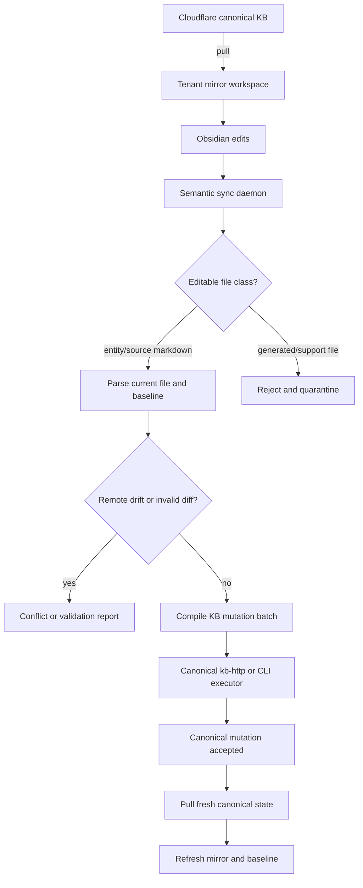

# Summary

Add a semantic sync lane for tenant mirror workspaces so humans can edit supported KB files directly in Obsidian while Cloudflare KB remains canonical. The daemon will detect supported file edits, compile them into KB mutations, reject unsupported/generated-file edits, and refresh the mirror from canonical state after successful writes.

## Problem Frame

Today the mirror daemon is a file-level `pull` / `push` loop over the canonical R2 layout. That is fine for support and migration work, but it is too blunt for human authoring: direct markdown edits can bypass KB validation, drift structured relations, and silently treat generated files as if they were safe to overwrite. The missing product surface is a semantic translation layer between “human edited a file in Obsidian” and “canonical KB accepted a valid mutation.”

---

## Requirements

### Human Authoring And Canonicality

- R1. A tenant mirror workspace can be used as a first-class human authoring surface for supported KB records without making the mirror itself canonical.
- R2. Cloudflare-backed KB state remains the shared source of truth for cloud agents, local agents, and human edits; supported human edits must round-trip through KB mutation semantics before canonical state changes.
- R3. The daemon must detect supported file edits by comparing the edited mirror state against the last synced baseline, not by blindly pushing raw file bytes upstream.

### Editable Surface And Translation

- R4. The first supported human-edit surface must be explicit and narrow. It must identify which files are human-editable, which are generated/support-only, and how each supported edit maps to KB mutations.
- R5. Supported entity and source edits must compile into deterministic KB mutations using the existing service semantics wherever possible, introducing new command or route surface only when the existing mutation set cannot express a safe round-trip.
- R6. Unsupported or ambiguous edits must fail closed with actionable feedback; they must not silently rewrite canonical state.

### Safety, Conflicts, And Observability

- R7. The daemon must detect remote drift before applying a locally edited record so a human edit does not overwrite newer canonical state.
- R8. Validation failures, unsupported edits, and remote conflicts must be preserved in a reviewable local quarantine or conflict surface so the human does not lose work.
- R9. Operator status surfaces must distinguish raw mirror health from semantic-sync health, including supported edits, rejected edits, and pending conflicts.

### Verification

- R10. Automated coverage must prove semantic diffing, command compilation, remote-drift handling, generated-file rejection, and successful mirror refresh after canonical writes.

---

## Key Technical Decisions

- KTD1. Keep Cloudflare KB canonical and treat the daemon as a semantic compiler, not a raw mirror pusher, for human-edited records. This preserves the repo’s Cloudflare-first production model and keeps validation, mutation hydration, and auth on the canonical path.
- KTD2. Introduce semantic sync as an explicit lane on top of the existing mirror flow rather than replacing raw `pull` / `push` behavior outright. Existing support and migration workflows still need byte-level mirror tooling; human authoring needs stricter semantics.
- KTD3. Limit v1 human-edit support to markdown-backed entity and source records. Generated JSON and sidecar artifacts such as drafts, events, links, registry, and meta files remain support-only until a human-authorable contract exists for them.
- KTD4. Compute semantic diffs against the last synced baseline copy, not only against the current local file. This is the only reliable way to separate “human changed this record” from “canonical changed since last pull” and to preserve conflict detection.
- KTD5. Prefer existing mutation surfaces (`record`, `annotate`, `capture-source`, `relate`, relation delete, rebuild/inspect/doctor) before inventing new public APIs. Add a new internal or public mutation surface only if current commands cannot safely express a supported round-trip.

---

## High-Level Technical Design



The semantic lane sits between local vault edits and canonical writes. The daemon remains responsible for transport and state refresh, but canonical mutations still happen through KB semantics rather than raw object replacement.

---

## Output Structure

```text
packages/kb-cli/src/semantic-sync/
  contract.ts
  diff.ts
  compile.ts
  apply.ts
tests/
  kb-obsidian-sync.test.ts
docs/operations/
  kb-obsidian-semantic-sync.md
```

The exact split may move during implementation, but the plan assumes a dedicated semantic-sync cluster inside `kb-cli` rather than burying the feature inside the existing raw R2 sync helpers.

---

## Scope Boundaries

### In Scope

- semantic human-authoring support for entity and source markdown files in tenant mirror workspaces
- daemon-side diffing, validation, conflict detection, and mutation compilation
- status/reporting surfaces for semantic sync outcomes
- preserving current raw mirror tooling for support and migration use cases

### Deferred To Follow-Up Work

- direct human authoring of explicit relations through a markdown-native relation grammar
- direct human authoring of events, drafts, registry entries, or meta/version state
- richer UI affordances on top of the daemon beyond Obsidian editing plus local reports

### Outside This Product’s Identity

- making the mirror workspace a peer source of truth to canonical Cloudflare KB
- last-write-wins raw file sync for human-edited records
- replacing explicit KB mutations with chat-memory-style implicit persistence

---

## System-Wide Impact

- `kb-cli` becomes responsible for two distinct sync lanes: raw support mirroring and semantic authoring sync. The operator UX must make that distinction obvious.
- `kb-core` parsing and document contracts become more user-facing because human edits now depend on stable markdown semantics.
- If current mutation surfaces cannot express safe source upserts or conflict-aware semantic apply, `kb-http` and CLI contracts may need narrowly-scoped additions. Any such addition must preserve the existing “canonical HTTP contract first, MCP adapter second” architecture.
- Mirror status is no longer only “files in sync or not.” It also needs semantic state such as rejected edits, drift conflicts, and last successful translation.

---

## Risks & Dependencies

- Risk: entity/source markdown is not enough to express all durable KB state. Mitigation: explicitly scope v1 to supported markdown surfaces and fail closed on generated/support artifacts.
- Risk: semantic compilation may introduce accidental public-surface expansion. Mitigation: exhaust current mutation surfaces first and add new routes only when they close a real round-trip gap.
- Risk: remote drift and local edits collide often in active tenants. Mitigation: baseline-aware diffing plus quarantine/conflict reports before any canonical write.
- Risk: daemon complexity grows until it becomes harder to reason about than the current raw mirror loop. Mitigation: isolate semantic-sync contract, compiler, and apply stages behind dedicated modules and tests.

---

## Implementation Units

### U1. Define the semantic authoring contract

- **Goal:** Establish which mirrored files are human-editable, which remain generated/support-only, and how semantic-sync state is represented locally.
- **Requirements:** R1, R4, R6, R9
- **Dependencies:** none
- **Files:** `packages/kb-cli/src/sync-daemon.ts`, `packages/kb-cli/src/r2-sync-lib.ts`, `packages/kb-cli/src/semantic-sync/contract.ts`, `tests/kb-r2-sync.test.ts`, `tests/kb-cli.test.ts`, `docs/operations/kb-r2-sync.md`, `docs/operations/kb-obsidian-semantic-sync.md`
- **Approach:** Add a semantic authoring policy layer on top of the existing mirror planner. It should classify canonical-layout files into human-editable markdown records, generated/support files, and daemon-owned state such as baselines and quarantines. Preserve the existing raw mirror state directories (`.kb-sync-base`, `.kb-sync-conflicts`, manifest) and extend them with semantic status rather than replacing them.
- **Execution note:** Start with characterization coverage around the current mirror planner and daemon summary shapes before introducing the new semantic policy outputs.
- **Patterns to follow:** Reuse the current mirror manifest and conflict-root patterns in `packages/kb-cli/src/r2-sync-lib.ts` and the compact daemon-status envelope pattern in `packages/kb-cli/src/sync-daemon.ts`.
- **Test scenarios:**
  - The semantic contract marks `entities/*.md` and `sources/*.md` as human-editable and classifies `drafts/*.json`, `events/*.json`, `links/**`, `registry/*.json`, and `meta/version.json` as support-only.
  - A mirror root containing daemon-owned state directories does not surface those files as editable or pushable user records.
  - `kb daemon status --stats` reports semantic-sync capability and distinguishes “raw mirror healthy” from “semantic sync blocked by conflicts.”
  - `kb sync status` on a mirror with only generated-file edits reports a rejected-edit state rather than a normal push candidate.
- **Verification:** An operator can inspect a tenant mirror and tell, from CLI output and docs, exactly which files a human may edit and how unsupported edits are surfaced.

### U2. Parse supported vault edits and compute semantic diffs

- **Goal:** Turn baseline-vs-edited markdown changes into structured semantic diffs for supported entity and source files.
- **Requirements:** R2, R3, R4, R7, R10
- **Dependencies:** U1
- **Files:** `packages/kb-cli/src/semantic-sync/diff.ts`, `packages/kb-core/src/documents.ts`, `packages/kb-core/src/types.ts`, `tests/kb-obsidian-sync.test.ts`
- **Approach:** Reuse the existing entity/source markdown parsers as the normalization boundary. Compare parsed baseline and edited records to classify safe field updates, additive timeline/citation changes, destructive or ambiguous rewrites, and parse/validation failures. Semantic diffing should be baseline-aware so it can detect drift when canonical state changed after the last pull.
- **Execution note:** Implement new diff logic test-first with focused fixtures for entity and source markdown variants.
- **Patterns to follow:** Mirror the strict frontmatter and section parsing in `packages/kb-core/src/documents.ts`; follow the explicit validation style already used for entity/source documents.
- **Test scenarios:**
  - Editing an entity’s `currentTruth`, tags, aliases, or owners yields a structured field-update diff rather than a raw text diff.
  - Adding one timeline bullet to an entity preserves existing timeline entries and classifies the change as additive rather than destructive.
  - Editing a source summary, content, or citations yields a structured source-update diff keyed by source ID.
  - Removing required frontmatter or renaming required sections fails validation with a record-specific error and no mutation batch.
  - Editing a record whose canonical version changed since the baseline was captured produces a remote-drift conflict instead of a mutation plan.
- **Verification:** Given baseline and edited markdown fixtures, the diff engine produces deterministic semantic classifications that an implementer can inspect without reading raw text patches.

### U3. Compile semantic diffs into canonical KB mutations

- **Goal:** Translate supported semantic diffs into deterministic KB mutation batches and apply them through canonical KB semantics.
- **Requirements:** R2, R5, R6, R10
- **Dependencies:** U2
- **Files:** `packages/kb-cli/src/semantic-sync/compile.ts`, `packages/kb-cli/src/semantic-sync/apply.ts`, `packages/kb-cli/src/index.ts`, `packages/kb-http/src/server.ts`, `tests/kb-obsidian-sync.test.ts`, `tests/kb-cli.test.ts`, `tests/kb-http.test.ts`
- **Approach:** Introduce a compiler stage that maps semantic diff classes onto existing KB operations. Full entity field updates should prefer `record`; additive timeline notes can use `annotate` when that preserves intent better than rewriting whole records; source document updates should use `capture-source` with explicit IDs unless that proves insufficient. If any safe round-trip cannot be expressed with the current command set, add the narrowest missing command or route and cover it through the same HTTP/CLI contract.
- **Patterns to follow:** Follow the current mutation-hydration envelopes and executor split in `packages/kb-cli/src/index.ts`; preserve the canonical route discipline in `packages/kb-http/src/server.ts`.
- **Test scenarios:**
  - An edited entity markdown file compiles into a `record`-shaped mutation and hydrates the updated entity after apply.
  - An additive timeline-only edit compiles into an `annotate` mutation and appends a new event without erasing prior history.
  - An edited source markdown file compiles into a stable `capture-source`-style upsert keyed by its existing source ID.
  - A semantic diff that implies unsupported destructive behavior, such as deleting historical links by removing prose, is rejected before any canonical write.
  - If a new HTTP or CLI mutation surface is introduced, read-only callers remain unchanged and scoped auth still distinguishes read/write/operator behavior.
- **Verification:** Supported file edits can be expressed as canonical KB mutations with predictable hydrated results and without bypassing the existing service layer.

### U4. Integrate semantic apply into the daemon and mirror lifecycle

- **Goal:** Make the daemon pull canonical state, detect local semantic edits, apply safe mutations, and refresh the mirror/baseline after success.
- **Requirements:** R1, R3, R7, R8, R9, R10
- **Dependencies:** U3
- **Files:** `packages/kb-cli/src/sync-daemon.ts`, `packages/kb-cli/src/sync.ts`, `packages/kb-cli/src/semantic-sync/apply.ts`, `tests/kb-cli.test.ts`, `tests/kb-r2-sync.test.ts`
- **Approach:** Preserve the current periodic pull loop, but branch local change handling into semantic apply for supported editable files. The daemon should debounce local edits, compile and apply only supported record changes, quarantine or conflict unsupported edits, then re-pull canonical state and refresh the baseline on success. Raw `push` remains available as an explicit support-mode path for workflows that are intentionally byte-level.
- **Patterns to follow:** Reuse the existing daemon status/log flow and the mirror conflict-root pattern; keep semantic apply state compact like the current JSON summaries rather than introducing opaque background state.
- **Test scenarios:**
  - When a user edits one entity markdown file locally and canonical state is unchanged, the daemon applies the semantic mutation, pulls fresh canonical state, and updates the baseline signature.
  - When a user edits a generated/support file, the daemon does not call canonical write surfaces and records a rejected-edit artifact locally.
  - When canonical state changed remotely since baseline, the daemon preserves the local edited file and writes a conflict artifact instead of overwriting canonical state.
  - When semantic apply succeeds but the follow-up pull fails, daemon status reports canonical write success plus mirror refresh failure instead of collapsing both states together.
  - Existing raw `kb sync push` behavior remains available for explicit support-mode use and is not silently invoked by semantic authoring mode.
- **Verification:** A running daemon can support an edit-save-sync loop for supported Obsidian edits without losing local work or degrading existing support mirroring flows.

### U5. Document and verify the Obsidian authoring workflow

- **Goal:** Ship a clear operator workflow and regression coverage for semantic authoring mode.
- **Requirements:** R1, R8, R9, R10
- **Dependencies:** U4
- **Files:** `README.md`, `docs/consumer-quickstart.md`, `docs/operations/kb-r2-sync.md`, `docs/operations/kb-obsidian-semantic-sync.md`, `tests/kb-cli-docs.test.ts`, `tests/kb-cli.test.ts`
- **Approach:** Document the recommended human workflow explicitly: canonical KB on Cloudflare, tenant mirror as local vault, Obsidian edits on supported markdown files, daemon translating edits into canonical mutations, and generated/support files remaining non-authoritative. Update docs/tests so the semantic lane is discoverable without weakening the existing Cloudflare-first positioning.
- **Patterns to follow:** Follow the repo’s capability-envelope language from `README.md`, `docs/consumer-quickstart.md`, and the current `inspect` / `verify` documentation style.
- **Test scenarios:**
  - Docs describe semantic authoring as a canonical-client workflow, not as a second source of truth.
  - Docs name which files are human-editable and which are support-only.
  - CLI/help docs expose semantic-sync status and conflict handling without implying that raw push is the default human authoring path.
  - A user following the quickstart can understand the end-to-end loop: pull, edit in Obsidian, semantic apply, refresh mirror, inspect status.
- **Verification:** A new operator can read the updated docs and adopt the Obsidian workflow without inferring an unsafe “edit any mirrored file and push it raw” model.

---

## Documentation And Operational Notes

- Keep `docs/operations/kb-r2-sync.md` as the low-level mirror transport reference, but add a dedicated `docs/operations/kb-obsidian-semantic-sync.md` for the human-authoring workflow so support-mode and authoring-mode guidance do not blur together.
- Update `docs/consumer-quickstart.md` and `README.md` to describe semantic authoring as a client workflow layered on top of canonical Cloudflare KB, not as a rival backend.
- Ensure `inspect` and daemon status outputs give operators enough signal to distinguish raw sync drift, semantic validation failures, and remote conflicts.

---

## Sources & Research

- `STRATEGY.md`
  Cloudflare-first runtime remains the production contract; local and mirror modes support it rather than replace it.
- `docs/product/deployment-model.md`
  Canonical-production vs. local-development vs. mirror-support roles already exist and should remain explicit.
- `docs/operations/kb-r2-sync.md`
  Current mirror tooling is byte-level, manifest-driven, and conflict-aware, but not semantic.
- `packages/kb-cli/src/sync-daemon.ts`
  Current daemon runs `pull` and `push` loops against mirror signatures; this is the main semantic-sync insertion point.
- `packages/kb-cli/src/r2-sync-lib.ts`
  Current planner, manifest, baseline, and conflict-root patterns should be extended rather than replaced.
- `packages/kb-core/src/documents.ts`
  Existing entity/source markdown parsing is the correct normalization boundary for Obsidian-edited records.
- `packages/kb-storage-cloudflare/src/r2-store.ts`
  Canonical R2 layout already distinguishes markdown entities/sources from generated JSON support artifacts; this shapes the editable-surface decision.
- `tests/kb-r2-sync.test.ts`, `tests/kb-cli.test.ts`, `tests/kb-http.test.ts`
  Existing test rails already cover mirror planning, daemon envelopes, and canonical HTTP mutation behavior and should anchor the new coverage.
