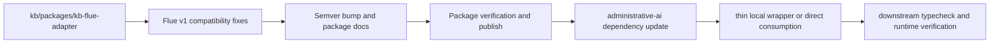

# feat: release the Flue v1 kb-flue-adapter and cut consumers over

## Summary

Bring `packages/kb-flue-adapter` up to a clean Flue v1-compatible contract in the `kb` monorepo, publish that package as a real `@emmassist-co/kb-flue-adapter` release, and then switch `administrative-ai/agent` to consume the released adapter contract instead of carrying local shim drift and package-level type errors.

---

## Problem Frame

Right now the shared adapter ownership is split incorrectly across two repos:

- the `kb` repo is the declared source of truth for published shared packages under `@emmassist-co/*`
- `administrative-ai/agent` still carries a local shim package and repo-specific fixes around `kb-flue-adapter`
- the current adapter surface is not cleanly aligned with Flue v1, and the downstream repo is paying for that drift through typecheck failures and compatibility glue

This is the wrong place to keep the contract unstable. The adapter behavior belongs upstream in `kb`, because that repo owns:

- `packages/kb-flue-adapter`
- release discipline and semver for `@emmassist-co/*`
- publish verification
- docs for consumer install and migration

The goal of this plan is to make the `kb` repo publish a Flue v1-compatible adapter release that downstream consumers can actually install and use, then cut `administrative-ai/agent` over to that release with the smallest possible local shim surface.

---

## Requirements

### Upstream Adapter Contract

- R1. `packages/kb-flue-adapter` must compile and typecheck cleanly against the intended Flue v1 host contract.
- R2. The adapter must expose a stable consumer surface for KB command wiring that does not require downstream repos to patch package internals.
- R3. Any behavior that is pure shared KB adapter contract must live in `kb`, not in downstream repo-local copies.

### Release Readiness

- R4. The changed package must receive an intentional semver bump in `packages/kb-flue-adapter/package.json`, with dependent local package ranges updated if needed.
- R5. Package docs and consumer docs must describe the released Flue v1 adapter behavior truthfully.
- R6. Publish verification must prove the package artifact that consumers install is the artifact that was tested.

### Downstream Consumer Cutover

- R7. `administrative-ai/agent` must be able to consume the released adapter without carrying adapter-contract fixes that belong upstream.
- R8. The downstream runtime loading path must point at the released adapter contract cleanly, with only explicitly administrative-only wrapper behavior left local.
- R9. The downstream repo must typecheck and run its affected verification rails after the cutover.

### Rollout Discipline

- R10. The rollout must leave both repos with updated changelog entries and a clear migration note for the consumer change.

---

## Scope Boundaries

### In Scope

- Flue v1 compatibility fixes that belong in `packages/kb-flue-adapter`
- package versioning and release prep in the `kb` repo
- consumer docs and migration notes for the new adapter release
- downstream `administrative-ai/agent` dependency and consumption updates
- focused verification in both repos

### Deferred for Later

- broader redesign of the KB runtime model beyond adapter compatibility
- unrelated package releases in the `kb` monorepo
- non-Flue consumer migrations unless they are directly affected by the adapter release

### Out of Scope

- keeping long-lived downstream forks of `kb-flue-adapter`
- shipping repo-local adapter fixes only in `administrative-ai`
- changing package ownership away from the `kb` repo

---

## Key Technical Decisions

- KTD1. The Flue v1 adapter contract must be fixed upstream first.
  The `kb` repo owns the package. Fixing only the downstream shim would lock in the wrong ownership model and create more migration debt.

- KTD2. Treat this as a real package release, not just a cross-repo code sync.
  The release artifact is the contract consumers depend on. Versioning, docs, and publish verification are part of the implementation, not cleanup.

- KTD3. Keep downstream wrappers thin and explicitly administrative-only.
  If `administrative-ai` still needs local behavior, it should be limited to product-specific inspect/help/recovery semantics rather than shared adapter compatibility logic.

- KTD4. Verify both the package repo and the consumer repo before calling the rollout complete.
  The adapter release is not done when `kb` is green alone. The real bar is: published package ready, downstream consumer upgraded, downstream checks green.

---

## High-Level Technical Design

---

## Risks & Dependencies

- If `packages/kb-flue-adapter` still depends on host-only types or repo-local internals, Flue v1 compatibility may require interface extraction before release.
- If the package artifact differs from the workspace source shape, publish verification can pass locally but fail for consumers. Pack/install verification needs to stay explicit.
- If `administrative-ai` has hidden assumptions about the local shim, the downstream cutover may need a temporary compatibility wrapper rather than a direct import swap.

---

## Implementation Units

### U1. Audit and fix the upstream Flue v1 adapter contract

- **Goal:** Make `packages/kb-flue-adapter` itself compatible with the intended Flue v1 host/runtime contract.
- **Requirements:** R1, R2, R3
- **Dependencies:** none
- **Files:** `packages/kb-flue-adapter/src/command.ts`, `packages/kb-flue-adapter/src/config.ts`, `packages/kb-flue-adapter/src/index.ts`, `tests/kb-flue-adapter.test.ts`
- **Approach:** Identify the exact Flue v1 contract mismatches in the adapter surface, especially runtime executor typing, command wiring, and host assumptions. Fix them in the package itself rather than downstream. Preserve only package-owned behavior.
- **Execution note:** Start with failing focused adapter tests or new characterization tests before broad refactors.
- **Patterns to follow:** package ownership and release discipline in `AGENTS.md`; current package-local tests in `tests/kb-flue-adapter.test.ts`
- **Test scenarios:**
  - package adapter compiles and typechecks under the intended Flue v1 contract
  - KB command wiring still exposes the expected adapter behavior for consumers
  - repo-local administrative-only behavior is not reintroduced into the shared package by accident
- **Verification:** focused adapter tests pass, and the repo typecheck no longer fails on the adapter package.

### U2. Prepare and verify the publishable adapter artifact

- **Goal:** Turn the fixed adapter into a real releasable package artifact.
- **Requirements:** R4, R5, R6
- **Dependencies:** U1
- **Files:** `packages/kb-flue-adapter/package.json`, `packages/kb-flue-adapter/README.md`, `docs/consumer-quickstart.md`, `docs/migration-status.md`, `CHANGELOG.md`
- **Approach:** Apply the correct semver bump, update package docs, and make the consumer guidance explicit about Flue v1 usage. Add or tighten pack/publish verification if needed so the published artifact matches what was tested.
- **Patterns to follow:** release discipline in `AGENTS.md`; current publish/readiness docs under `docs/`
- **Test scenarios:**
  - package metadata reflects the intended new version
  - README and consumer docs describe the released adapter contract accurately
  - pack/install verification proves the artifact is consumable outside the monorepo
- **Verification:** `npm run typecheck`, `npm test`, focused package tests, and publish/pack verification pass in `kb`.

### U3. Publish the adapter and record the release contract

- **Goal:** Ship the new adapter version as the canonical shared package.
- **Requirements:** R4, R5, R6, R10
- **Dependencies:** U2
- **Files:** release workflow/config files if needed, `CHANGELOG.md`
- **Approach:** Use the repo’s package release discipline to publish the new `@emmassist-co/kb-flue-adapter` version. Record the release note, affected consumers, and migration expectations in changelog and PR/release notes.
- **Patterns to follow:** repo publish workflow and changelog discipline
- **Test scenarios:**
  - publish path targets the intended package version and registry
  - release note names the consumer-visible change and whether migration is required
- **Verification:** the package is actually published and installable at the new version.

### U4. Cut `administrative-ai` over to the released adapter contract

- **Goal:** Make `administrative-ai/agent` consume the released adapter without carrying upstream-owned fixes locally.
- **Requirements:** R7, R8, R9, R10
- **Dependencies:** U3
- **Files:** downstream `package.json`, `package-lock.json`, `packages/kb-flue-adapter/*` if any local shim remains, `src/lib/runtime/workspace-command-loader.ts`, `src/lib/kb/command.ts`, downstream docs/changelog as needed
- **Approach:** Update the downstream dependency to the released package version. Remove or shrink any local shim behavior that only existed because the package was not yet Flue v1-compatible. Keep only administrative-specific wrapper behavior local, if still needed.
- **Patterns to follow:** the downstream plan and README note that the local adapter should stay thin
- **Test scenarios:**
  - downstream installs and resolves the released package version
  - runtime KB command loading still works through the intended adapter boundary
  - downstream typecheck and affected chat/runtime tests pass after the cutover
- **Verification:** downstream `npm run typecheck`, focused KB/chat tests, and build/runtime verification pass.

---

## Sources & Research

- `packages/kb-flue-adapter/package.json`
- `packages/kb-flue-adapter/README.md`
- `tests/kb-flue-adapter.test.ts`
- `docs/migration-status.md`
- `docs/consumer-quickstart.md`
- `docs/plans/2026-06-09-001-feat-kb-open-source-package-hardening-plan.md`
- `docs/plans/2026-06-10-002-feat-kb-cloudflare-mcp-release-readiness-plan.md`
- downstream references in `administrative-ai` showing the local shim and intended thin-wrapper contract
