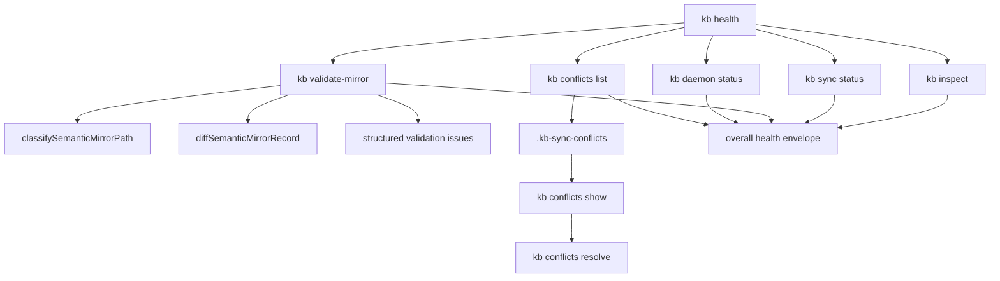

# feat: add KB operator reliability surfaces

## Summary

Add first-class operator diagnostics for tenant KB mirrors: explicit mirror validation, a composed health command, structured doctor issues, conflict review and repair helpers, and docs that teach the safe Obsidian authoring loop. This is a follow-on to the existing semantic sync lane, not a retrieval or ranking change.

## Problem Frame

The KB package now has the hard parts of semantic mirror sync: editable-path classification, baseline-aware markdown diffing, semantic compilation, daemon apply, rejected-edit counts, conflict counts, and the fixed daemon status summary. The remaining operator gap is that these signals are still scattered across `inspect`, `sync status`, `daemon status`, daemon logs, `doctor`, docs, and conflict artifacts.

An AI operator using a tenant mirror needs one reliable workflow:

1. confirm which tenant/backend/canonical surface is active
2. validate supported mirror markdown before sync or semantic apply
3. understand whether current state, last-known daemon state, canonical drift, and local mirror edits agree
4. review and resolve conflicts without spelunking sidecar directories
5. follow docs that distinguish Obsidian-safe edits from support-only raw sync

## Requirements

### Operator Truth Surfaces

- R1. Operator commands must expose tenant, backend, canonicality, mirror root, daemon current state, daemon last-known state, sync state, and semantic-sync state without contradictory running/stopped hints.
- R2. A single command must provide an end-to-end health envelope for local mirror operation, including blockers, warning counts, and next actions.
- R3. Health and diagnostics must stay local-operator-only for `KB_BACKEND=r2-mirror`; they must not imply that raw mirror tooling is a deployed runtime API.

### Mirror Validation

- R4. Operators must be able to validate a tenant mirror before daemon apply or raw support sync.
- R5. Validation must reuse the semantic-sync editability contract: `entities/*.md` and `sources/*.md` are editable records; generated/support files and daemon state are not editable records.
- R6. Validation failures must be structured by path, record kind, code, human message, nested issues, severity, and recommended next action.
- R7. Validation must distinguish parse/validation failures from remote drift, support-only local edits, missing baseline, and unsupported paths.

### Conflict Review And Repair

- R8. Existing `.kb-sync-conflicts` artifacts must become reviewable through CLI commands that list conflict sets and show base/local/remote/merged copies.
- R9. Operators must have an explicit resolve path that updates the mirror file from a chosen artifact or approved resolved file, refreshes baseline/manifest state when safe, and preserves auditability.
- R10. Conflict commands must fail closed when the conflict set is incomplete, stale, or does not match the current tenant mirror.

### Core Doctor Diagnostics

- R11. `kb doctor` must preserve its existing summary compatibility while adding structured issue details suitable for agents and operator UIs.
- R12. Structured doctor issues must classify source/entity validation failures, missing references, duplicate aliases, contradictory active facts, and supersession cycles.

### Documentation And Release

- R13. Docs must teach the command-first operator loop: `inspect`, `sync status`, `validate-mirror`, `daemon status`, `health`, conflict review, and repair.
- R14. The package change must include a minor version bump, changelog entry, focused tests, typecheck, and downstream consumer verification guidance.

## Key Technical Decisions

- KTD1. Treat this as an operator reliability layer over the existing semantic sync implementation. Do not duplicate semantic parsing or apply logic.
- KTD2. Keep `sync`, `daemon`, `validate-mirror`, `conflicts`, and `health` local-only under `KB_BACKEND=r2-mirror`.
- KTD3. Make diagnostics additive and structured. Keep existing `issues: string[]` and compact summaries where current callers may depend on them.
- KTD4. Use `classifySemanticMirrorPath` as the editability source of truth, and `diffSemanticMirrorRecord` as the validation boundary for editable markdown.
- KTD5. Compose `kb health` from existing surfaces instead of introducing a separate state store.
- KTD6. Keep conflict repair explicit. This plan does not add automatic semantic merge intelligence.

## High-Level Technical Design

The health command should not become a new source of truth. It should be a concise aggregator that calls the same logic an operator would run manually and normalizes the result into `ok`, `state`, `tenantId`, `backend`, `canonical`, `mirrorRoot`, `counts`, `blockers`, `warnings`, and `nextActions`.

## Scope Boundaries

### In Scope

- `kb-cli` local mirror operator commands and help text
- structured mirror validation for semantic editable markdown
- conflict artifact list/show/resolve helpers
- additive `kb doctor` structured issue details
- docs, tests, changelog, version bump, and downstream verification notes

### Deferred To Follow-Up Work

- automatic semantic merge beyond existing raw text conflict artifacts
- UI beyond command output
- exposing mirror health through `kb-http` or MCP
- deep retrieval/ranking/model behavior changes

### Outside This Product's Identity

- making the tenant mirror canonical
- last-write-wins human authoring
- generic multi-tenant control plane work
- chat-history-as-memory shortcuts

## System-Wide Impact

- `kb-cli` gains a clearer operator command plane for local mirror work.
- `kb-core` doctor output becomes easier for agents and UIs to consume, while remaining backward-compatible.
- Docs become more precise about the difference between canonical Cloudflare KB, local development KB, R2 mirror support state, and Obsidian semantic authoring.
- Downstream consumers such as Flue or host repos should only need dependency updates and verification unless they choose to surface the new local operator commands.

## Implementation Units

### U1. Add shared operator diagnostic types and mirror validation primitives

- **Goal:** Centralize structured issue and next-action shapes so `validate-mirror`, `health`, daemon summaries, and conflict commands do not invent different vocabularies.
- **Requirements:** R1, R4, R5, R6, R7
- **Dependencies:** none
- **Files:** `packages/kb-cli/src/operator-diagnostics.ts`, `packages/kb-cli/src/semantic-sync/contract.ts`, `packages/kb-cli/src/semantic-sync/diff.ts`, `packages/kb-cli/src/sync.ts`, `packages/kb-cli/src/sync-daemon.ts`, `tests/kb-obsidian-sync.test.ts`, `tests/kb-cli.test.ts`
- **Approach:** Add a small diagnostics module with issue shape, severity, and next-action enums. Wrap existing semantic path classification and diff failures into this shape. Keep parse/validation errors from `diffSemanticMirrorRecord` intact, but enrich them with path class and recommended next action.
- **Test scenarios:**
  - Editable `entities/*.md` and `sources/*.md` parse into structured validation results.
  - Support-only generated paths return `support_only_edit` with a repair action, not a generic parse failure.
  - Daemon state paths are ignored by mirror validation unless explicitly requested in verbose output.
  - Remote drift and missing baseline are distinct issue codes.
  - Existing semantic diff tests continue passing without behavior changes.
- **Verification:** Diagnostics are deterministic, path-specific, and reusable by both standalone commands and health aggregation.

### U2. Add `kb validate-mirror`

- **Goal:** Give operators a direct mirror validation command before applying or repairing local edits.
- **Requirements:** R4, R5, R6, R7, R13
- **Dependencies:** U1
- **Files:** `packages/kb-cli/src/index.ts`, `packages/kb-cli/src/mirror-validation.ts`, `packages/kb-cli/src/sync.ts`, `tests/kb-cli.test.ts`, `tests/kb-r2-sync.test.ts`, `tests/kb-obsidian-sync.test.ts`, `tests/kb-cli-docs.test.ts`
- **Approach:** Add `kb validate-mirror [--changes] [--stats] [--verbose]`. The command should require `KB_BACKEND=r2-mirror`, resolve the tenant mirror root with existing sync helpers, read current sync status, validate changed editable records against baselines and canonical state when available, and summarize support-only edits as rejected local edits.
- **Test scenarios:**
  - A clean mirror returns `state: valid`, `ok: true`, zero blockers, and the tenant/mirror root in stats.
  - A malformed entity markdown file returns `state: invalid`, `ok: false`, path, code `parse_error`, and nested parser message.
  - A source markdown file missing required semantic fields returns validation issues, not a raw stack trace.
  - A support-only edited `events/*.json` file returns `support_only_edit` and recommends reverting or using repair/operator commands.
  - `KB_BACKEND=file` and HTTP mode reject the command with the same local-only posture as `sync` and `daemon`.
- **Verification:** An operator can run one command and see whether the mirror is safe for semantic sync, what blocks it, and what to do next.

### U3. Add conflict review and resolve commands

- **Goal:** Turn `.kb-sync-conflicts` from a sidecar directory into a guided repair workflow.
- **Requirements:** R8, R9, R10, R13
- **Dependencies:** U1
- **Files:** `packages/kb-cli/src/index.ts`, `packages/kb-cli/src/conflicts.ts`, `packages/kb-cli/src/r2-sync-lib.ts`, `packages/kb-cli/src/sync.ts`, `tests/kb-r2-sync.test.ts`, `tests/kb-cli.test.ts`, `docs/operations/kb-r2-sync.md`, `docs/operations/kb-obsidian-semantic-sync.md`
- **Approach:** Add a grouped `kb conflicts` surface under local mirror mode: `list`, `show`, and `resolve`. `list` should group artifacts by conflict timestamp and record path. `show` should expose available `base`, `local`, `remote`, and `merged-with-conflicts` artifacts. `resolve` should accept an explicit source such as `--from local|remote|merged|file --file PATH`, write the resolved mirror file, and refresh the relevant baseline/manifest metadata only when the remote state still matches the conflict being resolved.
- **Test scenarios:**
  - Conflict artifacts from failed raw push are listed as one conflict set with path and available variants.
  - `show` returns compact metadata by default and file contents only with an explicit flag.
  - `resolve --from merged` refuses unresolved conflict markers.
  - `resolve --from file` writes the selected mirror path and preserves an audit artifact.
  - Resolve fails if the current remote object no longer matches the conflict's remote artifact.
- **Verification:** Operators can inspect and resolve conflicts without manually navigating `.kb-sync-conflicts`, while unsafe or stale resolutions fail closed.

### U4. Add composed `kb health`

- **Goal:** Provide one reliable operator summary across inspect, sync, validation, daemon, and conflicts.
- **Requirements:** R1, R2, R3, R6, R13
- **Dependencies:** U1, U2, U3
- **Files:** `packages/kb-cli/src/index.ts`, `packages/kb-cli/src/health.ts`, `packages/kb-cli/src/sync.ts`, `packages/kb-cli/src/sync-daemon.ts`, `tests/kb-cli.test.ts`, `tests/kb-cli-docs.test.ts`
- **Approach:** Add `kb health [--stats] [--verbose]` for `KB_BACKEND=r2-mirror`. Compose existing local executor inspection, sync status summary, mirror validation, daemon status summary, and conflict scan. Normalize the envelope into `ok`, `state`, `workspace`, `counts`, `blockers`, `warnings`, `hints`, and `nextActions`.
- **Test scenarios:**
  - Clean mirror with stopped daemon returns `state: degraded` or equivalent warning, not a false healthy state.
  - Clean mirror with running daemon and valid markdown returns `state: healthy`.
  - Rejected support-only local edits make health `blocked` with `validate_mirror` as the next action.
  - Existing conflict artifacts make health `blocked` with `conflicts_review` as the next action.
  - Stale daemon last-known status is surfaced separately from current process running state.
- **Verification:** The health envelope is enough for an AI operator to decide whether to pull, validate, repair, start daemon, or escalate.

### U5. Add structured `kb doctor` issue details

- **Goal:** Make canonical KB integrity diagnostics machine-readable without breaking current consumers.
- **Requirements:** R6, R11, R12
- **Dependencies:** U1
- **Files:** `packages/kb-core/src/service.ts`, `packages/kb-core/src/types.ts`, `packages/kb-cli/src/index.ts`, `tests/kb-cli.test.ts`, `tests/kb-http.test.ts`
- **Approach:** Extend `doctor()` to return `issues: string[]` plus `details: Array<{ code, severity, message, entityId?, sourceId?, eventId?, linkId?, path?, nextAction? }>` or an equivalent additive field. Convert existing doctor checks into structured details while preserving the current human strings.
- **Test scenarios:**
  - Missing source references include source ID, owning entity ID, code, and next action.
  - Duplicate aliases include all conflicting entity IDs.
  - Contradictory singular active facts include relation type, origin, targets, and severity.
  - Supersession cycles include all cycle IDs.
  - Existing callers that read only `ok`, `issues`, and `counts` still work.
- **Verification:** Agents can inspect doctor output and choose repair commands without parsing prose.

### U6. Update docs, help, versioning, and downstream verification guidance

- **Goal:** Ship the operator lane as a public package change with clear usage guidance.
- **Requirements:** R13, R14
- **Dependencies:** U2, U3, U4, U5
- **Files:** `README.md`, `docs/consumer-quickstart.md`, `docs/operations/kb-r2-sync.md`, `docs/operations/kb-obsidian-semantic-sync.md`, `packages/kb-cli/README.md`, `packages/kb-cli/skills/kb-local-setup/SKILL.md`, `packages/kb-cli/package.json`, `CHANGELOG.md`, `tests/kb-cli-docs.test.ts`
- **Approach:** Update default help only where the commands are expected for ordinary local mirror operators. Keep repair-heavy conflict details in `kb help operator` and operations docs. Add a minor version bump for `@emmassist-co/kb-cli` and a changelog entry describing the new operator diagnostics. Document downstream verification for consumers that pin `@emmassist-co/kb-cli`.
- **Test scenarios:**
  - Help includes `kb validate-mirror` and `kb health` in the local mirror section.
  - Operator help includes `kb conflicts list|show|resolve`.
  - Obsidian docs describe the safe sequence: inspect, pull, edit supported markdown, validate, daemon/health, conflict repair if blocked.
  - Quickstart does not imply generated JSON files are safe human authoring surfaces.
  - Package version and changelog reflect a backward-compatible new CLI surface.
- **Verification:** A new operator can follow the docs without knowing implementation internals or sidecar paths.

## Verification Plan

- Focused CLI tests: `tests/kb-cli.test.ts`
- Focused mirror/sync tests: `tests/kb-r2-sync.test.ts`
- Focused semantic validation tests: `tests/kb-obsidian-sync.test.ts`
- Docs/help coverage: `tests/kb-cli-docs.test.ts`
- HTTP/core compatibility where doctor output changes: `tests/kb-http.test.ts`
- Package-wide gates: `npm run typecheck`, `npm test`, `npm run build:public`

Benchmarks are not required for this scope unless implementation changes retrieval, ranking, storage semantics, or indexing behavior. If `doctor` changes touch core persistence or relation indexing unexpectedly, rerun the benchmark suite before release.

## Risks & Dependencies

- Risk: `kb health` becomes a second truth source. Mitigation: compose existing commands/helpers and keep the output traceable to sub-checks.
- Risk: conflict resolve mutates the wrong mirror or stale remote state. Mitigation: require tenant/mirror matching, remote artifact checks, and explicit source selection.
- Risk: structured `doctor` details break API expectations. Mitigation: make details additive and keep existing `issues` strings.
- Risk: docs make support-mode raw push look like normal Obsidian authoring. Mitigation: keep semantic authoring and raw support sync in separate sections with clear warnings.
- Risk: adding commands only in the package leaves downstream wrappers stale. Mitigation: include post-release consumer verification notes and dependency bump guidance.

## Sources & Research

- `STRATEGY.md`
- `README.md`
- `AGENTS.md`
- `package.json`
- `docs/operations/kb-obsidian-semantic-sync.md`
- `docs/consumer-quickstart.md`
- `docs/plans/2026-06-07-001-feat-kb-agent-native-gaps-plan.md`
- `docs/plans/2026-06-11-001-feat-obsidian-semantic-sync-plan.md`
- `packages/kb-cli/src/index.ts`
- `packages/kb-cli/src/sync.ts`
- `packages/kb-cli/src/sync-daemon.ts`
- `packages/kb-cli/src/semantic-sync/contract.ts`
- `packages/kb-cli/src/semantic-sync/diff.ts`
- `packages/kb-core/src/service.ts`
- `tests/kb-cli.test.ts`
- `tests/kb-obsidian-sync.test.ts`
- `tests/kb-cli-docs.test.ts`

## Open Questions

- Should `kb validate-mirror` validate only changed files by default, or all editable records with a `--all` flag? Recommendation: changed files by default, `--all` for full audit.
- Should `kb health` return `ok: false` when daemon is stopped but the mirror is otherwise clean? Recommendation: `ok: false`, `state: degraded`, with `start_daemon` as a warning-level next action.
- Should conflict resolution refresh baseline immediately or require a follow-up `sync pull/status`? Recommendation: refresh the affected baseline only after proving the current remote artifact still matches the conflict.
