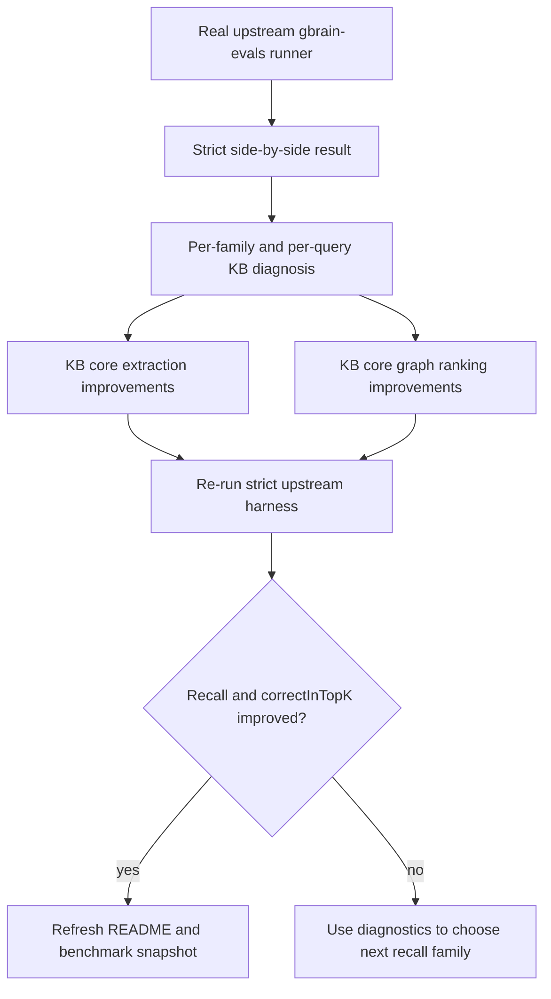

# Close KB Recall Gap On Real GBrain Harness

## Summary

Raise `kb-upstream` recall on the literal upstream `gbrain-evals` harness without breaking the apples-to-apples comparison contract. Keep `npm run eval:kb:gbrain-evals-upstream` as the only authoritative external rail, improve multi-answer recovery in `packages/kb-core`, and use `gbrain-world` only to diagnose failure families faster.

---

## Problem Frame

The benchmark contract is now correct: same upstream runner, same corpus, same query set, same metric semantics, same top-k. On that rail, current `kb-upstream` is strong on selectivity but still behind real GBrain on coverage.

Current authoritative snapshot:

- `gbrain`: `P@5 0.4915`, `R@5 0.9791`, `248/261`
- `kb-upstream`: `P@5 0.9115`, `R@5 0.8705`, `198/261`

That means the real deficit is recall, not precision. The current misses are mostly plural-answer coverage failures:

- `attended`: demo-day and board-meeting pages still under-return full rosters on some prose shapes
- `invested_in`: some company pages recover one investor correctly but miss the rest
- `advises`: some advisor relationships are still recovered from the wrong surface or ranked behind weaker secondary mentions

The plan should move `kb-core` closer to GBrain’s actual philosophy:

- stronger prose-to-graph extraction
- richer graph-backed ranking signals
- intent-aware result sizing that preserves plural-answer coverage

without drifting into benchmark-shaped adapter glue or corpus-specific hacks.

---

## Requirements

### External Benchmark Contract

- R1. `npm run eval:kb:gbrain-evals-upstream` remains the authoritative external comparison rail and continues to run real upstream `gbrain` and `kb-upstream` in the same upstream process.
- R2. Any benchmark claim about KB versus GBrain must use the same runner, corpus, query set, metric definitions, and top-k cutoff as the upstream harness.
- R3. Local rails such as `gbrain-world` remain explicitly diagnostic and must not be presented as parity proof.

### Recall Improvement Target

- R4. The next improvement pass must optimize for recall and `correctInTopK` on the real upstream rail, not for additional precision alone.
- R5. Changes must target reusable `packages/kb-core` extraction, graph construction, traversal, ranking, or result-sizing behavior, not benchmark-only adapter post-processing.
- R6. The implementation must improve at least one currently weak plural-answer family on the strict rail: `attended`, `invested_in`, or `advises`.

### Diagnostic Discipline

- R7. The repo must preserve enough diagnostics to explain recall failures on the strict rail at the per-family and per-query level.
- R8. The repo must make it easy to distinguish “high precision because we returned less” from “genuine quality improvement.”

---

## Key Technical Decisions

- KTD1. Optimize against the strict upstream rail, not the local proxy: the only success metric that matters for parity work is movement on `scripts/run-gbrain-evals-upstream.ts`, because local `gbrain-world` can mask prose-only failures.
- KTD2. Prioritize plural-answer recovery over more aggressive filtering: the benchmark gap is `-50` relevant hits, so the current bottleneck is missing answers, not junk suppression.
- KTD3. Keep improvements in `packages/kb-core` and its configurable rule surface: relation extraction and ranking may use workspace-tunable priors in `packages/kb-core/src/relation-rules.json`, but not benchmark-only adapter shims.
- KTD4. Add graph-signal richness before adding more phrase piles: GBrain’s own path relies on graph traversal plus adjacency and corroboration style ranking signals, so KB should move in that direction instead of mostly extending keyword triggers.
- KTD5. Treat person-page and company-page evidence as complementary, not competing: many advisor and investor truths are expressed on person pages or timelines, so ranking should reward anchor-origin evidence without suppressing legitimate multi-surface corroboration.

---

## High-Level Technical Design

The work splits into three layers:

1. **Strict-rail diagnosis**
   Compare `kb-upstream` and real `gbrain` on the same upstream harness, then use repo-local diagnostics to explain where KB is losing coverage.

2. **Core recall improvements**
   Improve extraction and ranking in `packages/kb-core` for plural-answer families. The main focus is:
   - more complete meeting-participant recovery from raw prose
   - more complete company-to-investor and company-to-advisor recovery from mixed current-truth and timeline prose
   - graph ranking that rewards multiple corroborating links and anchor-page-origin support without over-privileging a single noisy mention

3. **Benchmark-facing verification**
   Re-run the strict upstream harness after each meaningful change, then refresh the public benchmark snapshot only when the upstream rail confirms the gain.

---

## Implementation Units

### U1. Tighten strict-rail diagnostics around recall loss

- **Goal:** Make the remaining strict-harness recall failures cheaper to inspect and compare without confusing them with local proxy behavior.
- **Files:** `scripts/run-gbrain-evals-upstream.ts`, `scripts/run-gbrain-evals-kb-adapter.ts`, `packages/kb-autoresearch/src/evaluator.ts`, `docs/operations/kb-benchmark.md`
- **Patterns to follow:** Existing `realGbrain` / `deltaVsRealGbrain` reporting in `scripts/run-gbrain-evals-upstream.ts`; family and query diagnostics in `scripts/run-gbrain-evals-kb-adapter.ts`
- **Changes:**
  - expose or document the minimal diagnostic loop for strict-rail triage
  - preserve the distinction between authoritative upstream comparison and local family-level diagnosis
  - add any lightweight output needed to track average returned docs per query or other selectivity indicators beside recall
- **Test scenarios:**
  - strict upstream command still returns side-by-side `gbrain` and `kb-upstream`
  - KB-only mode still returns machine-readable KB metrics plus embedded real-GBrain reference
  - diagnostic path remains clearly labeled as non-authoritative
- **Verification:** `npm run eval:kb:gbrain-evals-upstream`; `npm run eval:kb:gbrain-evals-upstream:kb`; `node --import tsx/esm --test tests/kb-cli-docs.test.ts tests/kb-autoresearch.test.ts`

### U2. Improve plural-answer `attended` extraction from raw prose

- **Goal:** Raise strict-harness recall on meeting attendance queries where the current system returns only one or two people from a full attendee set.
- **Files:** `packages/kb-core/src/relations.ts`, `packages/kb-core/src/relation-rules.json`, `packages/kb-core/src/service.ts`, `eval/adapters/gbrain-evals/kb-adapter.ts`, `tests/kb-benchmark.test.ts`
- **Patterns to follow:** Recent title-aware and page-prior based `attends` improvements in `packages/kb-core/src/relation-rules.json`; graph-first relation query path in `packages/kb-core/src/service.ts`
- **Changes:**
  - expand generic meeting-participant cue coverage for board meetings and demo-day prose
  - improve clause/sentence level extraction where multiple attendees are described across consecutive sentences instead of one list-like sentence
  - keep the logic generic enough to apply to unseen meeting prose, not just current benchmark titles
- **Test scenarios:**
  - representative board-meeting page yields the expected multi-person roster
  - representative demo-day page yields the expected multi-person roster
  - no regression on one-on-one meeting title recovery
  - strict rail shows higher `attended` recall than the current baseline
- **Verification:** targeted strict diagnostic probe; `npm run eval:kb:gbrain-evals-upstream`; `npm run eval:kb:gbrain-world -- --json`

### U3. Improve plural-answer `invested_in` and `advises` recovery

- **Goal:** Recover additional investors and advisors when company pages and person pages both carry partial truth across current-truth and timeline surfaces.
- **Files:** `packages/kb-core/src/relations.ts`, `packages/kb-core/src/relation-rules.json`, `packages/kb-core/src/service-helpers.ts`, `packages/kb-core/src/service.ts`, `tests/kb-benchmark.test.ts`
- **Patterns to follow:** anchor-origin support boost in `packages/kb-core/src/service-helpers.ts`; page-prior driven `invested_in` / `advises` extraction in `packages/kb-core/src/relation-rules.json`
- **Changes:**
  - add more generic investor/advisor cue coverage where the company page clearly attributes the relationship
  - improve multi-surface reconciliation so anchor-page evidence outranks weaker secondary mentions, but true secondary corroboration still helps recall
  - improve ranking for partial sets so multiple valid investors/advisors survive top-k more reliably
- **Test scenarios:**
  - representative advisor query with current wrong winner now ranks the anchor-page advisor above weaker secondary mentions
  - representative investor query with one correct and several missed investors now returns a broader correct set
  - no new regression where historical-only noise displaces current company-page truth
- **Verification:** targeted strict diagnostic probe; `npm run eval:kb:gbrain-evals-upstream`; `npm run eval:kb:gbrain-evals-upstream:kb`

### U4. Add richer GBrain-style graph ranking signals

- **Goal:** Move KB ranking closer to GBrain’s actual retrieval posture by rewarding corroboration and graph structure more explicitly.
- **Files:** `packages/kb-core/src/service-helpers.ts`, `packages/kb-core/src/service.ts`, `tests/kb-benchmark.test.ts`, `docs/operations/kb-benchmark.md`
- **Patterns to follow:** signal framing in `eval/runner/cat27-graph-signals.ts`; graph-first rationale in `eval/runner/before-after.ts`
- **Changes:**
  - add or refine adjacency-like boost where several related results support the same anchor-answer relationship
  - add cross-source corroboration style weight where multiple sources reinforce the same answer
  - keep these signals generic and relation-agnostic where possible
- **Test scenarios:**
  - graph ranking favors candidates with stronger corroborating support over isolated weak mentions
  - multi-answer relation queries retain broader correct coverage rather than collapsing to one winner
  - no large regression on current product-core rails
- **Verification:** strict upstream benchmark; targeted local diagnostics; existing KB benchmark tests

### U5. Refresh benchmark posture and release-facing docs only from strict-rail truth

- **Goal:** Keep the repo’s public benchmark claims synchronized with the actual upstream side-by-side results after recall work lands.
- **Files:** `README.md`, `docs/benchmarks/kb-scorecard-latest.md`, `docs/benchmarks/kb-scorecard-latest.json`, `docs/operations/kb-benchmark.md`, `tests/kb-cli-docs.test.ts`
- **Patterns to follow:** current benchmark contract language in `README.md` and `AGENTS.md`
- **Changes:**
  - refresh the public benchmark snapshot from the strict upstream run
  - update any comparative wording that becomes stale after recall moves
  - preserve the rule that local rails are diagnostic only
- **Test scenarios:**
  - README numbers match the latest strict upstream run
  - docs still state the same-harness comparison rule explicitly
  - docs tests pass against the refreshed values
- **Verification:** `node --import tsx/esm --test tests/kb-cli-docs.test.ts`; `npm run eval:kb:gbrain-evals-upstream`

---

## Scope Boundaries

### Deferred to Follow-Up Work

- workspace-specific tuning commands that learn and write per-workspace relation configuration automatically
- broader non-relational benchmark expansion beyond the current upstream public relational rail
- replacing all remaining heuristic cue extraction with a more learned or model-assisted extraction layer

### Outside This Plan

- changing the external benchmark contract away from the literal upstream `gbrain-evals` runner
- treating `gbrain-world` as the public parity rail
- merging or releasing downstream consumer changes in `administrative-ai`

---

## Risks & Dependencies

- **Benchmark overfitting risk:** Raising recall by adding benchmark-shaped cues would produce misleading gains. Mitigation: keep changes in `packages/kb-core` and validate on the strict upstream rail first.
- **Precision collapse risk:** Broadening plural-answer recovery can introduce junk. Mitigation: watch `correctInTopK`, family-level precision, and representative wrong-winner cases while improving recall.
- **Diagnostic confusion risk:** Local diagnostic rails can look much stronger than the strict rail. Mitigation: use the upstream runner as the sole parity source and label all other rails as diagnostic.
- **Stale benchmark snapshot risk:** Public docs can drift from the code quickly. Mitigation: only refresh public numbers after a fresh strict upstream run and keep docs tests aligned with that output.

---

## Acceptance Examples

- AE1. After a plural-answer recall improvement, `npm run eval:kb:gbrain-evals-upstream` still compares real upstream `gbrain` and `kb-upstream` in the same run, and the reported `kb-upstream` recall is higher than the current `0.8705`.
- AE2. For a representative demo-day query that currently returns one attendee from a five-person set, KB returns most or all of the valid attendee roster without replacing them with junk.
- AE3. For a representative advisor query where a weak person-page mention currently outranks the explicit company-page advisor, KB surfaces the explicit advisor as the better answer.
- AE4. If a local diagnostic rail looks improved but the strict upstream rail does not move, the repo continues to treat the change as non-authoritative.

---

## Sources / Research

- `scripts/run-gbrain-evals-upstream.ts`
  Why: authoritative external benchmark wrapper; defines the real side-by-side comparison contract.
- `eval/adapters/gbrain-evals/kb-adapter.ts`
  Why: current KB adapter behavior, result budgeting, and diagnostic hooks used to inspect strict-rail misses.
- `packages/kb-core/src/relation-rules.json`
  Why: configurable extraction prior surface; the right place for reusable cue expansion instead of adapter-only logic.
- `packages/kb-core/src/relations.ts`
  Why: raw prose relation extraction and page-prior execution path.
- `packages/kb-core/src/service-helpers.ts`
  Why: graph result ranking path; current place to add more GBrain-like corroboration and anchor-origin scoring.
- `eval/runner/before-after.ts`
  Why: GBrain’s own articulation of the “graph plus fallback and rerank” win.
- `eval/runner/cat27-graph-signals.ts`
  Why: explicit GBrain graph-signal framing for adjacency, cross-source corroboration, and session demotion.
- `eval/precisionmembench/gbrainAdapter.ts`
  Why: evidence that GBrain’s live retrieval path is hybrid search with intent-aware return sizing, not just one-off regex extraction.
