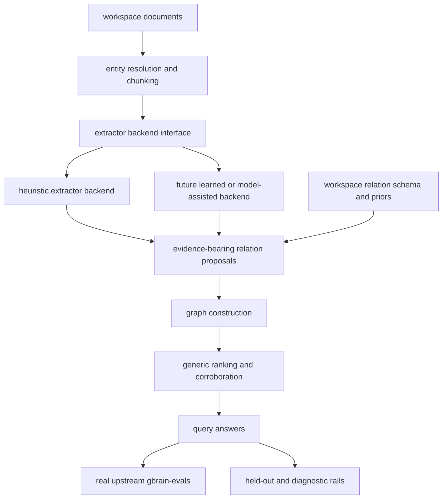

# Generalize KB Extraction Without Losing Real GBrain Benchmark Discipline

## Summary

Migrate KB from benchmark-shaped heuristic extraction toward a hybrid architecture: a generic relation-extraction pipeline, workspace-configurable relation schemas and priors, and strict benchmark gates that always compare against the real upstream `gbrain-evals` runner. Keep the current heuristic path alive during migration so benchmark gains stay measurable and regressions stay obvious.

---

## Problem Frame

KB is now strong on the real upstream `gbrain-evals` rail, but a meaningful part of the current win still comes from heuristic relation cues and page priors that are shaped by the current benchmark corpus. That is good enough to prove the core can move, but not good enough to trust as a general architecture for other KB workspaces.

The repo needs a migration path that preserves three truths at once:

- the real upstream `gbrain-evals` harness remains the public comparison rail
- `packages/kb-core` becomes more reusable across domains
- workspace-specific structure and tuning move into data and configuration instead of accumulating in core code

The target is not “throw heuristics away immediately.” The target is a stronger hybrid system where:

- the current heuristic extractor becomes one backend behind a cleaner interface
- new extraction backends can propose relations with evidence spans and confidence
- workspace configs define ontology, entity kinds, page families, and tuning knobs
- benchmark wins are trusted only when they survive strict and held-out rails

---

## Requirements

### Benchmark Truth

- R1. `npm run eval:kb:gbrain-evals-upstream` remains the authoritative external comparison rail throughout this migration.
- R2. Any architecture or quality claim in this work must be backed by the same runner, corpus, query set, metric definitions, and top-k cutoff as the upstream GBrain comparison.
- R3. Local rails such as `gbrain-world` and `eval:kb:gbrain-evals-upstream:kb` remain diagnostic only and must not be presented as parity proof.
- R4. The repo must add at least one held-out or perturbation rail so a `world-v1` win alone is insufficient proof of generalization.

### Architecture Direction

- R5. `packages/kb-core` must expose a generic relation-extraction pipeline rather than coupling extraction directly to one heuristic implementation.
- R6. Workspace-specific relation vocabulary, page-family priors, and ranking knobs must live in configuration or data artifacts rather than being hardcoded in core code wherever feasible.
- R7. Extractors must emit reusable evidence, including relation candidate, source span or source surface, and confidence, so ranking and verification are grounded in inspectable signals.
- R8. The current heuristic path must remain available during migration as one extractor backend, so benchmark posture can be compared before and after architectural changes.

### Quality And Generalization

- R9. The migration must preserve or improve the current real upstream GBrain benchmark posture while reducing benchmark-shaped logic in the core path.
- R10. The repo must gain diagnostics that distinguish “benchmark improvement from cleaner architecture” from “benchmark improvement from corpus-shaped rules.”
- R11. The resulting design must support workspace-level tuning without requiring code edits for each new domain’s ontology or page structure.

---

## Key Technical Decisions

- KTD1. Take a hybrid-first migration path: preserve the current heuristic extractor as a baseline backend while introducing a generic extraction interface and configuration model. This keeps benchmark truth stable during the migration.
- KTD2. Treat the real upstream `gbrain-evals` harness as the gold rail and use held-out rails as anti-overfitting guards. Local rails remain for diagnosis, not for final claims.
- KTD3. Move domain assumptions into workspace config before trying to make extraction smarter everywhere. A configurable system with a still-simple extractor is a better foundation than a clever but rigid core.
- KTD4. Standardize on evidence-bearing relation proposals as the contract between extraction and ranking. This makes cross-extractor comparison, debugging, and corroboration scoring possible.
- KTD5. Keep graph construction and ranking generic. Workspace config may influence weights and enabled relation families, but the ranking engine should not know about benchmark-specific phrases or one customer’s domain terms.
- KTD6. Use parallel verification tracks during migration: benchmark parity, held-out generalization, and docs snapshot consistency. A score win that fails the other two is suspect.

---

## High-Level Technical Design

The migration has four layers:

1. **Extractor contract**
   Introduce a relation-extraction interface in `packages/kb-core` that returns evidence-bearing relation proposals. The current heuristic extractor is adapted to that interface first.

2. **Workspace configuration**
   Define a workspace-level schema for relation ontology, entity kinds, page families, aliases, priors, and ranking knobs. Current benchmark-shaped priors move into that config surface where they remain visible and overridable.

3. **Hybrid runtime**
   Allow multiple extractors to feed the same graph and ranking path. Initially this is heuristic-only plus refactored priors, but the interface must support later model-assisted extraction without changing the core graph API.

4. **Verification rails**
   Keep the real upstream GBrain comparison as the public rail, add held-out rails for generalization, and extend diagnostics so per-family gains can be explained without confusing them for broad quality wins.

---

## Implementation Units

### U1. Introduce a generic relation-extraction contract in `kb-core`

- **Goal:** Decouple relation proposal from the current inlined heuristic path and define a reusable contract for extraction backends.
- **Files:** `packages/kb-core/src/types.ts`, `packages/kb-core/src/relations.ts`, `packages/kb-core/src/service.ts`, `packages/kb-core/src/index.ts`
- **Patterns to follow:** current relation and ranking flow in `packages/kb-core/src/relations.ts` and `packages/kb-core/src/service.ts`
- **Changes:**
  - define extractor input and output types, including candidate relation, evidence span or surface, confidence, and source metadata
  - refactor the existing heuristic logic to implement that contract without changing user-visible query behavior yet
  - ensure the graph builder consumes extractor output rather than assuming one hardwired relation path
- **Test scenarios:**
  - current heuristic extraction still produces graph links for representative `attends`, `member_of`, `invested_in`, and `advises` cases
  - extractor outputs include evidence-bearing fields needed for later ranking and debugging
  - no regression in current KB benchmark tests caused only by the interface split
- **Verification:** `npm run typecheck`; `node --import tsx/esm --test tests/kb-benchmark.test.ts`

### U2. Move benchmark-shaped priors into workspace-configurable rule data

- **Goal:** Shrink hardcoded domain logic in core code by formalizing a workspace-level relation schema and page-prior config surface.
- **Files:** `packages/kb-core/src/relation-rules.json`, `packages/kb-core/src/types.ts`, `packages/kb-core/src/relations.ts`, `README.md`
- **Patterns to follow:** current `relation-rules.json` structure and configured page-prior execution in `packages/kb-core/src/relations.ts`
- **Changes:**
  - define clearer config concepts for relation families, page families, source kinds, target kinds, match mode, and ranking priors
  - move remaining title or page-family assumptions out of imperative code where feasible
  - document which assumptions are workspace-configurable versus globally generic
- **Test scenarios:**
  - existing meeting and company page priors still work through config-driven execution
  - a workspace can disable or adjust a relation family without code edits
  - rule execution does not implicitly inherit unrelated keyword logic
- **Verification:** `npm run typecheck`; `node --import tsx/esm --test tests/kb-benchmark.test.ts tests/kb-cli-docs.test.ts`

### U3. Add evidence-aware ranking and corroboration plumbing

- **Goal:** Use the new extractor evidence contract to support more general ranking and trust decisions than phrase-matched heuristics alone.
- **Files:** `packages/kb-core/src/service-helpers.ts`, `packages/kb-core/src/service.ts`, `packages/kb-core/src/types.ts`
- **Patterns to follow:** current anchor-origin and graph-support signals in `packages/kb-core/src/service-helpers.ts`
- **Changes:**
  - rank candidate answers using explicit evidence counts, corroborating surfaces, and source locality
  - separate “current truth” and “historical mention” signals more cleanly at the ranking layer
  - expose enough structured diagnostics to understand whether a result won because of graph support, source corroboration, or one narrow cue
- **Test scenarios:**
  - corroborated answers outrank isolated weak mentions on representative relation queries
  - evidence-rich plural answers survive top-k more reliably than before
  - benchmark wins remain explainable in diagnostics instead of looking like opaque score jumps
- **Verification:** `node --import tsx/esm --test tests/kb-benchmark.test.ts`; `npm run eval:kb:gbrain-evals-upstream:kb`

### U4. Add held-out and perturbation rails for anti-overfitting checks

- **Goal:** Make it harder to trust benchmark-shaped improvements that only work on `world-v1`.
- **Files:** `scripts/run-gbrain-evals-upstream.ts`, `scripts/run-gbrain-evals-kb-adapter.ts`, `eval/adapters/gbrain-evals/kb-adapter.ts`, `packages/kb-autoresearch/src/evaluator.ts`, `docs/operations/kb-benchmark.md`
- **Patterns to follow:** existing side-by-side strict benchmark flow and KB-only machine-scoring flow
- **Changes:**
  - add at least one held-out or perturbation mode that changes wording, page order, or answer-surface shape while preserving truth labels
  - wire the new rail into autoresearch and manual verification so it can block suspicious wins
  - make the diagnostic output report both strict benchmark movement and held-out movement together
- **Test scenarios:**
  - strict rail still compares real `gbrain` and `kb-upstream` in the same upstream run
  - held-out rail can fail independently of `world-v1`, exposing benchmark-shaped regressions
  - autoresearch can reject or flag a candidate that improves strict score but harms held-out behavior
- **Verification:** `npm run eval:kb:gbrain-evals-upstream`; `npm run eval:kb:gbrain-evals-upstream:kb`; targeted autoresearch tests

### U5. Add workspace tuning entry points without per-domain code edits

- **Goal:** Let operators improve a KB workspace by generating or refining config artifacts from the corpus instead of patching `kb-core`.
- **Files:** `packages/kb-cli`, `packages/kb-core/src/types.ts`, `packages/kb-core/src/relation-rules.json`, `README.md`, `docs/operations/kb-benchmark.md`
- **Patterns to follow:** existing CLI and verification surfaces in the repo; current rule/config data flow
- **Changes:**
  - design a tuning command or config workflow that inspects a workspace and suggests relation aliases, page families, or priors
  - keep the output in config or data artifacts that can be reviewed and versioned
  - ensure the tuning flow is benchmark-aware and can rerun strict and held-out rails after changes
- **Test scenarios:**
  - a workspace can adopt adjusted relation schema or priors without source edits in `packages/kb-core`
  - generated config remains inspectable and reversible
  - benchmark verification can be run immediately after tuning
- **Verification:** CLI tests where applicable; `npm run eval:kb:gbrain-evals-upstream`; docs tests

### U6. Update autoresearch and release discipline around the hybrid architecture

- **Goal:** Ensure automated improvement loops and release-facing docs push the architecture in the right direction rather than rewarding narrow heuristic wins.
- **Files:** `packages/kb-autoresearch/src/evaluator.ts`, `packages/kb-autoresearch/src/prompt.ts`, `packages/kb-autoresearch/src/scorer.ts`, `AGENTS.md`, `README.md`, `docs/benchmarks/kb-scorecard-latest.md`, `docs/benchmarks/kb-scorecard-latest.json`
- **Patterns to follow:** existing strict-rail scoring and benchmark-discipline language
- **Changes:**
  - extend scoring so carried or accepted wins are penalized when they only improve strict score while harming held-out behavior
  - teach prompts to prefer reusable core or config changes over benchmark-shaped phrase piles
  - keep public docs synchronized with strict benchmark posture and the new anti-overfitting policy
- **Test scenarios:**
  - autoresearch can surface “strict gain, held-out regression” as a suspect result
  - prompts and docs explicitly point the search toward reusable core/config work
  - benchmark snapshot remains aligned with code and the real upstream rail
- **Verification:** `node --import tsx/esm --test tests/kb-autoresearch.test.ts tests/kb-cli-docs.test.ts`; strict benchmark rerun after any public snapshot change

---

## Scope Boundaries

### Deferred to Follow-Up Work

- a fully learned or model-assisted extraction backend
- broad multi-corpus benchmark expansion beyond the current upstream rail plus one held-out family
- consumer repo cutovers that only depend on the released package behavior

### Outside This Plan

- abandoning the current heuristic path before a replacement is proven on strict and held-out rails
- treating `gbrain-world` as a public parity benchmark
- per-customer code forks in downstream repos for ontology or relation tuning

---

## Risks & Dependencies

- **Migration drag risk:** a hybrid-first path can live too long in an awkward middle state. Mitigation: define clear contract boundaries early and force new work through them.
- **False generalization risk:** a strict `world-v1` win can still be overfit. Mitigation: add held-out rails and require them in benchmarking and autoresearch.
- **Config sprawl risk:** pushing too much into config can make workspaces hard to reason about. Mitigation: keep config typed, evidence-backed, and benchmark-verifiable.
- **Ranking opacity risk:** more generic extraction can make debugging harder if evidence is not surfaced. Mitigation: require evidence-bearing extractor outputs and structured diagnostics.
- **Release confusion risk:** public docs can overstate what “better than GBrain” means. Mitigation: keep the same-harness rule explicit and refresh benchmark snapshots only from the authoritative rail.

---

## Acceptance Examples

- AE1. A benchmark claim in this repo still means `npm run eval:kb:gbrain-evals-upstream` on the real upstream harness, and the docs continue to say so explicitly.
- AE2. A new workspace can adjust relation families or page priors through config artifacts rather than changing `packages/kb-core/src/relations.ts`.
- AE3. A strict benchmark win that fails the held-out rail is flagged as suspect rather than accepted as a clean quality improvement.
- AE4. The current heuristic extractor remains available behind the new extractor contract while a cleaner backend is introduced.
- AE5. An implementer can inspect a winning relation result and see which evidence spans and corroborating surfaces caused it to rank highly.

---

## Sources / Research

- `AGENTS.md`
  Why: repo-level benchmark discipline, anti-overfitting posture, and required verification rails.
- `STRATEGY.md`
  Why: compounding KB positioning and the need for inspectable, reusable semantics across runtimes.
- `docs/plans/2026-06-29-001-feat-kb-real-gbrain-recall-parity-plan.md`
  Why: current strict-rail benchmark contract and recent recall-oriented work already underway.
- `packages/kb-core/src/relations.ts`
  Why: current heuristic extraction and page-prior execution path that needs to be generalized.
- `packages/kb-core/src/relation-rules.json`
  Why: existing config surface that should become the home for workspace-specific assumptions.
- `packages/kb-core/src/service.ts`
  Why: graph-backed answer path and the seam where extractor outputs feed retrieval behavior.
- `packages/kb-core/src/service-helpers.ts`
  Why: current ranking and corroboration logic that should become more evidence-aware and less cue-shaped.
- `packages/kb-autoresearch/src/evaluator.ts`
  Why: current improvement loop that must learn to reward strict plus held-out gains, not narrow benchmark wins.
- `scripts/run-gbrain-evals-upstream.ts`
  Why: authoritative external benchmark wrapper that must remain the public source of truth.
- `eval/adapters/gbrain-evals/kb-adapter.ts`
  Why: benchmark-facing adapter boundary and diagnostic surface for strict-rail inspection.
