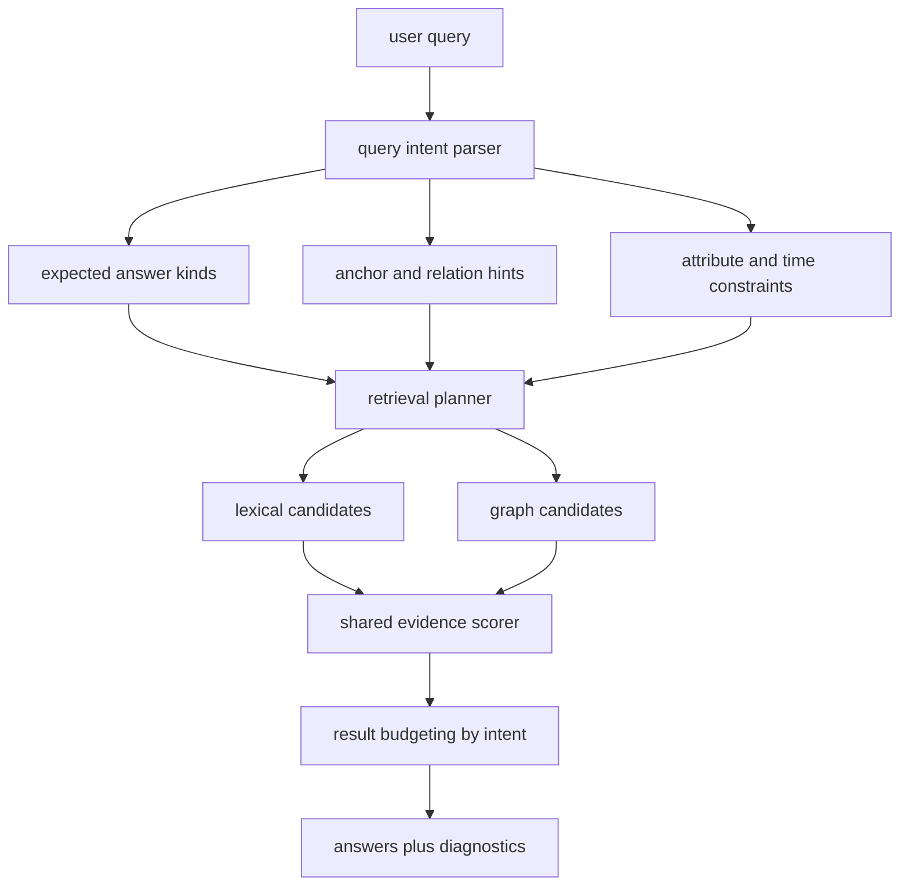

# Close Held-Out KB Gaps With Generic Entity-Filter Intent And Reasoning

## Summary

Add a generic query-understanding and filtering layer in `kb-core` for person-set, intersection, aggregation, and background-style queries. Keep the real upstream `gbrain-evals` harness as the gold external rail, and treat held-out synthetic improvement as the primary success signal for this work.

The goal is not another phrase pile. The goal is to make KB understand questions like “all senior engineers”, “people associated with both biotech and infrastructure”, and “prior experience before joining” as structured retrieval problems rather than noisy lexical similarity problems.

---

## Problem Frame

KB is now strong on the real upstream `gbrain-evals` benchmark:

- `kb-upstream`: `P@5 0.7661`, `R@5 0.9948`, `259/261`

But the held-out synthetic rail is still materially weaker:

- `P@5 0.2968`, `R@5 0.7766`, `MRR@5 0.6986`, `nDCG@5 0.7007`

The remaining misses are concentrated in a small number of query shapes:

- `cross-domain`
- `relationship-depth`
- `background-check`
- `aggregation`

Recent debugging showed that the remaining failures are mostly not basic relation extraction failures. They are failures to interpret a fuzzy natural-language query as:

- a set query over entities
- an intersection of attributes
- a query with current-vs-prior temporal constraints
- a relationship-strength or duration query

So the missing layer is a generic “entity filter intent” and reasoning layer that sits between raw query text and lexical/graph ranking.

---

## Requirements

### Benchmark Truth

- R1. `npm run eval:kb:gbrain-evals-upstream` remains the only authoritative external comparison rail.
- R2. This work must not regress the current real upstream benchmark posture.
- R3. Held-out synthetic improvement is the primary acceptance signal for this plan, because that is where the remaining generalization gaps live.
- R4. Any kept change must be checked on both rails:
  - real upstream GBrain
  - held-out synthetic

### Query Understanding

- R5. `kb-core` must infer structured answer intent for fuzzy natural-language queries without relying on benchmark-specific hardcoding.
- R6. The system must distinguish at least these query intents:
  - single-entity profile lookup
  - entity-set query
  - aggregation query
  - attribute intersection query
  - background / prior-experience query
  - relationship-depth query
- R7. Query interpretation must produce inspectable structured signals that ranking and diagnostics can consume.

### Retrieval And Reasoning

- R8. The retrieval path must support filtering by expected answer kind, anchor entity, relation family, and free-text attributes at the same time.
- R9. The system must separate current-truth and historical / prior-experience evidence more explicitly for background-style questions.
- R10. Aggregation and set queries must be able to return multiple correct people or companies without collapsing back into one best lexical match.

### Architecture Discipline

- R11. New behavior should prefer generic query decomposition and graph-aware filtering over new benchmark-shaped regex piles.
- R12. Any domain assumptions that truly must be configurable should live in typed rule/config data rather than imperative one-off logic where feasible.

---

## Key Technical Decisions

- KTD1. Introduce a first-class `entity filter intent` layer rather than continuing to overload lexical token scoring for all fuzzy queries.
- KTD2. Treat the output of query interpretation as structured retrieval constraints:
  - expected answer kinds
  - anchor candidates
  - attribute tokens
  - set/aggregation mode
  - temporal/background mode
- KTD3. Keep the lexical and graph retrieval engines, but give them better structured intent so they stop competing on junk similarity.
- KTD4. Handle background and relationship-depth as evidence-shaping problems, not just keyword problems. Current-truth, historical timeline, and repeated multi-source support must be distinguished.
- KTD5. Improve diagnostics along with behavior so future score jumps can be explained in terms of query intent and evidence composition.

---

## High-Level Technical Design

Add a lightweight structured query-understanding stage ahead of retrieval:

1. Parse the user query into a generic `QueryIntent`.
2. Use that intent to build candidate filters and retrieval hints.
3. Score candidate entities and sources using:
   - lexical evidence
   - connected-anchor graph evidence
   - attribute overlap
   - temporal fit
   - corroboration / relationship-depth evidence
4. Apply result budgeting appropriate to the intent:
   - single-answer
   - plural set query
   - aggregation

---

## Implementation Units

### U1. Add a typed query-intent model for fuzzy retrieval

- **Goal:** Introduce a structured representation for fuzzy questions so later retrieval and ranking logic can consume more than raw text.
- **Files:** `packages/kb-core/src/types.ts`, `packages/kb-core/src/relations.ts`, `packages/kb-core/src/service-helpers.ts`
- **Patterns to follow:** current relation classification and expected-answer-kind logic in `packages/kb-core/src/relations.ts` and `packages/kb-core/src/service-helpers.ts`
- **Changes:**
  - define a `QueryIntent` model that can express:
    - expected answer kinds
    - anchor query
    - candidate relation types
    - attribute terms
    - set/aggregation intent
    - background/temporal intent
  - refactor existing fuzzy classification helpers to produce that model
  - keep the model generic and explainable
- **Test scenarios:**
  - “All senior engineers” resolves to a plural people-set intent
  - “Who focuses on synthetic biology at Delta?” resolves to a people-set intent with company anchor and topic attributes
  - “Prior experience of Delta senior engineers before joining” resolves to a plural people intent with historical/background mode
- **Verification:** `npm run typecheck`; `node --import tsx/esm --test tests/kb-relations.test.ts`

### U2. Build a generic retrieval planner from query intent

- **Goal:** Turn query intent into retrieval hints and filters that both lexical and graph paths can use.
- **Files:** `packages/kb-core/src/service.ts`, `packages/kb-core/src/service-helpers.ts`
- **Patterns to follow:** current expected-answer-kind bias and connected-anchor bias in `packages/kb-core/src/service.ts`
- **Changes:**
  - build a retrieval-planning step that computes:
    - allowed answer kinds
    - anchor-connected boosts
    - attribute-overlap boosts
    - set-query source suppression rules
  - make this planner generic enough to support both search-only and graph-first-hybrid flows
- **Test scenarios:**
  - person-set queries stop being dominated by anchor companies
  - topic-plus-anchor queries rank connected relevant people above unrelated people with incidental lexical overlap
  - simple single-profile queries do not regress
- **Verification:** `node --import tsx/esm --test tests/kb-relations.test.ts`; targeted query probes

#### U2 failed approaches to avoid repeating

- Broad anchor-cleanup heuristics for fuzzy set queries:
  - intent-level anchor stripping like removing `network`, `corpus`, `labs`, or role tails from generic anchors looked reasonable but reduced held-out synthetic `P@5` and `R@5`.
  - lesson: do not mutate fuzzy anchor phrases aggressively unless the gain survives both rails.

- Generic connected-context stuffing into lexical fields:
  - injecting linked company/project truth into every person lexical haystack hurt held-out synthetic overall even when it helped a few target cases.
  - lesson: connected-entity context should not be blended as a broad lexical field; if used at all, it must be tightly gated by intent and evidence type.

- Broad planner bias over all set/background queries:
  - scoring boosts for anchor links, role links, and connected attribute terms improved isolated cases like `background-check`, but worsened overall synthetic `P@5` and `R@5`.
  - lesson: planner behavior should be activated for very narrow query families first, with per-family verification, not as a general additive scorer.

- Focused intent-token lexical replacement for complex set queries:
  - replacing raw lexical tokens with only `attributeTerms + roleTerms + anchorTokens` for `aggregation`, `attribute-intersection`, `relationship-depth`, and `background` looked cleaner in probes, but reduced held-out synthetic from `P@5 0.3021 / R@5 0.7979` to `P@5 0.2950 / R@5 0.7766`.
  - lesson: do not wholesale replace natural-language lexical evidence with a narrow intent token bag; use structured intent as a supplement or filter, not a hard lexical rewrite.

- Narrow intent-coverage rerank on degraded set queries:
  - adding small post-BM25 bonuses for role matches, attribute coverage, and timeline depth on `aggregation`, `attribute-intersection`, and `relationship-depth` queries looked directionally plausible in code, but produced no benchmark movement at all.
  - lesson: small generic additive reranks are too weak to fix these misses; the remaining gap likely needs a true filter/planner stage or better candidate generation, not another scoring nudge.

### U3. Add explicit support for aggregation and plural-set queries

- **Goal:** Make aggregation-style questions work as filtered entity-set retrieval instead of “best match” retrieval.
- **Files:** `packages/kb-core/src/service.ts`, `eval/adapters/gbrain-evals/kb-adapter.ts`, `packages/kb-core/src/types.ts`
- **Patterns to follow:** current result budgeting in `eval/adapters/gbrain-evals/kb-adapter.ts`
- **Changes:**
  - classify aggregation and plural-set intents explicitly
  - widen result budgeting and reduce over-pruning for those intents
  - ensure ranking still prefers coherent sets over noisy broad returns
- **Test scenarios:**
  - “List all advisors in our corpus” returns multiple advisors instead of one narrow profile
  - “All senior engineers” and similar queries return the right set shape
  - plural follow-up queries do not regress
- **Verification:** `env KB_GBRAIN_QUERY_SET=synthetic KB_GBRAIN_COMPACT=true node --import tsx/esm scripts/run-gbrain-evals-kb-adapter.ts`

### U4. Add background and prior-experience reasoning signals

- **Goal:** Support questions that explicitly ask about prior experience, history, or what happened before a current affiliation.
- **Files:** `packages/kb-core/src/service-helpers.ts`, `packages/kb-core/src/service.ts`, `packages/kb-core/src/relations.ts`
- **Patterns to follow:** current truth vs timeline handling and evidence metadata in `packages/kb-core/src/service-helpers.ts`
- **Changes:**
  - detect background/history intent in the query layer
  - bias timeline and prior-affiliation evidence appropriately for those intents
  - penalize current-truth-only matches when the question is explicitly historical
- **Test scenarios:**
  - “Prior experience of Delta senior engineers before joining” prefers pre-Delta evidence
  - background/profile queries still keep the correct person on top
  - ordinary current-state relation queries do not get polluted by historical weighting
- **Verification:** focused `kb-relations` tests; held-out synthetic rerun

### U5. Add relationship-depth and multi-constraint scoring

- **Goal:** Support queries about strength, duration, or repeated relationship evidence rather than one-off mention matching.
- **Files:** `packages/kb-core/src/service-helpers.ts`, `packages/kb-core/src/types.ts`
- **Patterns to follow:** existing corroboration, evidence span, and support surface scoring in `packages/kb-core/src/service-helpers.ts`
- **Changes:**
  - score repeated cross-source relationship evidence
  - incorporate timeline duration or multi-event support where available
  - use this for “multi-year relationship” or “ongoing advisor relationship” style queries
- **Test scenarios:**
  - relationship-depth synthetic queries stop falling to zero recall
  - ordinary relation queries remain stable
  - no benchmark-only phrase logic is required to trigger the stronger scoring
- **Verification:** held-out synthetic rerun; real upstream rail sanity rerun

### U6. Expand diagnostics so intent and failure mode are explicit

- **Goal:** Make remaining misses attributable to the right layer instead of a generic `classification-thin` bucket.
- **Files:** `scripts/run-gbrain-evals-kb-adapter.ts`, `eval/adapters/gbrain-evals/kb-adapter.ts`, `packages/kb-core/src/service.ts`
- **Patterns to follow:** current diagnostic shape in `scripts/run-gbrain-evals-kb-adapter.ts`
- **Changes:**
  - split the current broad held-out residuals into clearer buckets:
    - query-intent-thin
    - attribute-intersection-thin
    - aggregation-thin
    - historical-fit-thin
    - relationship-depth-thin
  - include intent summaries in diagnostics so future work is cheaper to target
- **Test scenarios:**
  - failing held-out queries can be grouped by the actual missing reasoning layer
  - diagnostics remain compact enough for autoresearch and manual inspection
- **Verification:** synthetic diagnostic run; docs/tests where relevant

---

## Scope Boundaries

### Deferred to Follow-Up Work

- a learned or model-assisted query-understanding backend
- cross-corpus validation beyond the current real upstream rail plus held-out synthetic rail
- full semantic retrieval infrastructure beyond the current hybrid lexical/graph path

### Outside This Plan

- changing the gold external benchmark away from real upstream `gbrain-evals`
- benchmark-shaped one-off rules justified only by one synthetic query
- downstream consumer cutovers or release work

---

## Risks & Dependencies

- **Intent sprawl risk:** a query-intent layer can become a new heuristic dumping ground. Mitigation: keep the schema generic and tests centered on behavior classes, not exact benchmark wording.
- **Plural-overreturn risk:** improving aggregation recall can flood results with junk. Mitigation: pair wider budgets with stronger answer-kind and anchor-connected scoring.
- **Temporal confusion risk:** background/history weighting can damage current-state queries. Mitigation: activate historical bias only when query intent explicitly requires it.
- **False confidence risk:** a few synthetic wins can still be brittle. Mitigation: keep the real upstream rail in every verification loop and improve diagnostics before claiming robustness.

---

## Acceptance Examples

- AE1. “Who focuses on synthetic biology at Delta?” ranks the Delta engineer before the Delta company page or unrelated biotech people.
- AE2. “Who would you ask about enterprise security architecture?” returns the correct advisor page rather than generic security-adjacent people.
- AE3. “All senior engineers” behaves like a plural people-set query rather than a single-profile lookup.
- AE4. “Prior experience of Delta senior engineers before joining” uses historical evidence instead of only current affiliation text.
- AE5. The held-out synthetic rail improves materially from the current `0.2968 / 0.7766` posture without regressing the real upstream rail.

---

## Sources / Research

- `docs/plans/2026-06-29-002-feat-kb-generalizable-extraction-benchmark-discipline-plan.md`
  Why: current migration direction and benchmark-discipline constraints.
- `packages/kb-core/src/service.ts`
  Why: current lexical, graph, and connected-anchor scoring seams.
- `packages/kb-core/src/service-helpers.ts`
  Why: current query-assist, intent, and scoring helper surface.
- `packages/kb-core/src/relations.ts`
  Why: current relation and fuzzy-query classification logic.
- `tests/kb-relations.test.ts`
  Why: focused regression surface for the exact held-out query shapes now under repair.
- `scripts/run-gbrain-evals-kb-adapter.ts`
  Why: held-out synthetic diagnostics and family-level measurement.
- `scripts/run-gbrain-evals-upstream.ts`
  Why: authoritative external benchmark rail that must remain stable.
