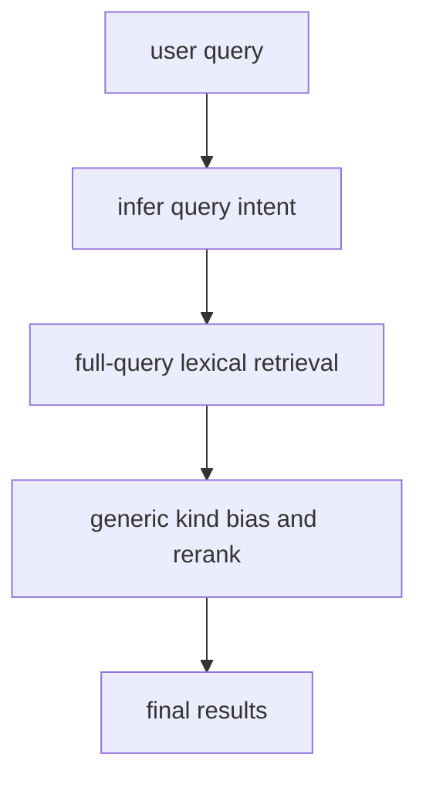
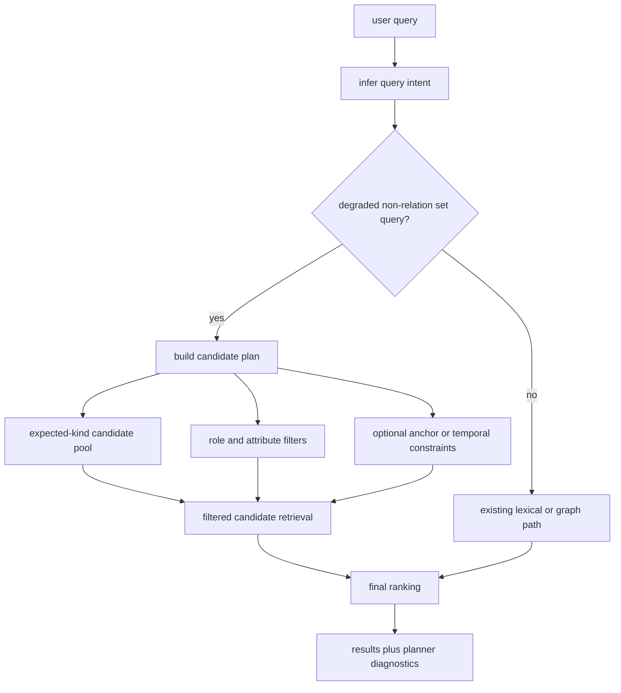

# Add KB Candidate Filter Planner For Degraded Set Queries

## Summary

Add a real candidate planner/filter stage in `kb-core` for degraded non-relation set queries so KB stops depending on raw full-query BM25 for `aggregation`, `attribute-intersection`, and `relationship-depth` cases.

The goal is to improve the held-out synthetic rail without regressing the real upstream `gbrain-evals` benchmark or falling back into benchmark-shaped heuristics.

---

## Problem Frame

The current kept benchmark posture is strong on the real upstream external rail:

- `kb-upstream`: `P@5 0.7661`, `R@5 0.9948`, `259/261`

But held-out synthetic is still materially weaker:

- `P@5 0.3021`, `R@5 0.7979`, `MRR@5 0.7199`, `nDCG@5 0.7220`

Recent work clarified what is not working:

- broad anchor cleanup heuristics hurt held-out quality
- connected-context lexical stuffing hurt held-out quality
- replacing lexical tokens with narrow intent tokens hurt held-out quality
- small additive intent reranks did nothing

So the remaining gap is not a scoring-nudge problem. It is a candidate-generation problem. For degraded non-relation set queries, KB still feeds raw natural-language text into broad lexical retrieval and only tries to repair ranking afterward. That leaves the system vulnerable to junk BM25 matches like concepts, meetings, and companies that mention the right words but are the wrong answer type.

The next step should therefore be a true planner/filter stage:

- infer the answer kind and query mode
- build a constrained candidate pool before final ranking
- use structured filters to reduce obviously wrong candidates
- keep raw lexical evidence as one signal, not the whole retrieval strategy

---

## Requirements

### Benchmark Truth

- R1. `npm run eval:kb:gbrain-evals-upstream` remains the only authoritative external comparison rail.
- R2. Kept changes must preserve or improve the current real upstream posture of `P@5 0.7661`, `R@5 0.9948`, `259/261`.
- R3. Held-out synthetic improvement remains the primary acceptance signal for this work.
- R4. Every kept change must be verified on both:
  - `env KB_GBRAIN_QUERY_SET=synthetic KB_GBRAIN_COMPACT=true node --import tsx/esm scripts/run-gbrain-evals-kb-adapter.ts`
  - `env BRAINBENCH_N=1 npm run eval:kb:gbrain-evals-upstream:kb`

### Planner Behavior

- R5. For degraded non-relation set queries, KB must build an explicit retrieval plan before final ranking.
- R6. The retrieval plan must support at least:
  - expected answer kinds
  - query mode (`aggregation`, `attribute-intersection`, `relationship-depth`, `background`)
  - role terms
  - attribute terms
  - optional anchor constraints
- R7. The planner must narrow candidate pools before final ranking instead of only nudging scores after broad retrieval.
- R8. Planner behavior must stay generic and reusable across corpora; no benchmark-only hardcoded phrase lists in imperative core logic.

### Query Families To Improve

- R9. `aggregation` queries must stop collapsing into broad lexical junk and should retrieve plausible person/company candidates of the expected answer kind first.
- R10. `attribute-intersection` queries must favor candidates that satisfy multiple requested attributes, not just one high-scoring lexical shard.
- R11. `relationship-depth` queries must prefer candidates with repeated or temporally supported evidence over shallow mentions.
- R12. `background-check` behavior that already works must not regress.

### Diagnostics

- R13. Planner-stage effects must be visible in diagnostics so future work can distinguish:
  - candidate generation misses
  - candidate filter misses
  - final ranking misses

---

## Key Technical Decisions

- KTD1. Introduce a candidate planner stage for degraded non-relation set queries instead of continuing to tune raw lexical scoring.
- KTD2. Keep the planner opt-in and narrowly activated at first: only degraded non-relation queries with `entity-set` modes should use it.
- KTD3. Make the planner produce constrained candidate IDs or candidate predicates, not replacement lexical text. The failed token-rewrite attempt showed that replacing the natural-language query is too destructive.
- KTD4. Apply answer-kind filtering before ranking whenever the intent is clear. Wrong-kind concepts and meetings should lose before final ranking, not after.
- KTD5. Preserve benchmark discipline by treating failed planner experiments as first-class artifacts. Flat or regressive attempts get reverted and recorded.

---

## High-Level Technical Design

Current weak path:

Target path:

Planner output should be structured, not lexicalized:

- candidate kind constraints
- candidate inclusion rules
- candidate exclusion rules
- attribute coverage requirements
- relationship-depth evidence requirements when applicable

---

## Scope Boundaries

### In Scope

- candidate planning and pre-ranking filtering for degraded non-relation set queries
- planner-aware diagnostics
- benchmark verification and snapshot refresh if posture changes materially

### Deferred to Follow-Up Work

- replacing heuristic extraction with a model-assisted relation extractor
- workspace-specific planner configuration surfaces beyond what current rule data already supports
- non-set fuzzy queries that are not part of the current held-out gap

### Explicitly Out of Scope

- benchmark-only adapter shims to fake planner success
- broad lexical field stuffing
- whole-query token rewriting
- hardcoded corpus-specific aliases or phrase piles in imperative planner code

---

## System-Wide Impact

- `packages/kb-core` becomes the first place where query intent can actively shape candidate generation, not just downstream ranking.
- `packages/kb-autoresearch` and the benchmark scripts will gain a cleaner signal: whether a candidate failed in planning or in final ranking.
- This change establishes the architectural seam needed for later workspace-configurable retrieval planning without forcing a full extractor rewrite first.

---

## Implementation Units

### U1. Define a first-class candidate planner contract

- **Goal:** Add a typed planner output that can represent candidate-kind constraints, attribute requirements, and optional temporal/relationship filters for degraded set queries.
- **Requirements:** R5, R6, R13
- **Dependencies:** none
- **Files:** `packages/kb-core/src/types.ts`, `packages/kb-core/src/service-helpers.ts`, `packages/kb-core/src/relations.ts`, `tests/kb-relations.test.ts`
- **Approach:** Introduce a `CandidateRetrievalPlan` shape derived from `KnowledgeQueryIntent`. It should carry constraints and candidate-selection hints, not rewritten query text. Keep the initial activation narrow and explicit.
- **Execution note:** Start with characterization coverage around current weak query families before wiring behavior into ranking.
- **Patterns to follow:** `KnowledgeQueryIntent` in `packages/kb-core/src/types.ts`; current intent inference in `packages/kb-core/src/relations.ts`
- **Test scenarios:**
  - a synthetic `aggregation` query yields a planner with expected person kind and role constraints
  - a synthetic `attribute-intersection` query yields a planner with multiple attribute requirements
  - a synthetic `relationship-depth` query yields a planner with company answer kind and relationship-depth mode
  - ordinary single-profile fuzzy queries do not produce the new planner path
- **Verification:** `node --import tsx/esm --test tests/kb-relations.test.ts`

### U2. Build planner-driven candidate narrowing before ranking

- **Goal:** Use the planner to constrain candidate pools for degraded set queries before final ranking runs.
- **Requirements:** R7, R9, R10, R11
- **Dependencies:** U1
- **Files:** `packages/kb-core/src/service.ts`, `packages/kb-core/src/service-helpers.ts`, `tests/kb-relations.test.ts`
- **Approach:** Add a planner-aware branch inside search that activates only for degraded non-relation `entity-set` intents. Candidate narrowing should happen by answer kind and planner predicates first, then ranking should operate over that smaller pool. Preserve the existing path for non-planner queries.
- **Execution note:** Add characterization assertions for the current weak probes before changing candidate flow.
- **Patterns to follow:** existing answer-kind bias and connected-anchor bias flow in `packages/kb-core/src/service.ts`; graph-result merging in `packages/kb-core/src/service-helpers.ts`
- **Test scenarios:**
  - “List all advisors in our corpus” stops surfacing concepts or meetings above plausible person answers
  - “All senior engineers” produces a person-only candidate pool before final ranking
  - “People we know who are associated with both biotech and software infrastructure” does not admit obvious wrong-kind concept pages into the top candidate pool
  - standard fuzzy profile queries still return the same top answer as before
- **Verification:** `node --import tsx/esm --test tests/kb-relations.test.ts`; targeted `explainSearch(...)` probes for the weak synthetic families

### U3. Add planner-aware result shaping for aggregation and relationship-depth queries

- **Goal:** Make the final result set reflect planner intent after candidate narrowing, especially for plural queries.
- **Requirements:** R9, R10, R11
- **Dependencies:** U2
- **Files:** `packages/kb-core/src/service.ts`, `eval/adapters/gbrain-evals/kb-adapter.ts`, `tests/kb-relations.test.ts`
- **Approach:** After candidate narrowing, apply mode-specific result shaping so `aggregation` and `relationship-depth` queries retain enough valid candidates without reintroducing noisy broad returns. Keep this grounded in planner output, not phrase heuristics.
- **Patterns to follow:** current result-budgeting logic in `eval/adapters/gbrain-evals/kb-adapter.ts`
- **Test scenarios:**
  - “List all advisors in our corpus” returns a coherent advisor-shaped result set
  - “Companies where our advisors have multi-year ongoing relationships” prefers companies with sustained advisory evidence over generic venture firms
  - plural result shaping does not reduce the current real upstream `gbrain-evals` recall posture
- **Verification:** `env KB_GBRAIN_QUERY_SET=synthetic KB_GBRAIN_COMPACT=true node --import tsx/esm scripts/run-gbrain-evals-kb-adapter.ts`

### U4. Split planner diagnostics from ranking diagnostics

- **Goal:** Make benchmark failures attributable to the correct layer.
- **Requirements:** R13
- **Dependencies:** U2
- **Files:** `packages/kb-core/src/service.ts`, `eval/adapters/gbrain-evals/kb-adapter.ts`, `scripts/run-gbrain-evals-kb-adapter.ts`, `tests/kb-autoresearch.test.ts`
- **Approach:** Expand diagnostics so degraded failures can be separated into at least:
  - candidate-plan-thin
  - candidate-filter-thin
  - ranking-thin
  This should replace the current overuse of `classification-thin` for planner-era misses.
- **Patterns to follow:** current synthetic diagnostic bucketing in `scripts/run-gbrain-evals-kb-adapter.ts`
- **Test scenarios:**
  - a planner miss reports a planner-specific residual bucket
  - a ranking miss after successful candidate narrowing does not collapse back into a generic bucket
  - diagnostics remain compact enough for autoresearch consumption
- **Verification:** `node --import tsx/esm --test tests/kb-autoresearch.test.ts`; synthetic diagnostic rerun

### U5. Refresh benchmark snapshots only if posture actually changes

- **Goal:** Keep published benchmark artifacts honest without churning them for no-op planner attempts.
- **Requirements:** R1, R2, R3, R4
- **Dependencies:** U2, U3, U4
- **Files:** `README.md`, `docs/benchmarks/kb-scorecard-latest.md`, `docs/benchmarks/kb-scorecard-latest.json`
- **Approach:** Refresh snapshots only if the planner work materially changes measured posture. If results are flat or regressive, keep code changes reverted and leave snapshots untouched.
- **Patterns to follow:** benchmark discipline in `AGENTS.md`
- **Test scenarios:** `Test expectation: none -- this unit is documentation and snapshot follow-through gated on measured benchmark change.`
- **Verification:** `npm run eval:kb:gbrain-evals-upstream`; `npm run eval:kb:gbrain-evals-upstream:kb`; `npm run eval:kb:gbrain-world -- --json`

---

## Risks & Dependencies

- The planner may accidentally become a hidden query-rewrite system if constraints are expressed as rewritten lexical text. Avoid that.
- Kind filtering can over-prune if intent classification is weak. The planner must stay narrowly activated at first.
- The current weak families may still require better candidate generation from graph structure, not only lexical narrowing. This plan should expose that clearly if it happens.

### Failed Approaches To Avoid Repeating

- Forcing `bm25-lexical` as the adapter-wide default looked attractive because it improved `cross-domain`, but it regressed the held-out rail overall by hurting unrelated direct-lookup families. Keep backend escalation narrow and query-shaped instead.
- For `relationship-depth`, trying to fix the ranking only with heavier planner weights was the wrong layer once the gold company was still missing an `advises` timeline link. Fix extraction gaps first, then let the planner exploit the new continuity evidence.

---

## Sources & Research

- current broad reasoning plan and failed-approach record: `docs/plans/2026-06-29-003-feat-kb-generic-entity-filter-intent-and-reasoning-plan.md`
- weak-query probes and benchmark state from current repo work:
  - `packages/kb-core/src/service.ts`
  - `packages/kb-core/src/service-helpers.ts`
  - `packages/kb-core/src/relations.ts`
  - `eval/adapters/gbrain-evals/kb-adapter.ts`
  - `scripts/run-gbrain-evals-kb-adapter.ts`
- benchmark corpus and held-out weak families:
  - `eval/data/gbrain-world-v1/tier5_5-synthetic-queries.json`
