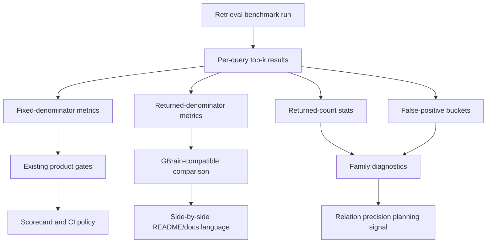
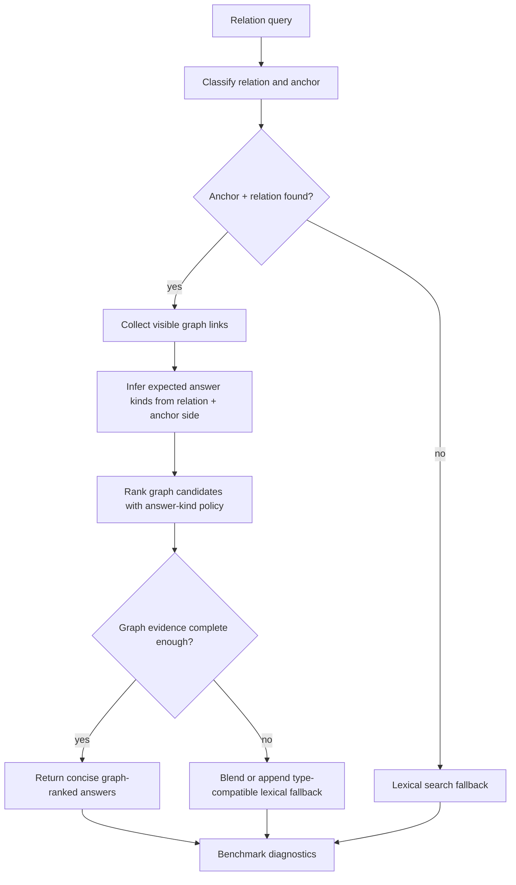

# feat: add GBrain metric parity and relation precision guardrails

## Summary

Make the GBrain external-reference rail metric-equivalent and harder to misread, then improve relation precision through product-general diagnostics, answer-kind handling, and graph-completeness arbitration. This plan keeps `admin-world-v3` as the optimize rail, preserves the exact public GBrain benchmark contract, and defers vector/reranker/RRF architecture until the scorer and relation-quality rails are trustworthy.

---

## Problem Frame

The deep dive in `docs/ideation/2026-07-14-gbrain-retrieval-precision-deep-dive.md` found that the visible GBrain precision gap is mostly a scorer-semantics mismatch. GBrain's public runner reports precision as hits divided by the number of returned top-k results, while this repo's `precisionAtK` divides hits by the requested `k`. On the exact 145-query public GBrain contract, the fixed-denominator P@5 ceiling is 36.0% because the corpus has 261 gold answers over 725 possible top-5 slots. Current KB graph-first BM25 reaches that fixed-denominator ceiling with 100.0% recall, while precision over returned results is about 94.2%.

That means the immediate work is not to copy GBrain's vector/reranker stack. The product risk is that public docs and maintainers can compare non-equivalent P@5 values, while the real quality gap lives in relation false positives, especially advisor ambiguity and fallback behavior. The plan should make metric semantics explicit first, then give implementers safe product-general levers for relation precision.

---

## Requirements

### Benchmark Semantics And Reporting

- R1. Preserve existing fixed-denominator `precisionAtK` semantics for current gates unless a later plan intentionally migrates historical metrics.
- R2. Add a separate returned-denominator precision metric for GBrain-compatible comparison, using hits divided by actual returned top-k count.
- R3. Add a fixed-denominator precision ceiling for every retrieval benchmark run so readers can tell when P@K is capped by gold cardinality.
- R4. Surface fixed-denominator precision, returned-denominator precision, recall, MRR, nDCG, returned-count distribution, and fixed-denominator ceiling in machine-readable benchmark output.
- R5. Update side-by-side GBrain reporting and public docs so KB measured scores and the GBrain public headline are labeled with their scorer semantics.

### Diagnostics And Anti-Gaming

- R6. Enrich retrieval diagnostics with per-family returned-count statistics and false-positive buckets that distinguish wrong type, anchor page, sibling distractor, lexical distractor, historical/stale relation, and relation-direction mismatch where the corpus supplies enough metadata.
- R7. Keep the exact `gbrain-world:github-benchmark` query contract unchanged: 145 public relational queries across attendance, employment, investing, and advising.
- R8. Do not introduce query-ID, file-name, benchmark-slug, exact-template, or `_facts` query-time special cases.
- R9. Keep `admin-world-v3 dev` as the optimization rail, `admin-world-v3 holdout` as confirmation, `core-six` as the deterministic regression floor, and `gbrain-world` as external-reference comparison.

### Relation Precision

- R10. Add relation answer-kind policy that can validate or demote candidates based on relation type, anchor side, and query shape without assuming every `Who` answer must be a person.
- R11. Add graph-completeness arbitration so strong graph evidence can return concise graph answers without lexical padding, while incomplete or low-confidence graph evidence can still fall back to lexical support.
- R12. Improve advisor/investor/member relation precision through schema-general behavior and fixtures, not through family-specific public-benchmark caps.
- R13. Add prose-only transfer coverage so relation improvements are validated against natural text extraction, not only seeded structured links.

### Release Discipline

- R14. Update docs, scorecard snapshots, changelog, and package versions when public metrics or `kb-core` behavior changes.
- R15. Benchmark-sensitive changes must rerun the required eval rails and preserve or improve the current release gates unless an explicit product decision accepts a regression.

---

## Scope Boundaries

### In Scope

- additional retrieval metrics and scorer metadata in eval result types, JSON output, side-by-side markdown output, and public benchmark docs
- returned-count and false-positive diagnostics for retrieval benchmark runs
- schema-general answer-kind policy for relation result filtering or demotion
- graph-completeness arbitration between graph answers and lexical fallback
- focused advisor ambiguity and prose-only transfer fixtures/tests
- docs, changelog, package-version, and scorecard updates required by the changed public surfaces

### Deferred to Follow-Up Work

- vector search, embedding storage, cross-encoder reranking, and contextual embedding wrappers
- replacing score addition with full RRF rank fusion across graph, lexical, and future vector arms
- changing the exact public GBrain benchmark contract or broadening it to `corpus-linkable`
- end-to-end agent workflow benchmarks, MCP-consumer quality benchmarks, or model-as-judge scoring
- a benchmark dashboard or historical trend service

### Outside This Product's Identity

- claiming KB beats GBrain based on non-equivalent precision semantics
- optimizing only for the public GBrain corpus at the expense of product-core rails
- using benchmark gold fields, `_facts`, or public query templates as runtime shortcuts
- treating chat transcript memory or opaque LLM expansion as a substitute for explicit KB graph/read/write behavior

---

## High-Level Technical Design

Metric work and relation-quality work should remain separate but report through the same retrieval benchmark envelope.

Relation retrieval should decide whether lexical fallback is helpful before padding graph-complete answers.

The key sequencing rule is that scorer/reporting honesty lands before relation-ranking changes. That prevents a ranking change from being judged against ambiguous metrics and keeps the GBrain public rail useful as an external reference rather than a distorted optimization target.

---

## Key Technical Decisions

- KTD1. Add sidecar metrics rather than redefining `precisionAtK`.
  Existing gates, scorecards, and tests already depend on fixed-denominator precision. A sidecar returned-denominator metric provides GBrain comparability without rewriting historical meaning.

- KTD2. Treat the fixed-denominator ceiling as first-class benchmark metadata.
  The GBrain public rail can look worse than it is under fixed P@5 because many queries have fewer than five gold answers. The ceiling makes that visible in both JSON and markdown output.

- KTD3. Keep public benchmark claims tied to scorer semantics.
  README and docs should name when a number is KB fixed-denominator, KB returned-denominator, or GBrain public headline. The plan should avoid a single unlabeled `P@5` comparison for mixed semantics.

- KTD4. Use relation schema and graph evidence for precision changes.
  Candidate filtering should derive from relation type, edge direction, target/source kind policy, and graph confidence. It must not rely on public GBrain query text or one-off caps like "advisor queries return one result."

- KTD5. Keep lexical fallback available but conditional.
  Strong graph evidence should be allowed to return concise complete answers. Sparse or ambiguous graph evidence should still use lexical fallback, but fallback candidates should be type-compatible and visibly marked in reasons/diagnostics.

- KTD6. Validate relation changes against prose-only transfer fixtures.
  The current GBrain public rail seeds structured links from benchmark facts, which is fair for exact benchmark comparability but not proof of production extraction quality. Behavior changes should pass at least one no-structured-link relation scenario.

- KTD7. Treat `kb-core` behavior changes as published-package changes.
  If relation ranking or search behavior changes under `packages/kb-core`, update the package version intentionally and record changelog/release notes according to `AGENTS.md`.

---

## Acceptance Examples

- AE1. Given a benchmark run where a query returns two documents and one is relevant, when fixed and returned-denominator precision are computed, then fixed P@5 remains `1 / 5` while returned-denominator precision is `1 / 2`.
- AE2. Given the exact GBrain public contract with 261 total gold answers across 145 top-5 queries, when the benchmark summary is generated, then the fixed-denominator ceiling is reported as 36.0% and the GBrain public headline remains labeled as an external returned-denominator reference.
- AE3. Given an advisor relation query with two current advisors and one investor/co-mention distractor, when graph evidence is complete, then both advisors are returned and the investor distractor is filtered or demoted without hard-capping the family to one result.
- AE4. Given an investor relation query whose valid investor is an organization rather than a person, when answer-kind policy runs, then the organization is allowed if the relation schema permits organization investors.
- AE5. Given a prose-only relation fixture with no seeded structured relation, when the KB extracts or indexes the relation from current truth/source text, then the relevant answer remains retrievable and the benchmark does not rely on `_facts` at query time.

---

## Implementation Units

### U1. Add retrieval scorer parity metrics

- **Goal:** Extend the eval metric model with returned-denominator precision and fixed-denominator ceiling while preserving existing `precisionAtK` behavior.
- **Requirements:** R1, R2, R3, R4; covers AE1 and AE2.
- **Dependencies:** None.
- **Files:**
  - `eval/runner/types.ts`
  - `eval/runner/cat1-retrieval.ts`
  - `tests/kb-benchmark.test.ts`
- **Approach:**
  - Keep `precisionAtK` as fixed denominator.
  - Add a separately named helper for returned-denominator precision.
  - Add benchmark-level fields for returned-denominator aggregate precision, fixed-denominator ceiling, total hits, total returned within top-k, and top-k slot denominator.
  - Add per-query and per-family values only where they materially help downstream diagnostics; avoid bloating every scorecard category.
- **Patterns to follow:** Existing metric helpers in `eval/runner/types.ts`; aggregate construction in `eval/runner/cat1-retrieval.ts`; focused metric assertions in `tests/kb-benchmark.test.ts`.
- **Test scenarios:**
  - Happy path: docs `[relevant, irrelevant]`, `k=5`, one gold answer yields fixed precision `0.2`, returned precision `0.5`, recall `1.0`.
  - Edge case: empty returned list yields `0` returned-denominator precision and does not divide by zero.
  - Edge case: a corpus with mixed one-answer and three-answer queries reports the expected fixed-denominator ceiling.
  - Regression: existing fixed `precisionAtK`, recall, MRR, and nDCG assertions continue to pass unchanged.
- **Verification:** The benchmark result type exposes both precision semantics with distinct names, and tests prove existing precision semantics did not move.

### U2. Surface metric semantics in side-by-side output and public docs

- **Goal:** Make GBrain comparison output impossible to read as apples-to-apples fixed P@5 versus returned-denominator P@5.
- **Requirements:** R2, R3, R4, R5, R7, R9, R14; covers AE2.
- **Dependencies:** U1.
- **Files:**
  - `eval/runner/kb-benchmark.ts`
  - `eval/runner/kb-eval.ts`
  - `README.md`
  - `docs/operations/kb-benchmark.md`
  - `tests/kb-cli-docs.test.ts`
  - `tests/kb-benchmark.test.ts`
- **Approach:**
  - Extend JSON side-by-side output with scorer semantics for KB and GBrain reference values.
  - Update markdown side-by-side output to show fixed P@5, returned-denominator P@returned-K, fixed P@5 ceiling, and recall/ranking metrics.
  - Update README's benchmark table and explanatory bullets so the external reference row says which scorer semantics each number uses.
  - Keep `gbrain-world:github-benchmark` labeled as the exact public contract, not a broader local reinterpretation.
- **Patterns to follow:** Existing side-by-side comparison printing in `eval/runner/kb-benchmark.ts`; README assertions in `tests/kb-cli-docs.test.ts`; benchmark policy copy in `docs/operations/kb-benchmark.md`.
- **Test scenarios:**
  - Happy path: GBrain external-reference JSON output contains fixed precision, returned-denominator precision, fixed ceiling, and external reference metadata.
  - Happy path: side-by-side markdown includes clear labels for scorer semantics and does not present a single unlabeled GBrain precision delta.
  - Regression: docs tests still assert the exact public GBrain contract and updated benchmark posture.
  - Edge case: non-GBrain corpora still print sensible metric output without requiring an external reference.
- **Verification:** README and benchmark docs describe the GBrain comparison with metric parity caveats, and runner JSON contains enough fields for downstream tooling to avoid parsing prose.

### U3. Add returned-count and false-positive diagnostics

- **Goal:** Give future retrieval work actionable precision signals beyond aggregate P@5.
- **Requirements:** R4, R6, R8, R9.
- **Dependencies:** U1.
- **Files:**
  - `eval/runner/types.ts`
  - `eval/runner/cat1-retrieval.ts`
  - `tests/kb-benchmark.test.ts`
- **Approach:**
  - Add returned-count statistics at benchmark and family level: min, max, mean, and histogram buckets for returned top-k counts.
  - Expand false-positive diagnostics from top-result-only samples toward any-returned top-k false positives where practical.
  - Bucket false positives using existing query metadata first (`expectedTargetTypes`, `distractorGroups`, `anchorId`, `requiresTimeline`) and leave unknowns explicitly unclassified rather than guessing.
  - Preserve existing diagnostics names where they are already public enough for tests or downstream readers.
- **Patterns to follow:** Existing diagnostics envelope in `EvalRunResult`; existing `distractorGroups` and `expectedTargetTypes` metadata in `EvalQuery`; existing `topFalsePositives` sampling style.
- **Test scenarios:**
  - Happy path: a synthetic adapter result with one relevant and one wrong-type result increments returned count, false-positive count, and wrong-type bucket.
  - Edge case: a false positive that is both a sibling and lexical distractor is recorded deterministically without double-counting aggregate false positives incorrectly.
  - Edge case: a false positive with no metadata lands in an `unknown` or uncategorized bucket instead of being dropped silently.
  - Regression: existing anchor, wrong-type-top, distractor-win, and graph-edge diagnostics remain populated as before.
- **Verification:** Benchmark JSON explains where extra returned results come from, especially per family, without relying on manual inspection of `perQuery` blobs.

### U4. Add schema-safe answer-kind policy and graph-completeness arbitration

- **Goal:** Improve relation precision through general relation semantics rather than benchmark-template behavior.
- **Requirements:** R8, R10, R11, R12, R15; covers AE3 and AE4.
- **Dependencies:** U3.
- **Files:**
  - `packages/kb-core/src/types.ts`
  - `packages/kb-core/src/relations.ts`
  - `packages/kb-core/src/relation-rules.json`
  - `packages/kb-core/src/service-helpers.ts`
  - `packages/kb-core/src/service.ts`
  - `tests/legacy/kb-application.integration.ts`
  - `tests/kb-benchmark.test.ts`
  - `packages/kb-core/package.json`
- **Approach:**
  - Model expected answer kinds as a relation endpoint policy, not as a blanket question-word rule. Direction matters: `Who invested in X?` asks for link sources when the company is the anchor, while `What did person X invest in?` asks for link targets.
  - Extend or centralize `relationPreferredKinds` so GBrain and admin-world relation families have explicit product-general target/source expectations, including organization investors when allowed.
  - Use answer-kind policy to filter, demote, or gate lexical fallback candidates. Prefer demotion when removing a candidate could hide legitimate organization/team answers.
  - Add a graph-completeness signal based on resolved anchor, classified relation, visible high-confidence links, expected answer-kind match, and graph result count. Use it to decide whether `graph-first-hybrid` should return concise graph results or include lexical fallback.
  - Keep `graph-only` explainability intact; any new filtering should be visible in reasons or diagnostics when feasible.
  - Treat the `kb-core` version bump as part of this unit if behavior changes land.
- **Patterns to follow:** Existing `expectedAnswerTypeBoost` and `relationPreferredKinds` in `service-helpers.ts`; relation classification in `relations.ts`; existing wrong-type relation test in `tests/legacy/kb-application.integration.ts`.
- **Test scenarios:**
  - Happy path: a clear owner/approver/advisor query returns person/team answers ahead of project/process distractors.
  - Happy path: an investor query permits an organization investor when the relation policy allows it.
  - Edge case: graph evidence with two valid advisors returns both advisors and does not hard-cap to one.
  - Edge case: sparse graph evidence still allows lexical fallback, but type-incompatible lexical candidates are demoted or filtered.
  - Error path: an unclassified relation query degrades to existing lexical search behavior without throwing.
  - Integration: `KnowledgeBaseService.search` in `graph-first-hybrid` preserves replay capture metadata and relation classification fields after arbitration.
- **Verification:** Relation precision improves through explainable schema behavior, existing graph-only paths remain diagnosable, and package versioning reflects the behavior change.

### U5. Add advisor ambiguity and prose-only transfer coverage

- **Goal:** Prove relation precision changes transfer beyond seeded public GBrain facts.
- **Requirements:** R8, R9, R12, R13, R15; covers AE3, AE4, and AE5.
- **Dependencies:** U3, U4.
- **Files:**
  - `tests/kb-benchmark.test.ts`
  - `tests/legacy/kb-application.integration.ts`
  - `eval/data/admin-world-v3/admin-world.json`
  - `scripts/expand-admin-world-v3.mjs`
  - `eval/runner/loaders.ts`
- **Approach:**
  - Add focused service-level tests for advisor/investor ambiguity before broadening benchmark data. These tests should cover current versus former advisor, advisor versus investor, board/member-like mentions, and person versus organization answer kinds.
  - Add at least one prose-only benchmark scenario where pages omit structured `relations` but contain enough current-truth or source text for normal KB indexing/extraction to create retrievable links.
  - Prefer generator or fixture-update paths that keep `admin-world-v3` reproducible. If direct manifest edits are unavoidable, document why in the unit implementation notes and keep changes small.
  - Keep the exact GBrain public corpus untouched.
- **Patterns to follow:** Admin-world metadata and split structure in `eval/data/admin-world-v3/admin-world.json`; loader query metadata in `eval/runner/loaders.ts`; service seeding behavior in `eval/runner/shared.ts`.
- **Test scenarios:**
  - Happy path: advisor ambiguity fixture appears in dev and holdout or has an explicit reason for single-split placement.
  - Happy path: prose-only relation fixture retrieves the right answer without a structured `relations` array.
  - Edge case: historical advisor mention does not beat current advisor truth.
  - Edge case: investor mention does not satisfy advisor query unless a real advisor edge exists.
  - Regression: `loadGbrainWorldCorpus(..., 'github-benchmark')` still returns exactly 145 queries and unchanged family counts.
- **Verification:** Product-core and focused tests cover transfer scenarios before relation ranking changes are treated as successful.

### U6. Refresh public artifacts, changelog, and release metadata

- **Goal:** Complete the package/release discipline required by metric and `kb-core` behavior changes.
- **Requirements:** R5, R7, R9, R14, R15.
- **Dependencies:** U1, U2, U3, U4, U5.
- **Files:**
  - `README.md`
  - `docs/operations/kb-benchmark.md`
  - `docs/benchmarks/kb-scorecard-latest.md`
  - `docs/benchmarks/kb-scorecard-latest.json`
  - `CHANGELOG.md`
  - `packages/kb-core/package.json`
  - package manifests for any local package whose dependency range must track the new `kb-core` version
  - `tests/kb-cli-docs.test.ts`
- **Approach:**
  - Refresh benchmark snapshots only after the retrieval/eval changes are complete and benchmark rails have been rerun.
  - Update README numbers and prose to distinguish fixed-denominator KB metrics, returned-denominator KB metrics, and GBrain public reference metrics.
  - Add a changelog entry with customer-visible impact, deployment status, human testing status, automated coverage, and iteration status.
  - Apply an intentional `kb-core` patch bump for relation-ranking/search-behavior changes; update dependent local ranges if required.
- **Patterns to follow:** Current changelog entry template in `CHANGELOG.md`; benchmark snapshot layout in `docs/benchmarks/`; docs assertions in `tests/kb-cli-docs.test.ts`; semver guidance in `AGENTS.md`.
- **Test scenarios:**
  - Happy path: docs tests assert updated benchmark language and no stale single-semantics GBrain precision claim.
  - Regression: scorecard JSON remains valid and contains the refreshed metrics/metadata expected by the docs.
  - Edge case: if only eval/reporting changes land without `kb-core` behavior changes, package version bump rationale is revisited rather than applied mechanically.
- **Verification:** Public docs, scorecards, changelog, and package versions are internally consistent with the final code and benchmark outputs.

---

## System-Wide Impact

- **Eval output contract:** `EvalRunResult` will gain new public-ish fields consumed by CLI output, JSON artifacts, docs, and tests.
- **Public documentation:** README benchmark claims will change from a single P@5 comparison to a scorer-aware comparison; docs tests must protect that language.
- **Release gates:** Benchmark-sensitive work will continue to require the full eval rails, and the new metrics should make future gates easier to interpret rather than stricter by accident.
- **Published package behavior:** Relation ranking/search behavior in `kb-core` can affect CLI, HTTP, MCP, and adapter consumers that rely on search ordering.
- **Benchmark data:** Admin-world or focused fixtures may grow to cover advisor/prose-only transfer, making benchmark snapshots materially different from the current published posture.

---

## Risks & Dependencies

- **Metric drift risk:** Adding a new precision metric can confuse readers if names are too similar. Mitigation: keep fixed and returned-denominator names explicit in JSON, markdown, and README prose.
- **Overfiltering risk:** Strong answer-kind filtering can hide legitimate organization/team answers. Mitigation: relation endpoint policy must allow non-person targets where product semantics require them, and tests must cover organization investors.
- **Structured-benchmark overconfidence:** Public GBrain facts are seeded as structured relations. Mitigation: prose-only transfer coverage is required before relation-ranking changes are considered complete.
- **Generated data risk:** Admin-world manifest edits can become hard to reproduce. Mitigation: prefer generator/script-backed fixture updates or document small direct edits clearly.
- **Public package release risk:** `kb-core` behavior changes require version, dependency-range, changelog, and validation discipline. Mitigation: keep release metadata in the final implementation unit instead of treating it as cleanup.
- **Benchmark runtime risk:** Full benchmark rails can be slow. Mitigation: focused tests cover scorer and relation logic first; full rails run before completion and scorecard refresh.

---

## Documentation And Operational Notes

- README should stop presenting KB fixed P@5 and the GBrain public headline as if they share one denominator.
- `docs/operations/kb-benchmark.md` should define fixed-denominator precision, returned-denominator precision, and when each is used.
- `docs/benchmarks/kb-scorecard-latest.*` should be refreshed only after the final benchmark run, not during partial implementation.
- Changelog human-testing status should remain pending until a real person reviews the updated benchmark output and relation-search behavior.

---

## Sources & Research

- `docs/ideation/2026-07-14-gbrain-retrieval-precision-deep-dive.md`
- `STRATEGY.md`
- `AGENTS.md`
- `README.md`
- `docs/operations/kb-benchmark.md`
- `eval/runner/types.ts`
- `eval/runner/cat1-retrieval.ts`
- `eval/runner/kb-benchmark.ts`
- `eval/runner/kb-eval.ts`
- `eval/runner/loaders.ts`
- `eval/runner/shared.ts`
- `packages/kb-core/src/service.ts`
- `packages/kb-core/src/service-helpers.ts`
- `packages/kb-core/src/relations.ts`
- `packages/kb-core/src/relation-rules.json`
- `tests/kb-benchmark.test.ts`
- `tests/kb-cli-docs.test.ts`
- `tests/legacy/kb-application.integration.ts`
- GBrain implementation evidence cited in the ideation doc from `garrytan/gbrain` at `5008b287e47bf791132eedfebf66bdef11e9398c`
- GBrain eval methodology evidence cited in the ideation doc from `garrytan/gbrain-evals` at `565b80754ffa6abb9afb041026f2fab048aa7553`

---

## Verification Plan

The implementer should treat this as benchmark-sensitive work. Completion requires focused tests plus the full KB benchmark rails:

- focused metric and runner coverage for U1 through U3
- focused relation/service coverage for U4 and U5
- docs coverage for U2 and U6
- repository typecheck and full test suite passing
- full core-six eval suite passing with refreshed scorecard artifacts when metrics materially change
- admin-world dev and holdout rails passing their product-core floors
- GBrain external-reference rail passing guardrails with both fixed-denominator and returned-denominator precision visible

The final benchmark summary must state which layers passed: focused tests, core-six, admin-world dev, admin-world holdout, and GBrain external reference. Do not claim launch readiness from the GBrain rail alone.

---

## Implementation Completion Notes

Completed on 2026-07-14 in branch `feat/gbrain-metric-parity-relation-precision`.

- Added fixed `precisionAtK`, returned-denominator `returnedPrecisionAtK`, fixed precision ceilings, returned-count stats, and false-positive bucket diagnostics to retrieval benchmark JSON/markdown output.
- Kept `gbrain-world:github-benchmark` at the exact 145-query public contract.
- Added schema-safe relation answer-kind handling for advisor/investor/member-like queries, organization-investor coverage, graph-incomplete lexical fallback, and prose-only relation extraction coverage.
- Removed benchmark metadata (`id`, `tier`, `tags`) from the GBrain adapter scoring path and added tests proving query results are invariant to polluted benchmark metadata.
- Refreshed public benchmark docs and scorecard artifacts with scorer labels.
- Bumped `@emmassist-co/kb-core` to `0.4.3`; existing local dependency ranges already accept the patch release.

Verification passed:

- `node --import tsx/esm --test tests/kb-benchmark.test.ts tests/kb-relations.test.ts`
- `node --import tsx/esm --test tests/kb-cli-docs.test.ts`
- `node --import tsx/esm --test tests/kb-eval-cli-guard.test.ts tests/kb-benchmark.test.ts`
- `npm run typecheck`
- `npm test`
- `npm run eval:kb:all -- --json`
- `npm run eval:kb:admin-world -- --split dev --json`
- `npm run eval:kb:admin-world -- --split holdout --json`
- `npm run eval:kb:gbrain-world -- --json`
- `npm run eval:kb:gbrain-evals-upstream`
- `KB_GBRAIN_QUERY_SET=synthetic KB_GBRAIN_COMPACT=true node --import tsx/esm scripts/run-gbrain-evals-kb-adapter.ts`
