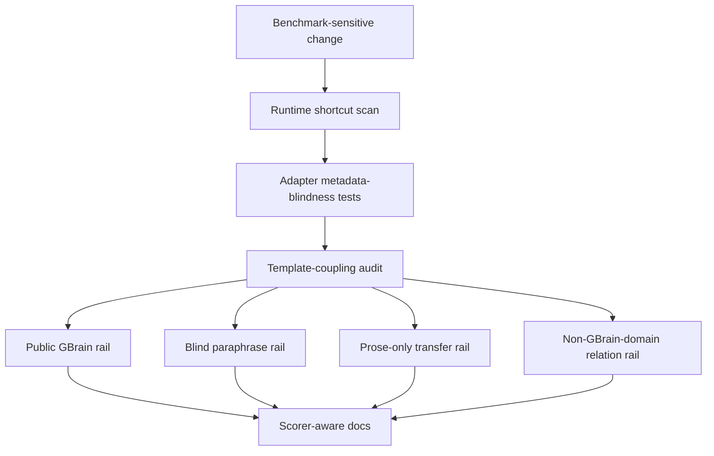

# test: add GBrain anti-cheat and generalization guardrails

## Summary

Add hard safeguards that prevent KB from improving the GBrain posture through benchmark shortcuts or template-specific regex inflation, and add blind paraphrase/prose-only rails that make relation retrieval prove it transfers beyond the public GBrain query shapes.

---

## Problem Frame

The current GBrain comparison is strong, but the public benchmark is relation-shaped and template-heavy. It is not enough to prove that KB avoids `_facts`, query IDs, or gold labels at runtime. We also need to make sure future improvements do not turn into a larger set of public-query regexes that pass `world-v1` while failing other domains or paraphrases.

The goal of this plan is not to remove deterministic relation parsing entirely. GBrain itself has typed relational recall, and KB's product identity includes explicit relation memory. The goal is to separate **schema-general relation understanding** from **benchmark-template coupling**, then enforce that boundary in code, tests, CI, and docs.

---

## Requirements

**Runtime Anti-Shortcut Guardrails**

- R1. Package runtime code must not reference GBrain-specific markers, public benchmark names, `_facts`, gold/relevant labels, query IDs, file names, or benchmark slugs.
- R2. The GBrain adapter scoring path must be metadata-blind: query `id`, `tier`, `tags`, `author`, `known_failure_modes`, and gold fields must not affect retrieved results.
- R3. Eval-only loaders may use `_facts` to build benchmark corpora and gold labels, but that use must stay outside package runtime and outside adapter scoring decisions.

**Regex And Template-Coupling Controls**

- R4. Relation parsing may use schema-general intent rules, but public GBrain query templates must not appear as special-case scoring shortcuts.
- R5. Any new relation regex or keyword rule must be tied to a reusable relation schema or product-domain rule, not to a benchmark family name.
- R6. CI must include a template-coupling audit that fails on new forbidden public-template strings or benchmark metadata use in runtime and adapter scoring paths.
- R7. The audit must allow legitimate evaluator code to generate or score benchmark queries without creating false positives for runtime code.

**Generalization Rails**

- R8. Add a blind paraphrase rail for relation retrieval where query wording differs from the public `Who <relation> <anchor>?` forms.
- R9. Add a prose-only relation rail where the service must extract/index relations from natural text rather than seeded structured relations.
- R10. Add at least one non-GBrain-domain transfer corpus so relation quality is validated outside the fictional people/company/meeting benchmark surface.
- R11. Generalization rails must report fixed precision, returned-denominator precision, recall, MRR, nDCG, returned-count stats, and false-positive buckets using the existing metric envelope.

**Release And Claims Discipline**

- R12. Public docs must distinguish public GBrain benchmark performance from anti-cheat/generalization rail performance.
- R13. The GBrain comparison may not be described as product-general unless the paraphrase/prose-only transfer rails pass their configured floors.
- R14. Benchmark-sensitive changes must rerun core-six, admin-world dev/holdout, GBrain upstream, GBrain local diagnostic, and the new anti-cheat/generalization rails before scorecard refresh.

---

## Scope Boundaries

### In Scope

- anti-shortcut grep/static-audit tests for package runtime and adapter scoring paths
- metadata-blind adapter tests for query `id`, `tier`, `tags`, and other benchmark-only fields
- a relation-rule/template-coupling audit that allows schema-general relation rules but rejects benchmark-specific shortcuts
- deterministic blind paraphrase fixtures for relation queries
- deterministic prose-only relation fixtures without structured seeded links
- at least one non-GBrain-domain relation-transfer corpus
- docs and CI updates that make the new rails part of benchmark-sensitive verification

### Deferred

- vector search, cross-encoder reranking, and RRF architecture changes
- replacing deterministic relation extraction with LLM-based query understanding
- measuring every regex in GBrain quantitatively as a release gate
- hiding evaluator source data from local developers through encryption or remote-only harnesses
- changing the exact public `gbrain-world:github-benchmark` contract

### Outside This Product's Identity

- claiming deterministic relation parsing is cheating by itself
- banning all regex or keyword rules from KB relation extraction
- optimizing the product solely for the public GBrain templates
- using `_facts`, query IDs, tags, or gold labels at query time

---

## High-Level Technical Design

The key design rule is that the public GBrain rail stays an external reference, while new internal rails test whether relation behavior survives when benchmark scaffolding is unavailable or misleading.

---

## Key Technical Decisions

- KTD1. Treat anti-cheat as a CI gate, not a reviewer checklist. Human review is useful, but shortcuts like `_facts` access, query IDs, and benchmark-specific strings should fail tests automatically.

- KTD2. Audit scoring paths separately from diagnostics. Diagnostics may record query IDs and families after retrieval for analysis, but scoring/ranking must not branch on benchmark metadata.

- KTD3. Allow relation-schema regex, reject public-template shortcuts. Rules like `advisor to`, `invested in`, or `works at` are legitimate extraction cues when they live in reusable relation schema. Branches like `if queryFamily === 'advises'` in scoring are suspect and should be eliminated or tightly justified.

- KTD4. Use deterministic fixtures first. The new rails should run locally without API keys or model judges so they can become reliable regression gates.

- KTD5. Require prose-only and cross-domain transfer before broad claims. A strong GBrain score alone proves comparability on that benchmark, not general relation memory quality.

---

## Acceptance Examples

- AE1. Given a GBrain adapter query whose `id`, `tier`, and `tags` are changed but `text` is unchanged, when the adapter runs, then returned page IDs and order are unchanged.
- AE2. Given a new runtime file that references `_facts` or `gbrain-world`, when tests run, then the anti-shortcut guard fails with the offending file and pattern.
- AE3. Given a query paraphrase like “Which people does Orbit Labs lean on for advice?” instead of “Who advises Orbit Labs?”, when the blind paraphrase rail runs, then valid advisors are retrieved without using query family metadata.
- AE4. Given a prose-only page that says “Northstar Capital backed Orbit Labs in the seed round,” when the relation rail asks for investors, then the organization investor is retrievable without seeded `relations` input.
- AE5. Given a non-GBrain-domain corpus about policies, vendors, systems, and owners, when relation retrieval runs, then answer-kind policy and graph-completeness behavior still pass configured floors.

---

## Implementation Units

### U1. Add runtime anti-shortcut guard script and tests

- **Goal:** Make benchmark shortcuts mechanically fail in package runtime code.
- **Requirements:** R1, R3, R6, R7; covers AE2.
- **Files:**
  - `scripts/check-kb-benchmark-shortcuts.mjs`
  - `tests/kb-eval-cli-guard.test.ts`
  - `package.json`
  - `.github/workflows/ci.yml`
- **Approach:**
  - Add a small script that scans allowlisted runtime directories and reports forbidden patterns.
  - Runtime scan targets should include `packages/kb-core/src`, adapter scoring code, and package surfaces that can affect query-time behavior.
  - Eval-only directories such as `eval/runner/loaders.ts` may use `_facts` and gold labels, but should be excluded or audited under a different allowlist.
  - Wire the script into `npm test` or an explicit CI step so it cannot be skipped accidentally.
- **Patterns to follow:** Existing CLI-guard tests in `tests/kb-eval-cli-guard.test.ts`; package script style in `package.json`.
- **Test scenarios:**
  - Runtime file containing `_facts` fails with a clear file/pattern report.
  - Runtime file containing `gbrain-world` or `github-benchmark` fails.
  - Eval loader code that legitimately reads `_facts` does not fail the runtime scan.
  - The guard catches adapter scoring-path metadata use but allows diagnostic-only query IDs when explicitly allowlisted.
- **Verification:** `node --import tsx/esm --test tests/kb-eval-cli-guard.test.ts` fails on a planted forbidden runtime marker and passes on the clean tree.

### U2. Make GBrain adapter scoring path metadata-blind by construction

- **Goal:** Ensure query metadata cannot influence retrieval order, even accidentally.
- **Requirements:** R2, R6, R7; covers AE1.
- **Files:**
  - `eval/adapters/gbrain-evals/kb-adapter.ts`
  - `eval/adapters/gbrain-evals/upstream-contract.ts`
  - `tests/kb-benchmark.test.ts`
- **Approach:**
  - Introduce a narrow internal query shape for scoring, such as `{ text: string }`, and convert `PublicQuery` to that before relation classification or search.
  - Keep benchmark metadata available only to diagnostics after retrieval, never to budget selection, lexical backend selection, ranking, pruning, or fallback policy.
  - Add a property-style test that varies `id`, `tier`, `tags`, `author`, and `known_failure_modes` while holding `text` constant.
- **Patterns to follow:** Existing GBrain adapter metadata guard in `tests/kb-benchmark.test.ts`; adapter sanitization functions in `eval/adapters/gbrain-evals/upstream-contract.ts`.
- **Test scenarios:**
  - Changing `id` leaves returned IDs/order unchanged.
  - Changing `tier` leaves returned IDs/order unchanged.
  - Adding misleading `tags` leaves returned IDs/order unchanged.
  - Adding `author` and `known_failure_modes` leaves returned IDs/order unchanged.
  - Diagnostics still report metadata after retrieval for analysis, without influencing scoring.
- **Verification:** Adapter metadata-blindness tests pass and no scoring helper accepts full `PublicQuery` unless documented as diagnostics-only.

### U3. Add relation template-coupling audit

- **Goal:** Prevent future work from adding public-template scoring shortcuts under the guise of relation precision.
- **Requirements:** R4, R5, R6, R7.
- **Files:**
  - `scripts/audit-relation-template-coupling.mjs`
  - `packages/kb-core/src/relations.ts`
  - `packages/kb-core/src/relation-rules.json`
  - `packages/kb-core/src/service-helpers.ts`
  - `eval/adapters/gbrain-evals/kb-adapter.ts`
  - `tests/kb-eval-cli-guard.test.ts`
- **Approach:**
  - Scan scoring paths for public-template literals such as `Who attended`, `Who works at`, `Who invested in`, and `Who advises`.
  - Scan for branches on benchmark family labels like `works_at`, `attended`, `invested_in`, and `advises` outside evaluator diagnostics.
  - Allow schema-general relation names in `relation-rules.json` and `relations.ts`, but require them to be expressed as reusable relation definitions, not benchmark family branches.
  - Produce a human-readable report that distinguishes hard failures from review warnings.
- **Patterns to follow:** Existing relation rules in `packages/kb-core/src/relation-rules.json`; existing guard-test style in `tests/kb-eval-cli-guard.test.ts`.
- **Test scenarios:**
  - A scoring-path branch on `queryFamily === 'advises'` fails.
  - A relation schema entry for `advises` in `relation-rules.json` passes.
  - A public-template string in runtime scoring fails.
  - A docs or eval-loader mention of public templates passes or is downgraded to informational.
- **Verification:** The audit catches template-specific scoring shortcuts while preserving legitimate schema-general relation extraction.

### U4. Add blind paraphrase relation rail

- **Goal:** Test relation retrieval on non-template phrasings of the same relation intents.
- **Requirements:** R8, R11, R13, R14; covers AE3.
- **Files:**
  - `eval/data/relation-paraphrase-v1/relation-paraphrase.json`
  - `eval/runner/loaders.ts`
  - `eval/runner/cat1-retrieval.ts`
  - `eval/runner/kb-benchmark.ts`
  - `tests/kb-benchmark.test.ts`
  - `docs/operations/kb-benchmark.md`
- **Approach:**
  - Create deterministic paraphrase queries for relation intents without using the exact public GBrain templates.
  - Include phrasings that change question word, relation synonym, and anchor placement.
  - Keep gold labels evaluator-only and use normal seeded/prose KB input depending on the fixture case.
  - Add a benchmark command or flag that runs the rail and emits the existing retrieval metric envelope.
- **Patterns to follow:** Corpus loader patterns in `eval/runner/loaders.ts`; retrieval benchmark metric envelope in `eval/runner/cat1-retrieval.ts`.
- **Test scenarios:**
  - Advisor paraphrase retrieves advisors without `Who advises <company>?` wording.
  - Investor paraphrase retrieves person and organization investors.
  - Attendance paraphrase retrieves meeting participants.
  - Membership paraphrase retrieves people affiliated with an organization.
  - Misleading lexical anchor does not cause anchor-page-over-answer regressions.
- **Verification:** The rail passes configured floor gates and reports returned precision plus fixed precision ceiling.

### U5. Add prose-only and non-GBrain-domain relation-transfer rail

- **Goal:** Prove relation behavior transfers when structured benchmark facts are unavailable and the domain is not the GBrain people/company/meeting surface.
- **Requirements:** R9, R10, R11, R13, R14; covers AE4 and AE5.
- **Files:**
  - `eval/data/relation-transfer-v1/relation-transfer.json`
  - `eval/runner/loaders.ts`
  - `eval/runner/shared.ts`
  - `tests/kb-benchmark.test.ts`
  - `tests/kb-relations.test.ts`
  - `docs/operations/kb-benchmark.md`
- **Approach:**
  - Build a small deterministic corpus with policies, vendors, systems, processes, teams, and people.
  - Omit structured `relations` arrays for selected cases so relation extraction must come from `compiledTruth`, source summaries, or source content.
  - Include answer-kind edge cases: team owner, vendor system, organization investor, current/former relation, and wrong-type distractors.
  - Reuse existing metric and diagnostic output rather than inventing a separate scorer.
- **Patterns to follow:** Prose-only service fixture in `tests/kb-benchmark.test.ts`; admin-world metadata style in `eval/data/admin-world-v3/admin-world.json`.
- **Test scenarios:**
  - Prose-only owner relation retrieves a person or team owner.
  - Prose-only vendor/system relation retrieves a vendor/system instead of a person.
  - Historical relation mention does not beat current truth.
  - Wrong-type lexical distractor is bucketed correctly.
  - Graph-completeness fallback behaves consistently without structured seeded links.
- **Verification:** The rail passes its floors and failures are bucketed enough to diagnose whether misses are extraction, anchor resolution, answer-kind, or ranking issues.

### U6. Wire guardrails into benchmark policy and docs

- **Goal:** Make anti-cheat and transfer rails part of the release story rather than optional local checks.
- **Requirements:** R12, R13, R14.
- **Files:**
  - `README.md`
  - `docs/operations/kb-benchmark.md`
  - `docs/benchmarks/kb-scorecard-latest.md`
  - `docs/benchmarks/kb-scorecard-latest.json`
  - `tests/kb-cli-docs.test.ts`
  - `CHANGELOG.md`
- **Approach:**
  - Update benchmark docs to define the anti-shortcut guard, blind paraphrase rail, and prose-only transfer rail.
  - Public README language should say GBrain is an external relation benchmark and generalization claims require transfer rails.
  - Scorecard refresh should include or link to the new rail outputs once they are stable.
  - Changelog entries for benchmark-sensitive changes should list anti-cheat rails explicitly in automated coverage.
- **Patterns to follow:** Current benchmark standard section in `README.md`; docs assertions in `tests/kb-cli-docs.test.ts`; changelog discipline in `CHANGELOG.md`.
- **Test scenarios:**
  - Docs tests assert scorer-aware GBrain language remains.
  - Docs tests assert generalization claims are gated on paraphrase/prose-only rails.
  - Changelog template or entry includes anti-cheat/generalization coverage for benchmark-sensitive relation work.
- **Verification:** Docs and scorecards make it hard to overstate the GBrain result as proof of product-general semantic retrieval.

---

## System-Wide Impact

- **Eval policy:** Benchmark-sensitive work gains new mandatory rails beyond public GBrain and admin-world.
- **Adapter contract:** GBrain adapter scoring becomes intentionally narrower and metadata-blind.
- **Relation development:** New regex/keyword rules require schema-general justification and transfer coverage.
- **CI runtime:** Tests may run slightly longer due to additional guard scripts and relation-transfer fixtures.
- **Public claims:** README and release notes must distinguish benchmark comparability from product-general relation quality.

---

## Risks & Dependencies

- **False-positive audit risk:** Static scans can block legitimate evaluator code. Mitigation: separate runtime/scoring path allowlists from eval-loader/docs allowlists.
- **Overcorrecting against regex risk:** Banning all regex would remove legitimate deterministic relation parsing. Mitigation: permit schema-general relation rules and only fail benchmark/template coupling.
- **Fixture-design risk:** Paraphrase fixtures can become another overfit target. Mitigation: keep them broader than one phrasing, include non-GBrain domains, and refresh periodically.
- **Runtime cost risk:** More rails can slow local verification. Mitigation: keep guard scripts fast and make full relation-transfer rails part of benchmark-sensitive verification rather than every tiny edit if needed.
- **Claim drift risk:** Future docs may still overclaim. Mitigation: docs tests should enforce the distinction between public GBrain, paraphrase, prose-only, and product-core rails.

---

## Documentation And Operational Notes

- `docs/operations/kb-benchmark.md` should describe four separate concepts: public GBrain comparison, anti-shortcut guard, blind paraphrase rail, and prose-only transfer rail.
- `README.md` should avoid “beats GBrain broadly” language unless transfer rails justify it.
- Changelog automated coverage for relation/benchmark-sensitive work should list anti-cheat and transfer rails explicitly.
- If a rail is diagnostic-only at first, docs should label it diagnostic until thresholds are stable.

---

## Sources & Research

- `docs/ideation/2026-07-14-gbrain-retrieval-precision-deep-dive.md`
- `docs/plans/2026-07-14-001-feat-gbrain-metric-parity-relation-precision-plan.md`
- `eval/adapters/gbrain-evals/kb-adapter.ts`
- `eval/adapters/gbrain-evals/upstream-contract.ts`
- `eval/runner/loaders.ts`
- `eval/runner/cat1-retrieval.ts`
- `packages/kb-core/src/relations.ts`
- `packages/kb-core/src/relation-rules.json`
- `packages/kb-core/src/service.ts`
- `packages/kb-core/src/service-helpers.ts`
- `tests/kb-benchmark.test.ts`
- `tests/kb-eval-cli-guard.test.ts`
- `tests/kb-relations.test.ts`
- GBrain relational recall evidence cited in the ideation doc from `garrytan/gbrain` at commit `5008b287e47bf791132eedfebf66bdef11e9398c`
- GBrain public benchmark methodology evidence cited in the ideation doc from `garrytan/gbrain-evals` at commit `565b80754ffa6abb9afb041026f2fab048aa7553`

---

## Verification Plan

Completion requires:

- focused anti-shortcut and metadata-blindness tests
- focused relation-template audit tests
- focused blind paraphrase rail tests
- focused prose-only / transfer-domain rail tests
- `npm run typecheck`
- `npm test`
- `npm run eval:kb:all -- --json`
- `npm run eval:kb:admin-world -- --split dev --json`
- `npm run eval:kb:admin-world -- --split holdout --json`
- `npm run eval:kb:gbrain-world -- --json`
- `npm run eval:kb:gbrain-evals-upstream`
- new blind paraphrase and prose-only transfer rail commands once added

The final implementation summary should state which layers passed and should not use the public GBrain rail alone as proof of product-general retrieval quality.
