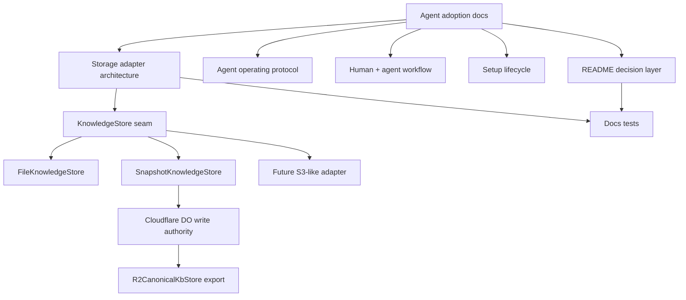

# docs: agent adoption and storage architecture guide

## Summary

Strengthen the public KB docs for the agent evaluating whether to use KB as shared memory with a human partner and other agents. The work should add decision-oriented README sections, concrete multi-agent workflows, local-to-remote setup paths, safety/trust explanations, and a storage adapter architecture guide that explains existing file/Cloudflare adapters and what it takes to build another adapter such as S3.

---

## Problem Frame

The README now explains the package map, agent-first architecture, benchmark posture, and workspace language. It still does not fully answer the adoption question an agent would ask before depending on KB as durable memory:

> Can I safely share this with my human partner and other agents, understand how memory persists and recovers, and extend the storage layer if my runtime is not file-backed or Cloudflare-backed?

The missing material is not more benchmark proof. It is operational trust: how agents should use KB day to day, how humans correct it, how local and remote flows relate, what multi-writer behavior is safe, and how storage adapters fit beneath `kb-core`.

---

## Requirements

**Agent adoption and trust**

- R1. README must include a concise adoption decision section for agents explaining when KB is the right shared memory layer and when it is not.
- R2. README must explain the trust model in plain language: durable state, evidence/source capture, human corrections, provenance, relation edges, stale/superseded facts, and recovery boundaries.
- R3. README must include a concrete multi-agent workflow showing one human and multiple agents reading, writing, correcting, and reusing memory through the same KB contract.
- R4. README must include an agent operating protocol that tells agents when to search, when to record, when to relate, when to capture sources, and what not to write.

**Setup and lifecycle clarity**

- R5. README or linked docs must provide copy/paste setup paths for plain local agents, local daemon sharing, remote HTTP agents, MCP-aware clients, and Cloudflare-hosted/serverless agents.
- R6. Docs must describe the local-to-remote migration story: starting with `KB_ROOT_DIR`, moving to a Cloudflare canonical surface, what continues to work, and how human mirror editing fits.
- R7. Docs must explain multi-writer behavior without overclaiming: lock scope, idempotent/deduped relation behavior, conflict/mirror support, and the difference between normal writes and support-mode repair.
- R8. Docs must explain failure and recovery paths for bad writes, stale memory, remote outages, local folder loss, and mirror divergence.

**Storage adapter architecture**

- R9. Docs must describe the `KnowledgeStore` interface as the core storage adapter seam and distinguish it from transport adapters (`kb-http`, `kb-mcp`) and runtime wrappers.
- R10. Docs must explain the current storage implementations: `FileKnowledgeStore`, `SnapshotKnowledgeStore`, `R2CanonicalKbStore`, and the Cloudflare Durable Object state wrapper.
- R11. Docs must provide an adapter authoring guide for an S3-like object store, including required methods, object/key layout choices, lock strategy, consistency risks, tests, exports, and package integration steps.
- R12. Docs must make clear that a new storage adapter should not fork retrieval, ranking, relation extraction, HTTP routes, or MCP tools; those remain above the storage seam.

**Language and maintainability**

- R13. Public-facing docs should use workspace/folder/namespace language, not product tenancy language. Legacy internal field names may appear only where unavoidable in code/interface references, and should be framed as compatibility/internal vocabulary.
- R14. Docs tests must assert the new adoption and storage architecture sections exist so future edits do not remove the decision-critical material silently.
- R15. Changelog must record the docs/product impact and human-testing expectation.

---

## Scope Boundaries

### In Scope

- README additions for agent adoption, trust, workflows, lifecycle, and storage architecture entry points.
- A dedicated storage adapter architecture guide under `docs/architecture/` or `docs/product/`.
- Updates to setup docs and package READMEs when they carry public-facing setup language.
- Docs tests for the new decision-critical language.
- Changelog entry.

### Deferred

- Implementing an actual S3 adapter package.
- Renaming internal `tenantId` fields across `kb-core` and existing tests.
- Changing persisted markdown frontmatter schema.
- Changing Cloudflare Durable Object/R2 runtime behavior.
- Adding OAuth flows for MCP clients.
- Building UI onboarding or hosted dashboards.

### Outside This Product's Identity

- Presenting KB as a chat app, IDE extension, or full agent runtime.
- Treating local file mode, mirror support, and canonical remote mode as equivalent production surfaces.
- Claiming broad semantic memory behavior beyond the measured retrieval/relation surfaces.

---

## High-Level Technical Design

Storage architecture should be described as layers:

1. `kb-core` owns the knowledge model, service behavior, retrieval, relation extraction, and the `KnowledgeStore` interface.
2. Storage adapters implement `KnowledgeStore` methods for entity/source markdown, registry entries, events, drafts, links, and entity locks.
3. Runtime wrappers choose a store and expose the service through CLI, HTTP, MCP, or Worker surfaces.
4. Object-store adapters may use the snapshot/export layout pattern, but they should still preserve the `KnowledgeStore` semantics expected by `KnowledgeBaseService`.

---

## Key Technical Decisions

- KTD1. Put the agent adoption story in `README.md`, with deep details linked out. The README is the decision surface; long operational mechanics belong in dedicated docs.
- KTD2. Add a dedicated storage adapter guide rather than burying adapter details in package READMEs. Adapter authors need a stable, architecture-level checklist with links to implementations.
- KTD3. Treat S3 as an illustrative adapter, not an implementation target. The guide should explain design requirements and pitfalls without creating a half-supported package surface.
- KTD4. Keep workspace language in public docs. If docs must mention legacy internal names, they should do so only in code/interface context and explicitly frame them as internal compatibility vocabulary.
- KTD5. Make docs tests assert concepts, not exact prose. The tests should protect the existence of adoption/trust/storage sections without making future copy edits painful.

---

## Acceptance Examples

- AE1. Given an agent reading the README, when it asks “should I use this as shared memory with my human and other agents?”, then it can find a short decision section explaining fit, non-fit, and trust boundaries.
- AE2. Given a human and two agents using KB, when one agent records a decision and another searches later, then README shows the intended record/search/correct loop in concrete steps.
- AE3. Given an agent starting locally, when it later needs shared remote memory, then docs explain how local file mode, remote HTTP, `/mcp`, and Cloudflare setup relate without implying they are separate memories.
- AE4. Given an adapter author considering S3, when they read the storage guide, then they can identify `KnowledgeStore` methods to implement, object layout decisions to make, lock semantics to preserve, and tests to add.
- AE5. Given a future README edit that removes the agent operating protocol or storage adapter guide link, when docs tests run, then the removal is caught.

---

## Implementation Units

### U1. Add README adoption decision layer

- **Goal:** Make the README answer the agent's adoption question before it dives into package details or benchmarks.
- **Requirements:** R1, R2, R3, R4, R13; covers AE1 and AE2.
- **Files:**
  - `README.md`
  - `tests/kb-cli-docs.test.ts`
- **Approach:**
  - Add a section near the agent-first architecture map titled along the lines of `Should an agent use KB?` or `How agents and humans share KB`.
  - Cover best-fit cases: durable workspace memory, cross-agent facts/decisions/sources, human-correctable state, local-to-remote portability.
  - Cover non-fit cases: chat UI, generic vector database, broad semantic personal-brain product, source-of-truth replacement for app databases.
  - Add a concrete multi-agent loop with roles: human, Codex-like CLI agent, Claude-like MCP agent, Pi-like remote HTTP agent.
  - Add a short trust model: persisted records, source capture, explicit relation edges, supersession/freshness metadata, inspect/doctor surfaces.
- **Patterns to follow:** Existing README sections `Agent-First Architecture Map`, `Cloudflare-First Deployment Shape`, and `Benchmark Standard`.
- **Test scenarios:**
  - README contains an adoption decision heading.
  - README mentions human+agent shared memory.
  - README includes a multi-agent workflow.
  - README includes trust/provenance/correction language.
  - README does not reintroduce public-facing product tenancy language.
- **Verification:** `node --import tsx/esm --test tests/kb-cli-docs.test.ts`.

### U2. Document the agent operating protocol and lifecycle paths

- **Goal:** Give agents copy/paste rules for using KB correctly in local, daemon, remote HTTP, MCP, and Cloudflare/serverless contexts.
- **Requirements:** R4, R5, R6, R7, R8, R13; covers AE2 and AE3.
- **Files:**
  - `README.md`
  - `docs/consumer-quickstart.md`
  - `docs/cloudflare-agent-setup.md`
  - `packages/kb-cli/README.md`
  - `packages/kb-mcp/README.md`
  - `tests/kb-cli-docs.test.ts`
- **Approach:**
  - Add a compact protocol: search before answering workspace facts, record durable decisions, capture sources for external evidence, relate explicit edges, annotate timeline/provenance, avoid dumping raw chat logs, ask before overwriting canonical truth.
  - Add setup snippets by actor/environment: plain command-running local agent, local daemon sharing, protected remote HTTP, MCP-aware client, Worker/serverless runtime.
  - Add local-to-remote lifecycle text: local `KB_ROOT_DIR` starts as workspace memory; remote `KB_BASE_URL` points agents at canonical Cloudflare; mirror mode is support/human editing, not a second production path.
  - Add failure/recovery bullets: bad memory correction/supersession, `doctor`, `inspect`, mirror validation, conflict resolution, remote outage fallback boundaries.
- **Patterns to follow:** Existing setup snippets in `docs/consumer-quickstart.md`, `docs/cloudflare-agent-setup.md`, and `packages/kb-cli/README.md`.
- **Test scenarios:**
  - Docs mention `KB_ROOT_DIR`, `KB_BASE_URL`, `KB_API_TOKEN`, `KB_WORKSPACE_ID`, `/mcp`, and `kb-local serve` in the relevant setup paths.
  - Docs distinguish local-development, canonical-production, and mirror-support roles.
  - Docs state mirror support is not a peer production architecture.
  - Docs include failure/recovery language for bad writes or divergence.
- **Verification:** `node --import tsx/esm --test tests/kb-cli-docs.test.ts`; targeted CLI docs assertions.

### U3. Add storage adapter architecture and S3-style authoring guide

- **Goal:** Explain how storage adapters fit below `kb-core` and what an implementer would need to build another adapter.
- **Requirements:** R9, R10, R11, R12, R13; covers AE4.
- **Files:**
  - `docs/architecture/kb-storage-adapters.md` (new)
  - `README.md`
  - `packages/kb-storage-file/README.md`
  - `packages/kb-storage-cloudflare/README.md`
  - `tests/kb-cli-docs.test.ts`
- **Approach:**
  - Create a dedicated guide with these sections:
    - `Storage adapter seam`: `KnowledgeStore` from `packages/kb-core/src/store.ts`.
    - `What the service expects`: markdown reads/writes, registry persistence, events, drafts, origin-scoped link replacement, locks.
    - `Existing implementations`: `FileKnowledgeStore`, `SnapshotKnowledgeStore`, `R2CanonicalKbStore`, Cloudflare DO wrapper.
    - `What an S3-like adapter would require`: object key layout, list pagination, read/write consistency assumptions, delete semantics, lock implementation, versioning/rebuild strategy, auth/credential injection, tests.
    - `What not to implement in storage`: retrieval, relation parsing, HTTP/MCP, agent protocol, benchmark logic.
  - Link the guide from README Architecture and both storage package READMEs.
  - Prefer diagrams/tables for layer boundaries and method responsibilities.
- **Patterns to follow:**
  - `packages/kb-core/src/store.ts`
  - `packages/kb-storage-file/src/file-store.ts`
  - `packages/kb-core/src/snapshot-store.ts`
  - `packages/kb-storage-cloudflare/src/r2-store.ts`
  - `packages/kb-storage-cloudflare/src/state-cloudflare-do.ts`
- **Test scenarios:**
  - New guide exists.
  - Guide references `KnowledgeStore`, `FileKnowledgeStore`, `SnapshotKnowledgeStore`, `R2CanonicalKbStore`, and S3-style adapter requirements.
  - README links to the guide.
  - Storage package READMEs link to the guide.
- **Verification:** `node --import tsx/esm --test tests/kb-cli-docs.test.ts`; `npm run typecheck` if tests import paths.

### U4. Tighten docs tests and changelog

- **Goal:** Keep the new adoption and storage docs from regressing silently.
- **Requirements:** R14, R15; covers AE5.
- **Files:**
  - `tests/kb-cli-docs.test.ts`
  - `CHANGELOG.md`
- **Approach:**
  - Add docs assertions for the adoption decision section, agent operating protocol, multi-agent workflow, storage adapter guide, S3-style adapter checklist, and workspace-language guard.
  - Add a changelog entry recording docs impact and human testing expectations.
  - Avoid exact paragraph matching; assert durable concepts and file existence.
- **Patterns to follow:** Existing docs assertions in `tests/kb-cli-docs.test.ts` and current changelog entry format.
- **Test scenarios:**
  - Removing the README adoption section fails tests.
  - Removing the storage adapter guide or README link fails tests.
  - Reintroducing public-facing product tenancy language in README/deployment model fails tests.
- **Verification:** `node --import tsx/esm --test tests/kb-cli-docs.test.ts`.

---

## System-Wide Impact

- **Public positioning:** README becomes a decision document for agents and operators, not just a package index plus benchmark report.
- **Docs architecture:** Storage adapter guidance becomes explicit and extensible, reducing pressure to copy Cloudflare or file-store internals for future backends.
- **Adapter ecosystem:** Future S3-like work gets a checklist without prematurely committing to a new package.
- **Language discipline:** Workspace/folder/namespace language remains enforced in public-facing docs.

---

## Risks & Dependencies

- **Over-documentation risk:** README could become too long. Mitigation: put decision-critical material in README and link deeper mechanics to dedicated docs.
- **Adapter-guide overpromise risk:** An S3-style guide might imply support exists. Mitigation: label it as an authoring checklist, not a shipped adapter.
- **Legacy vocabulary leakage risk:** Existing internal names may leak into product docs. Mitigation: docs tests should guard README and deployment model; implementation references should be scoped to code/API compatibility.
- **Behavioral overclaim risk:** Multi-writer docs may imply stronger transactional guarantees than implemented. Mitigation: document lock/conflict semantics narrowly and point to validation/doctor flows.

---

## Documentation And Operational Notes

- Keep setup snippets short and runnable.
- Prefer `KB_WORKSPACE_ID` and `--workspace-id` in public docs.
- Mention legacy compatibility names only in CLI reference or migration notes, not in the main README path.
- If the storage guide mentions internal metadata names, frame them as current code vocabulary rather than product concepts.
- Human testing should include reading the README as a first-time agent/operator and following at least one local setup path.

---

## Sources & Research

- `README.md`
- `docs/product/deployment-model.md`
- `docs/consumer-quickstart.md`
- `docs/cloudflare-agent-setup.md`
- `packages/kb-cli/README.md`
- `packages/kb-mcp/README.md`
- `packages/kb-storage-file/README.md`
- `packages/kb-storage-cloudflare/README.md`
- `packages/kb-core/src/store.ts`
- `packages/kb-storage-file/src/file-store.ts`
- `packages/kb-core/src/snapshot-store.ts`
- `packages/kb-storage-cloudflare/src/r2-store.ts`
- `packages/kb-storage-cloudflare/src/state-cloudflare-do.ts`
- `tests/kb-cli-docs.test.ts`

---

## Verification Plan

- `node --import tsx/esm --test tests/kb-cli-docs.test.ts`
- `npm run check:kb:anti-cheat`
- `npm run typecheck`
- `npm test` if implementation touches CLI help, package exports, package versions, or test helpers beyond docs assertions.
