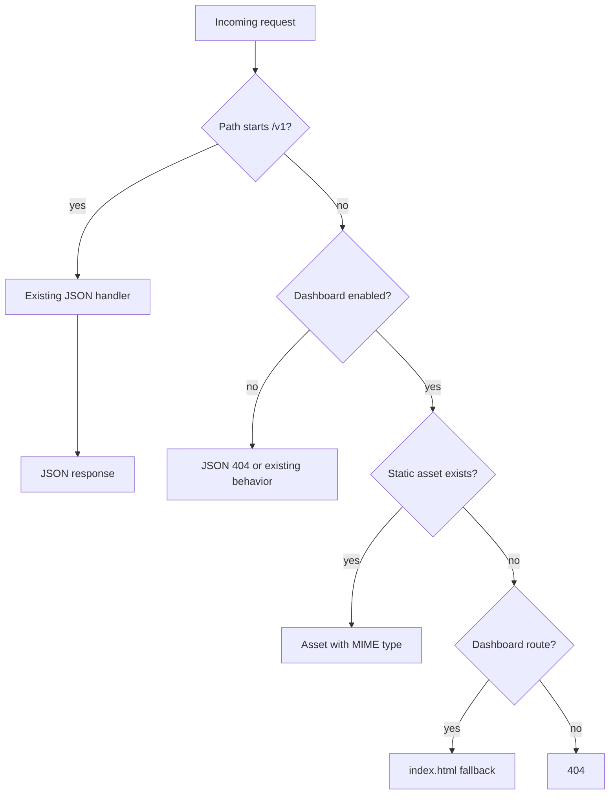
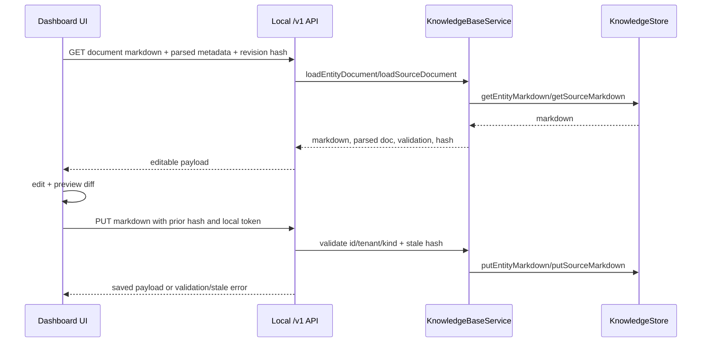

# feat: Add local KB browser dashboard

## Summary

Add a basic Vite + TypeScript browser dashboard to `@emmassist-co/kb-cli` so users can inspect and operate a local file-backed KB without Obsidian. The dashboard should be served by the local KB CLI daemon, use the existing `/v1` API wherever possible, and add only the small document-editing API needed for safe markdown/frontmatter edits.

---

## Problem Frame

The KB already stores inspectable state as entities, sources, links, drafts, events, and markdown/frontmatter files, but users currently need CLI commands, raw filesystem browsing, or Obsidian/mirror workflows to operate it comfortably. A local browser surface lowers the adoption barrier for users who want to see what the KB contains, inspect graph relationships, review recent changes, and make safe edits without installing a PKM tool.

The plan keeps the strategy intact: Cloudflare-backed `kb-http` remains the canonical production runtime, while the browser dashboard is a local operator/development surface over the same service semantics.

---

## Requirements

**Command and serving model**

- R1. The CLI exposes a local dashboard command or flag that serves the dashboard and prints both the dashboard URL and API URL.
- R2. The dashboard defaults to loopback-only serving and must not silently expose writable KB state on a non-loopback host.
- R3. Existing `/v1/*` JSON API behavior remains unchanged for current `kb serve` consumers unless the user opts into the dashboard surface.
- R4. Dashboard static routes must not shadow `/v1/*`; API errors remain JSON and dashboard routes return HTML/assets.

**Dashboard capabilities**

- R5. The dashboard home shows tenant/backend/canonicality, root path, counts, freshness, and health/doctor signals from existing API data.
- R6. Users can browse entities and sources, distinguish record kind, see backing metadata, and view rendered/raw markdown.
- R7. Users can inspect frontmatter and edit supported entity/source markdown through a safe validation and preview flow.
- R8. Users can inspect graph relationships from entities using existing relations, links, related, and traverse/query APIs.
- R9. Users can review recent events, drafts, and write activity signals without editing generated/support state directly.

**Safety and packaging**

- R10. Markdown writes validate document shape, reject identity/tenant changes, detect stale edits, and only save supported entity/source documents.
- R11. Browser write requests use local safety rails: session token/origin validation, explicit confirmations for destructive or operator actions, and read-only defaults where practical.
- R12. Dashboard assets are built as static Vite output, included in the published CLI package, and do not require a Vite dev server at runtime.
- R13. Public package versions, dependency ranges, README/help text, and `CHANGELOG.md` are updated as part of the implementation.

---

## Key Technical Decisions

- **Use Vite with vanilla TypeScript for the first dashboard:** A frameworkless Vite app keeps dependencies low, is easy to serve as static files, and is enough for inventory, table/list, graph, and editor flows. React or another component framework can be added later if UI complexity justifies it.
- **Place dashboard source under `packages/kb-cli`:** The feature is an operator CLI surface, not a standalone product package. Source should live near the command that serves it, and Vite output should build into `packages/kb-cli/dist/dashboard` so existing package `files: ["dist"]` includes assets.
- **Extend the local Node host with optional static serving:** `packages/kb-http` owns `startKnowledgeBaseNodeServer`; adding an optional dashboard/static asset handler there avoids a second server lifecycle while preserving `/v1` routing priority.
- **Add service-backed document endpoints for exact markdown saves:** Existing `/v1/record` merge semantics are not safe for arbitrary markdown editing. The dashboard needs explicit document read/save endpoints that validate with `kb-core` document helpers and perform stale-write checks.
- **Keep dashboard local-first, not hosted-control-plane-first:** Remote/production dashboard support is deferred unless it falls out naturally from existing `/v1` reads. Write-capable browser operation should be treated as local operator tooling until auth/CSRF/permission posture is deliberately expanded.
- **Implement safety before rich editing:** The initial editor can be simple, but writes must validate frontmatter, preserve identity, reject stale content, and clearly preview what will change.

---

## High-Level Technical Design

### Component topology

```mermaid
flowchart TB
  CLI[kb CLI]
  Daemon[startKnowledgeBaseCliDaemon]
  NodeServer[startKnowledgeBaseNodeServer]
  Static[Dashboard static assets]
  Api[/v1 JSON API]
  Service[KnowledgeBaseService]
  Store[FileKnowledgeStore]
  Browser[Browser dashboard]

  CLI --> Daemon
  Daemon --> NodeServer
  NodeServer -->|/dashboard and asset routes| Static
  NodeServer -->|/v1 routes first| Api
  Api --> Service
  Service --> Store
  Browser -->|fetch /v1/* with local token| NodeServer
```

### Request routing



### Editing flow



---

## Scope Boundaries

### In scope

- A basic local browser dashboard served by the KB CLI.
- Static Vite build output packaged with `@emmassist-co/kb-cli`.
- Inventory, entity/source browsing, frontmatter/raw markdown view, simple graph exploration, recents, and safe supported markdown edits.
- Local write safety sufficient for loopback operator use.
- Tests for server routing, API contracts, editing safety, packaging, and UI data mapping.

### Deferred to Follow-Up Work

- Hosted multi-tenant dashboard/control plane.
- Full Obsidian-equivalent editing experience, backlinks, daily notes, or workspace vault management.
- Rich graph diff playback over historical snapshots.
- Query ranking signal introspection beyond what current APIs expose.
- Public third-party dashboard plugin API; start with internal panels only if needed.
- Remote production write support from the dashboard.

### Outside This Product's Identity

- Replacing Cloudflare-backed `kb-http` as the canonical production runtime.
- Treating generated/support files such as events, links, registry, locks, or mirror metadata as directly human-authoritative editable content.

---

## System-Wide Impact

This feature touches published package surfaces and local operator safety. `@emmassist-co/kb-cli` gets a new user-visible command/help entry and packaged frontend assets. `@emmassist-co/kb-http` likely gets optional static serving and document-editing route support, which makes it a public API change. Because browser writes introduce CSRF/origin risks that raw CLI commands do not have, the implementation must treat local dashboard writes as a new safety boundary, not just a prettier client for unauthenticated POST routes.

---

## Implementation Units

### U1. Add dashboard command shape and local serving lifecycle

**Goal:** Introduce the CLI surface for launching the local dashboard while preserving existing `kb serve` API-only behavior.

**Requirements:** R1, R2, R3, R4

**Dependencies:** None

**Files:**

- `packages/kb-cli/src/index.ts`
- `packages/kb-cli/src/daemon.ts`
- `packages/kb-http/src/node-server.ts`
- `tests/kb-cli.test.ts`
- `tests/kb-http.test.ts`
- `packages/kb-cli/README.md`

**Approach:** Add a clear command surface, preferably `kb dashboard [--host 127.0.0.1] [--port 3001] [--read-only]`, with `kb serve` remaining API-only. Internally, dashboard mode can reuse `startKnowledgeBaseCliDaemon` but pass dashboard/static-serving options through to the Node server. Keep `/v1/*` routed to the existing JSON handler before any static route logic. Print a dashboard URL and API URL after startup.

For non-loopback hosts, require an explicit opt-in and ensure a local token/origin safety mechanism is enabled before write controls are allowed. If implementation chooses `kb serve --dashboard` instead, preserve `kb serve` default output and behavior for existing automation.

**Patterns to follow:** Existing serve wiring in `packages/kb-cli/src/index.ts`, local daemon capabilities in `packages/kb-cli/src/daemon.ts`, and Node host defaults in `packages/kb-http/src/node-server.ts`.

**Test scenarios:**

- Happy path: running the dashboard command starts a local server and returns HTML for the dashboard route.
- Compatibility: existing `kb serve` still returns JSON for `/v1/capabilities` and does not require dashboard assets.
- Routing: `/v1/unknown` remains a JSON API error, while a dashboard client route falls back to `index.html` only when dashboard mode is enabled.
- Safety: attempting to start write-capable dashboard mode on a non-loopback host without explicit protection fails with a clear error.
- Error path: missing dashboard assets in source/dev execution produces a clear build instruction rather than an opaque 500.

**Verification:** Existing CLI and HTTP tests pass, dashboard launch behavior is covered, and the help text clearly distinguishes `serve` from `dashboard`.

### U2. Add Vite TypeScript dashboard source and build packaging

**Goal:** Create the frontend project structure, build pipeline, and package inclusion needed to ship static dashboard assets in `@emmassist-co/kb-cli`.

**Requirements:** R12, R13

**Dependencies:** U1

**Files:**

- `packages/kb-cli/dashboard/index.html`
- `packages/kb-cli/dashboard/src/main.ts`
- `packages/kb-cli/dashboard/src/styles.css`
- `packages/kb-cli/dashboard/vite.config.ts`
- `packages/kb-cli/package.json`
- `package.json`
- `scripts/verify-public-packages.mjs`
- `tests/kb-cli.test.ts`

**Approach:** Use Vite with vanilla TypeScript. Configure the build to emit static assets into `packages/kb-cli/dist/dashboard` after or alongside TypeScript compilation. Keep dashboard code browser-only, with a small API client wrapper around `/v1`. Avoid runtime dependencies in the published CLI package unless the implementation discovers they are necessary; Vite and any browser-only tooling should be dev/build dependencies.

Wire the root and package build scripts so `npm run build:public` produces both CLI JS and dashboard assets. Ensure the clean script removes dashboard build output. Confirm the published package includes `dist/dashboard` under the existing `files` allowlist.

**Patterns to follow:** Existing package build scripts in root `package.json`, package export/files discipline in `packages/kb-cli/package.json`, and public package verification in `scripts/verify-public-packages.mjs`.

**Test scenarios:**

- Build: `build:public` produces dashboard HTML/assets under the CLI package `dist` output.
- Packaging: the package dry-run or verification script confirms dashboard assets are included in `@emmassist-co/kb-cli`.
- Runtime: the Node server can find built assets from the package layout.
- Dev failure: if assets are absent, the CLI explains that the dashboard must be built rather than serving an empty page.

**Verification:** Public package verification accounts for the new asset directory, and the dashboard can be served from built package output.

### U3. Implement dashboard inventory, browser shell, and API client

**Goal:** Build the first useful browser UI: layout, API client, inventory dashboard, entity/source lists, and empty/error states.

**Requirements:** R5, R6, R9

**Dependencies:** U1, U2

**Files:**

- `packages/kb-cli/dashboard/src/main.ts`
- `packages/kb-cli/dashboard/src/api.ts`
- `packages/kb-cli/dashboard/src/state.ts`
- `packages/kb-cli/dashboard/src/views/inventory.ts`
- `packages/kb-cli/dashboard/src/views/records.ts`
- `packages/kb-cli/dashboard/src/views/recents.ts`
- `packages/kb-cli/dashboard/src/styles.css`
- `tests/kb-dashboard-ui.test.ts`

**Approach:** Keep the frontend modular but simple: a small router/state module, an API client, and view modules for inventory, records, and recents. Use existing endpoints first: `/v1/capabilities`, `/v1/inspect`, `/v1/doctor`, `/v1/entities`, `/v1/export`, `/v1/events`, `/v1/drafts`, and `/v1/relations` as needed. Prefer incremental endpoint calls over loading the entire export for every screen; reserve `/v1/export` for aggregate data that lacks a narrower route.

The records view should distinguish entities from sources when possible, show useful frontmatter fields, and include clear zero-states for empty KBs. Recents should sort by timestamp when available and degrade gracefully for malformed or partial events.

**Patterns to follow:** Existing `/v1` response shape in `packages/kb-http/src/server.ts` and capability metadata from `packages/kb-cli/src/daemon.ts`.

**Test scenarios:**

- Happy path: inventory renders tenant, backend, root, canonicality, and counts from mocked `/v1` responses.
- Empty KB: dashboard renders zero-state lists without throwing.
- Error path: a failed `/v1/doctor` call shows a recoverable warning while the rest of the dashboard remains usable.
- Data mapping: entity/source cards preserve IDs, titles, kinds, timestamps, and confidence/freshness fields when present.
- Accessibility sanity: primary navigation and record list are keyboard reachable with visible focus states.

**Verification:** Browser UI tests or DOM-level tests cover key rendering flows, and manual local launch shows a usable dashboard against a small file-backed tenant.

### U4. Add safe document read/save API for markdown editing

**Goal:** Provide exact markdown/frontmatter editing support through service-backed endpoints that are safe enough for local browser writes.

**Requirements:** R7, R10, R11

**Dependencies:** U1

**Files:**

- `packages/kb-core/src/service.ts`
- `packages/kb-core/src/documents.ts`
- `packages/kb-http/src/server.ts`
- `packages/kb-http/src/route-auth.ts`
- `packages/kb-http/src/types.ts`
- `tests/kb-http.test.ts`
- `tests/kb-obsidian-sync.test.ts`

**Approach:** Add explicit document endpoints rather than overloading `/v1/record` merge semantics. A possible shape is `GET /v1/documents/:kind/:id` and `PUT /v1/documents/:kind/:id`, where `kind` is entity or source. The GET response should include raw markdown, parsed metadata, validation issues, and a revision hash computed from the current markdown. The PUT request should include markdown and the prior revision hash.

The service layer should validate by parsing the markdown with `parseEntityDocument` or `parseSourceDocument`, running the relevant validator, rejecting `id` or `tenantId` changes, rejecting unsupported kind mismatches, checking stale hashes, and only then writing through `putEntityMarkdown` or `putSourceMarkdown`. Generated/support state remains read-only. For browser safety, use existing auth scopes where configured and add local dashboard token/origin validation where the Node host enables write mode.

**Patterns to follow:** Store methods in `packages/kb-core/src/store.ts`, document parsers/validators in `packages/kb-core/src/documents.ts`, and semantic-sync fail-closed behavior in `tests/kb-obsidian-sync.test.ts`.

**Test scenarios:**

- Happy path: valid entity markdown with unchanged `id` and `tenantId` saves and can be read back exactly or with documented canonical formatting.
- Happy path: valid source markdown saves and preserves source-specific fields.
- Validation: missing YAML frontmatter is rejected with a specific validation error.
- Validation: unsupported entity/source kind is rejected.
- Safety: changing `id` or `tenantId` in frontmatter is rejected.
- Stale write: PUT with an old revision hash is rejected and returns the current hash or a clear stale-write error.
- Authorization: protected hosts require `kb.write` for PUT and `kb.read` for GET.
- CSRF/local safety: cross-origin or missing dashboard token write attempts are rejected when dashboard write safety is enabled.

**Verification:** HTTP route tests prove exact read/save semantics and rejection behavior before the frontend editor is wired to writes.

### U5. Build markdown/frontmatter editor and preview UI

**Goal:** Let users view, edit, validate, preview, and save supported entity/source markdown from the dashboard.

**Requirements:** R6, R7, R10, R11

**Dependencies:** U3, U4

**Files:**

- `packages/kb-cli/dashboard/src/views/editor.ts`
- `packages/kb-cli/dashboard/src/markdown.ts`
- `packages/kb-cli/dashboard/src/diff.ts`
- `packages/kb-cli/dashboard/src/api.ts`
- `packages/kb-cli/dashboard/src/styles.css`
- `tests/kb-dashboard-ui.test.ts`
- `tests/kb-http.test.ts`

**Approach:** Start with a simple textarea-based editor, parsed frontmatter summary, validation messages, rendered preview, and save button. Avoid raw HTML execution in markdown preview; use safe rendering or a deliberately minimal markdown renderer that treats raw HTML as text. Show identity fields as protected/warned fields and require confirmation if the user attempts a risky change that the API will reject anyway.

Before save, show a lightweight diff or summary of changed lines and require explicit confirmation for writes. If the API returns stale hash, validation, or auth errors, keep the user's draft in the browser and show recovery instructions.

**Patterns to follow:** The backend document endpoint from U4 and existing semantic-sync docs that only `entities/*.md` and `sources/*.md` are human-editable.

**Test scenarios:**

- Happy path: loading an entity document displays raw markdown, frontmatter summary, and preview.
- Save path: editing the current truth/body and saving calls the document PUT endpoint with the prior revision hash.
- Validation error: invalid frontmatter displays API validation errors and does not clear the editor draft.
- Stale error: stale hash response keeps unsaved content and prompts reload/compare.
- XSS safety: markdown containing `<script>` or event-handler HTML does not execute in preview.
- Unsupported state: generated/support records are shown read-only and cannot be edited from the UI.

**Verification:** UI tests cover editor state transitions, and backend tests already prove save safety.

### U6. Add graph and recents views over existing APIs

**Goal:** Provide lightweight graph exploration and recent activity browsing without adding a custom graph backend.

**Requirements:** R8, R9

**Dependencies:** U3

**Files:**

- `packages/kb-cli/dashboard/src/views/graph.ts`
- `packages/kb-cli/dashboard/src/views/recents.ts`
- `packages/kb-cli/dashboard/src/api.ts`
- `packages/kb-cli/dashboard/src/styles.css`
- `tests/kb-dashboard-ui.test.ts`
- `tests/kb-http.test.ts`

**Approach:** Implement graph exploration as a practical adjacency/provenance view first, not a complex force-directed canvas. Start from an entity, call `/v1/entities/:id/links`, `/v1/entities/:id/related`, `/v1/entities/:id/relations`, and `/v1/traverse`, then render nodes/edges in a capped, filterable list or simple SVG. Include filters for relation type, origin kind, and depth when the API supports them. Add caps for node/edge counts to avoid locking up large KBs.

Recents should combine `/v1/events`, drafts, and updated metadata where available. Treat events, links, registry, locks, and sync state as read-only unless a separate operator mode later adds explicit repair actions.

**Patterns to follow:** Existing graph commands and endpoints in `packages/kb-cli/src/index.ts` and `packages/kb-http/src/server.ts`.

**Test scenarios:**

- Graph happy path: selecting an entity shows adjacent links/relations and lets the user open a neighbor record.
- Graph filters: relation type/depth filters alter the displayed edge set without reloading the whole app.
- Large graph: graph rendering caps nodes/edges and shows a truncation message.
- Missing graph data: entity with no links shows an empty-state explanation.
- Recents: event list sorts by timestamp when present and degrades gracefully for missing fields.

**Verification:** UI tests cover graph/recents rendering against mocked API responses, and HTTP tests preserve the graph endpoints consumed by the UI.

### U7. Wire documentation, versions, changelog, and release discipline

**Goal:** Make the new public CLI/browser surface discoverable and release-ready.

**Requirements:** R1, R12, R13

**Dependencies:** U1, U2, U3, U4, U5, U6

**Files:**

- `README.md`
- `packages/kb-cli/README.md`
- `packages/kb-cli/package.json`
- `packages/kb-http/package.json`
- package dependency ranges that reference changed local packages
- `CHANGELOG.md`
- `tests/kb-cli-docs.test.ts`

**Approach:** Update help/README docs to show `kb dashboard` as a local operator/browser surface, not a remote runtime command. Because this adds a new CLI command and likely new HTTP document endpoints/options, bump `@emmassist-co/kb-cli` and `@emmassist-co/kb-http` as minor versions unless implementation proves the HTTP change is purely internal. Update dependent local package ranges accordingly.

Add a changelog entry with feature summary, customer-visible impact, deployment status, human testing status, and iteration status per repo policy. Human testing remains pending until a person manually launches and exercises the dashboard.

**Patterns to follow:** Existing changelog discipline in `AGENTS.md` and docs tests in `tests/kb-cli-docs.test.ts`.

**Test scenarios:**

- Docs test: CLI docs/help mention dashboard only in local/operator context.
- Package metadata: changed package versions and dependency ranges are consistent.
- Changelog: entry includes required status fields.

**Verification:** Documentation and package metadata reflect the shipped public surface, with no claim that the dashboard is a hosted production control plane.

---

## Acceptance Examples

- AE1. Given a local file-backed KB tenant, when the user runs the dashboard command, then the terminal prints a local dashboard URL and `/v1` API URL, and the browser page loads inventory data.
- AE2. Given an empty KB, when the dashboard opens, then the home page shows zero counts and clear empty states instead of API errors.
- AE3. Given an entity markdown file with valid frontmatter, when the user opens it in the dashboard editor, then the UI shows raw markdown, parsed frontmatter, rendered preview, and the backing record identity.
- AE4. Given a stale editor tab, when the user tries to save over a document that changed on disk, then the API rejects the write and the UI preserves the user's unsaved edits.
- AE5. Given markdown containing raw script HTML, when the dashboard renders preview, then no script executes and unsafe HTML is escaped or stripped.
- AE6. Given a non-loopback host request for write-capable dashboard mode, when protection is not explicitly configured, then startup or write enablement fails with a clear safety message.
- AE7. Given an entity with relations and links, when the user opens graph view, then the dashboard shows neighbors/edges with filters and allows navigation to connected records.

---

## Risks & Dependencies

- **Browser write safety:** The existing local API was designed for CLI/server clients, not browser-origin mutation. Mitigate with loopback defaults, token/origin validation, read-only defaults, and explicit operator confirmation.
- **Exact markdown editing semantics:** Existing record writes merge structured data and are not equivalent to exact markdown save. Mitigate with explicit document endpoints and stale-hash checks before any UI save flow ships.
- **Frontend scope creep:** A dashboard can quickly become a full PKM app. Mitigate by using vanilla Vite, focusing on inventory/browse/edit/graph/recents, and deferring hosted/Obsidian-equivalent features.
- **Package build complexity:** Adding Vite changes build and package verification. Mitigate by keeping assets inside `packages/kb-cli/dist/dashboard`, updating clean/build scripts, and extending package verification.
- **Public API versioning:** New CLI command and HTTP options/routes require semver and dependency range updates. Mitigate by treating the work as a minor release for affected packages.

---

## Documentation and Operational Notes

- Document `kb dashboard` as a local operator UI for file-backed/local-development KBs.
- State that Cloudflare `kb-http` remains the production runtime and the local dashboard does not replace deployed `/v1`/`/mcp` verification.
- Include a short safety note about loopback serving, non-loopback hosts, and write mode.
- Keep generated/support file editing out of the user-facing copy; only entity/source markdown is supported for direct edits.
- Update help text and docs tests so agents do not confuse the dashboard with runtime skills or Worker-hosted surfaces.

---

## Sources and Research

- `STRATEGY.md` — Cloudflare-first runtime, compounding knowledge model, operational adoption, verification and trust.
- `packages/kb-cli/src/index.ts` — existing CLI command/help surface including `serve`.
- `packages/kb-cli/src/daemon.ts` — local file-backed daemon capabilities and service wiring.
- `packages/kb-http/src/node-server.ts` — local Node HTTP host, default loopback binding, JSON handler.
- `packages/kb-http/src/server.ts` — existing `/v1` routes for inspect/export/entities/events/drafts/relations/search/traverse/write commands.
- `packages/kb-http/src/route-auth.ts` — read/write/operator scope model for protected hosts.
- `packages/kb-core/src/store.ts` — raw entity/source markdown store methods.
- `packages/kb-core/src/documents.ts` — entity/source markdown parsing and validation helpers.
- `docs/operations/kb-obsidian-semantic-sync.md` — supported human-editable markdown files and generated/support state boundaries.
- `docs/product/deployment-model.md` — local `kb serve`, deployed `/v1`, `/mcp`, and mirror-support distinctions.
- Vite documentation — production builds are static assets from `vite build`; server-layer SPA fallback and base-path handling must be configured deliberately.
