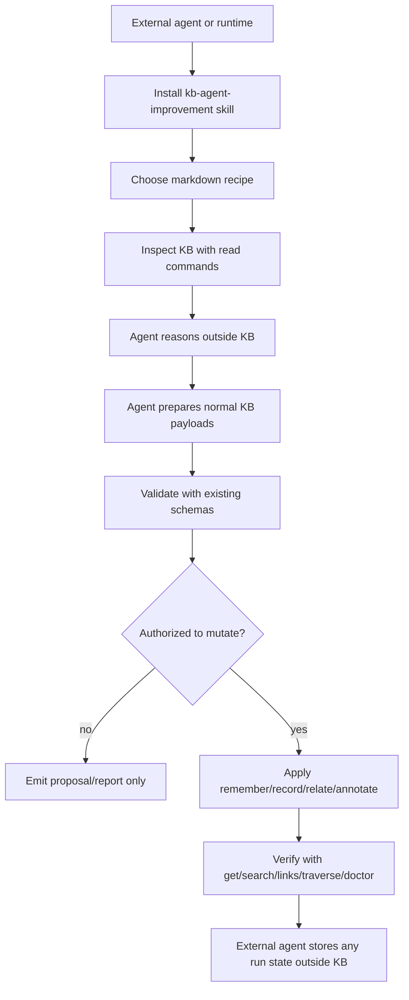

# feat: Support external-agent KB improvement workflows

## Summary

Add a lean agent-support layer for KB improvement workflows: packaged agent skills, markdown recipes, resolver/ontology guidance, proposal examples, docs, and tests that make external agents effective at improving KB state without making KB itself think, schedule, ingest documents, detect contradictions, or own workflow state.

---

## Problem Frame

The current KB already has durable primitives (`remember`, `record`, `relate`, `annotate`), validation schemas, relation traversal, provenance-bearing state, and installable setup/write skills. What is missing is the GBrain-like agent operating discipline around those primitives: external agents need clear playbooks for using KB as a substrate while they do the reasoning externally.

The product boundary is load-bearing. KB should expose storage, retrieval, validation, provenance, relation, and documentation surfaces. The agent or runtime should own scheduling, source reading, contradiction judgment, duplicate judgment, stale-review judgment, proposal construction, human approval, and any run state.

---

## Requirements

### Product Boundary

- R1. The implementation must explicitly state that KB does not autonomously run improvement work, schedule recipes, ingest external documents, detect contradictions, merge duplicates, regenerate truth, or maintain recipe run state.
- R2. Any added workflow artifact must describe the external agent as the actor that reads sources, reasons, decides, proposes, applies authorized writes, and verifies results.
- R3. The packaged surface must avoid command names or prose that imply KB performs judgment-heavy improvement work by itself.

### Agent Guidance And Recipes

- R4. Add an installable agent skill that teaches external agents how to run improvement workflows using existing KB primitives safely.
- R5. Add recipe playbooks for common external-agent flows: maintenance review, document-review-to-KB capture, correction sweep, relation curation, and stale knowledge review.
- R6. Each recipe must include goal, when to use it, required KB commands, agent-owned thinking steps, safe write policy, validation steps, verification steps, and non-goals.
- R7. Add resolver/ontology guidance that helps agents decide when to `search`, `get`, `remember`, `record`, `relate`, `annotate`, or avoid writing.

### Proposal And Verification Contracts

- R8. Document a standard proposal handoff shape that agents can emit for human or orchestrator approval, without requiring KB to validate or execute proposals as a workflow engine.
- R9. Proposal examples must compile down to normal `remember`, `record`, `relate`, or `annotate` payloads that can be validated with existing `kb validate` commands.
- R10. Recipes must require post-write verification through existing read surfaces such as `get`, `search`, `query-relations`, `links`, `traverse`, `doctor`, or `export`.

### Packaging, Docs, And Release Discipline

- R11. Package the new skill and recipes with `@emmassist-co/kb-cli` so installed agents can reference them from `node_modules`.
- R12. Update consumer docs to show how to install the agent-improvement skill alongside setup/write skills.
- R13. Update tests so skill packaging, recipe inclusion, docs references, and CLI help guidance stay narrow and non-autonomous.
- R14. Bump `@emmassist-co/kb-cli` with a minor version because new packaged skills/recipes are a public agent-facing capability, and update `CHANGELOG.md`.

---

## Support Matrix

| External-agent flow | Possible today | KB role after this plan | Agent-owned thinking | Active work in this plan | Add difficulty | Complexity risk |
|---|---:|---|---|---|---:|---:|
| Safe fact/source/correction capture | Yes | Validate/store `remember` payloads with provenance | Decide what fact/source/correction matters | Skill/recipe examples | Low | Low |
| Structured entity update | Yes | Validate/store `record` payloads | Decide create vs update and entity meaning | Resolver guidance | Low | Low |
| Explicit relation creation | Yes | Validate/store `relate` edges and expose graph reads | Infer whether the relation is true | Relation curation recipe | Low | Low |
| Timeline/provenance annotation | Yes | Append annotation/event evidence | Decide what evidence should be preserved | Evidence-first recipe language | Low | Low |
| External document review | Partial | Accept resulting source/fact/entity/relation writes | Read documents and extract meaning | Agent recipe only; no ingest command | Low-Med | Low |
| Correction sweep | Partial | Store correction and canonical updates | Interpret correction and propagation needs | Agent recipe only | Low-Med | Low |
| Duplicate cleanup | Partial | Expose search/list/get/delete/record | Decide whether entities are duplicates | Guidance only; no auto-merge | Low | Low |
| Contradiction review | Partial | Expose evidence, entities, relations, export | Decide whether claims conflict | Guidance only; no detector | Low | Low |
| Stale knowledge review | Partial | Expose timestamps, current truth, events, sources | Decide whether state is stale | Agent recipe only | Low | Low |
| Proposal handoff | Partial | Document payload shapes and existing validation | Produce findings and choose proposed writes | Proposal format docs/examples | Med | Med |
| Autonomous schedules | Intentionally no | CLI can be invoked externally | Own scheduler and checkpoints | Explicit non-goal | None | Avoided |
| Recipe run state | Intentionally no | N/A | Store state wherever the agent/runtime wants | Explicit non-goal | None | Avoided |
| KB-side thinking commands | Intentionally no | N/A | All judgment lives outside KB | Explicit non-goal | None | Avoided |

---

## Key Technical Decisions

- KTD1. **Recipe-first, not engine-first:** Implement the improvement surface as packaged skills, markdown recipes, examples, and docs. Do not add a scheduler, state table, workflow runner, or `kb improve` command that hides judgment behind KB.
- KTD2. **Name the actor explicitly:** Use names like `kb-agent-improvement` and `agent-*` recipe files so the surface reads as “an agent can improve KB with these tools,” not “KB improves itself.”
- KTD3. **Keep writes on existing verbs:** Recipes should end in standard `remember`, `record`, `relate`, `annotate`, batch, and validation commands. This preserves the current narrow write contract and avoids a second mutation path.
- KTD4. **Proposal format is documentation, not execution machinery:** Provide a stable handoff shape for agents and humans to discuss, but do not add generic proposal apply/validate commands until repeated usage proves a non-thinking primitive is missing.
- KTD5. **Read surfaces over reasoning surfaces:** If implementation reveals a real gap, prefer read-only inventory/provenance examples or help text over commands like “detect contradictions,” “suggest relations,” or “refresh truth.”
- KTD6. **Public package means minor release:** New packaged skills and recipes are a new agent-facing capability in `@emmassist-co/kb-cli`, so the package version and changelog must move with the implementation.

---

## High-Level Technical Design



The design intentionally has no KB-owned reasoning box. KB supplies artifacts and primitives that make the external-agent loop safe and inspectable; every judgment step remains outside the KB package.

---

## Output Structure

```text
packages/kb-cli/
├── skills/
│   └── kb-agent-improvement/
│       ├── SKILL.md
│       └── agents/openai.yaml
└── recipes/
    ├── agent-maintenance-review.md
    ├── agent-doc-review-to-kb.md
    ├── agent-correction-sweep.md
    ├── agent-relation-curation.md
    ├── agent-stale-knowledge-review.md
    └── proposal-format.md
```

The exact recipe filenames may adjust during implementation for clarity, but the package should ship an installable skill plus recipe playbooks under `packages/kb-cli` and include them in the published package.

---

## Scope Boundaries

### In Scope

- Agent-readable skill and recipes for external-agent KB improvement workflows.
- Documentation and examples that map improvement flows to existing KB commands.
- Tests that guard against autonomous/thinky wording and verify package inclusion.
- Public docs and package metadata updates, including semver and changelog discipline.

### Explicitly Out of Scope

- KB-owned schedules, cron configuration, or recipe run state.
- KB-side external document ingestion as a thinking workflow.
- KB-side contradiction detection, duplicate detection, relation suggestion, or truth regeneration.
- Generic `kb improve` workflow engine, proposal executor, or auto-apply command.
- MCP tool expansion for improvement recipes; MCP clients can already use read/write tools and external instructions.

### Deferred to Follow-Up Work

- Read-only filtering improvements such as richer `list` filters or provenance-specific query helpers, only if recipe usage proves existing `list`, `get`, `relations`, `links`, `traverse`, and `export` are insufficient.
- A machine-readable recipe manifest format, only after markdown recipes stabilize and multiple runtimes need structured discovery.

---

## Acceptance Examples

- AE1. Given an agent wants to sweep corrections, when it reads the packaged correction recipe, then the recipe directs the agent to search/read KB state, reason externally, prepare normal write payloads, validate them, apply only if authorized, and verify with KB reads.
- AE2. Given an agent wants to review external docs, when it reads the document-review recipe, then KB is framed only as the destination for selected evidence/entities/relations and not as the document ingester or extractor.
- AE3. Given a reader searches the new skill and recipes for “schedule,” “contradiction,” or “ingest,” then the wording must preserve the boundary that agents/runtimes do those activities and KB only supports storage, validation, retrieval, and provenance.
- AE4. Given a consumer installs `@emmassist-co/kb-cli`, then the package includes the new skill and recipe files and docs show `npx skills add ./node_modules/@emmassist-co/kb-cli/skills/kb-agent-improvement`.
- AE5. Given an agent emits a proposal from a recipe, then every proposed mutation is represented as a standard command plus payload that can be validated with the existing `kb validate` surface.

---

## Implementation Units

### U1. Add the agent-improvement support doctrine and matrix

- **Goal:** Create the durable product/operations documentation that defines the boundary and captures what is possible, supported, risky, or explicitly excluded.
- **Requirements:** R1, R2, R3, R7
- **Dependencies:** None
- **Files:**
  - `docs/product/kb-agent-improvement-support.md`
  - `docs/product/knowledge-base.md`
  - `README.md`
  - `tests/kb-cli-docs.test.ts`
- **Approach:** Add a concise doctrine doc centered on “agents think; KB stores, validates, retrieves, relates, and exposes evidence.” Include the support matrix from this plan or a refined version. Link it from product docs and README without reframing KB as an autonomous background worker.
- **Patterns to follow:** `docs/product/knowledge-base.md` for product-boundary framing; `README.md` “Product Direction” and “Should An Agent Use KB?” sections for top-level package positioning; `tests/kb-cli-docs.test.ts` for docs guardrails.
- **Test scenarios:**
  - Assert the new doctrine doc exists and includes the boundary phrase or equivalent: agents own thinking, KB owns storage/validation/retrieval/provenance.
  - Assert README links to the doctrine doc and install docs do not introduce autonomous scheduling language.
  - Assert docs mention that recipe state and external scheduling are external-agent/runtime concerns, not KB-owned state.
- **Verification:** Product docs make the boundary obvious to a reader before they reach package-specific recipes.

### U2. Ship a packaged `kb-agent-improvement` skill

- **Goal:** Provide an installable skill that tells agents how to run improvement workflows safely with existing KB commands.
- **Requirements:** R1, R2, R4, R6, R7, R10, R11
- **Dependencies:** U1
- **Files:**
  - `packages/kb-cli/skills/kb-agent-improvement/SKILL.md`
  - `packages/kb-cli/skills/kb-agent-improvement/agents/openai.yaml`
  - `tests/kb-skills.test.ts`
  - `tests/kb-cli-docs.test.ts`
- **Approach:** Model the skill structure after `packages/kb-cli/skills/kb-write/SKILL.md`: frontmatter, fast path commands, preferred workflow, command split, verification, and install instructions. The skill should direct agents to inspect first, search/get before write, keep judgment external, validate before mutating, apply only authorized writes, and verify afterward.
- **Patterns to follow:** `packages/kb-cli/skills/kb-write/SKILL.md`; `packages/kb-cli/skills/kb-local-setup/SKILL.md`; `packages/kb-cli/skills/kb-write/agents/openai.yaml`.
- **Test scenarios:**
  - Assert the package skill exists with `SKILL.md` and `agents/openai.yaml`.
  - Assert the skill references `kb inspect`, `kb search`, `kb get`, `kb schema`, `kb validate`, `kb remember`, `kb record`, `kb relate`, `kb annotate`, and verification commands.
  - Assert the skill does not direct agents to use operator-only commands for normal improvement workflows unless explicitly doing repair.
  - Assert the skill says KB does not do the thinking/scheduling/ingestion itself.
- **Verification:** Installing the skill from `node_modules` gives an agent enough guidance to run an improvement review without inventing unsafe write behavior.

### U3. Add markdown recipe playbooks for external agents

- **Goal:** Package common improvement flows as agent-readable recipes that compile to existing KB primitives.
- **Requirements:** R2, R3, R5, R6, R9, R10, R11
- **Dependencies:** U1, U2
- **Files:**
  - `packages/kb-cli/recipes/agent-maintenance-review.md`
  - `packages/kb-cli/recipes/agent-doc-review-to-kb.md`
  - `packages/kb-cli/recipes/agent-correction-sweep.md`
  - `packages/kb-cli/recipes/agent-relation-curation.md`
  - `packages/kb-cli/recipes/agent-stale-knowledge-review.md`
  - `tests/kb-cli-docs.test.ts`
- **Approach:** Each recipe should use a repeated structure: purpose, when to use, inputs the external agent must gather, KB read commands, external reasoning steps, allowed write commands, validation, verification, and non-goals. Use “agent-doc-review-to-KB” instead of “KB doc ingestion” naming to preserve the actor boundary.
- **Patterns to follow:** Existing skill markdown style under `packages/kb-cli/skills`; `docs/cloudflare-agent-setup.md` for command examples with package-local install paths.
- **Test scenarios:**
  - Assert every expected recipe file exists and includes sections for write policy, validation, verification, and non-goals.
  - Assert recipes use existing mutation verbs rather than inventing `kb improve`, `kb ingest-docs`, `kb detect-contradictions`, or similar commands.
  - Covers AE1. The correction recipe routes correction interpretation through the agent and KB writes through normal payloads.
  - Covers AE2. The document-review recipe says the agent reads documents externally and KB only receives selected durable writes.
- **Verification:** A command-running agent can choose a recipe and know exactly which KB commands to use without KB owning the reasoning flow.

### U4. Document the resolver/ontology and proposal handoff shape

- **Goal:** Give agents a clear classification and handoff contract without adding a workflow engine.
- **Requirements:** R7, R8, R9, R10
- **Dependencies:** U1, U2
- **Files:**
  - `packages/kb-cli/recipes/proposal-format.md`
  - `packages/kb-cli/skills/kb-agent-improvement/SKILL.md`
  - `packages/kb-cli/README.md`
  - `tests/kb-cli-docs.test.ts`
- **Approach:** Add a documented proposal shape with fields like summary, findings, proposed writes, validation commands, verification checks, and human-review notes. Include resolver guidance for command choice: search/get first; `remember` for evidence/corrections; `record` for canonical entity state; `relate` for explicit edges; `annotate` for timeline/provenance; avoid write when evidence is insufficient. Do not implement `kb proposal` commands.
- **Patterns to follow:** `packages/kb-cli/src/index.ts` schemas for supported payload fields; `packages/kb-cli/skills/kb-write/SKILL.md` command split; `tests/kb-cli.test.ts` validation and batch-write scenarios.
- **Test scenarios:**
  - Assert proposal docs include at least one proposed write for each normal mutation command and pair it with a `kb validate` example.
  - Assert proposal docs label proposal execution as human/orchestrator-owned rather than KB-owned.
  - Covers AE5. Every proposed mutation example is a normal command plus payload, not a new workflow primitive.
- **Verification:** An external agent can emit a reviewable proposal artifact while a human or orchestrator can validate/apply each mutation through existing CLI commands.

### U5. Surface packaged recipes and skill in install docs and package metadata

- **Goal:** Make the new support layer discoverable and included in the published `kb-cli` package.
- **Requirements:** R11, R12, R14
- **Dependencies:** U2, U3, U4
- **Files:**
  - `packages/kb-cli/package.json`
  - `packages/kb-cli/README.md`
  - `docs/consumer-quickstart.md`
  - `docs/cloudflare-agent-setup.md`
  - `README.md`
  - `package-lock.json`
  - `tests/kb-cli-docs.test.ts`
- **Approach:** Add `recipes` to the package `files` list, document installation of `kb-agent-improvement`, and show recipe paths under `node_modules`. Bump `@emmassist-co/kb-cli` from `1.7.0` to the next minor version and update lockfile metadata.
- **Patterns to follow:** Existing package skill documentation in `packages/kb-cli/README.md`, `docs/consumer-quickstart.md`, and `docs/cloudflare-agent-setup.md`; package-version discipline in `AGENTS.md`.
- **Test scenarios:**
  - Assert `packages/kb-cli/package.json` includes both `skills` and `recipes` in `files`.
  - Assert quickstart docs mention installing `kb-agent-improvement` only when an agent will run improvement workflows.
  - Assert Cloudflare setup docs preserve `kb-write` as the normal write skill and present `kb-agent-improvement` as optional workflow guidance.
- **Verification:** A fresh package consumer can install the new skill and access recipe files from the published package tarball contents.

### U6. Add non-autonomous CLI help discoverability if it stays documentation-only

- **Goal:** Optionally add a narrow CLI help topic that points agents to the skill/recipes and boundary rules without adding new mutation or reasoning behavior.
- **Requirements:** R1, R3, R10, R13
- **Dependencies:** U2, U3, U4
- **Files:**
  - `packages/kb-cli/src/index.ts`
  - `tests/kb-cli.test.ts`
  - `packages/kb-cli/README.md`
- **Approach:** If discoverability through package docs is not enough during implementation, add `kb help agent-improvement` as static help text only. The topic should list recipe paths and restate that external agents own thinking and state. Do not add `kb agent-improvement`, `kb improve`, `kb recipe`, or any command that executes a workflow.
- **Patterns to follow:** Static topic handling in `renderHelp` in `packages/kb-cli/src/index.ts`; existing `kb help operator` tests and docs.
- **Test scenarios:**
  - `kb help agent-improvement` exits successfully and returns static guidance with recipe paths.
  - Help text includes normal commands and validation commands but no `kb improve`, `kb ingest-docs`, `kb detect-contradictions`, or recipe-state commands.
  - Default `kb help` remains focused on the current agent surface and does not promote operator-only repair commands as normal flow.
- **Verification:** CLI discoverability improves without introducing any new execution path or state.

### U7. Update changelog and release metadata

- **Goal:** Complete repo release discipline for the public package-surface change.
- **Requirements:** R14
- **Dependencies:** U2, U3, U5, U6 if included
- **Files:**
  - `CHANGELOG.md`
  - `packages/kb-cli/package.json`
  - `package-lock.json`
- **Approach:** Add a changelog entry with feature summary, customer-visible impact, deployment status, human testing status, and iteration status. Use a minor version bump for `@emmassist-co/kb-cli` because the published package gains a new installable agent skill and recipe pack. Keep human testing marked pending unless a real person manually exercises the install/read flow.
- **Patterns to follow:** Existing `CHANGELOG.md` entry shape and `AGENTS.md` changelog/semver instructions.
- **Test scenarios:**
  - Changelog entry includes the required fields from `AGENTS.md`.
  - Package version and lockfile agree.
  - No local package dependency range needs adjustment unless implementation discovers a local dependency on `@emmassist-co/kb-cli`.
- **Verification:** Release follow-through is complete enough for a later package publish decision, without actually publishing.

---

## Documentation And Operational Notes

- The implementation should avoid adding generated artifacts unless needed by the version bump or package lock update.
- Human testing cannot be marked complete from automated tests. A person must manually inspect or install the skill/recipes after implementation to clear that field.
- Because this is mostly package/docs/skills surface, benchmark rails are not required unless implementation unexpectedly changes `packages/kb-core` retrieval, relation extraction, ranking, or storage behavior.
- If U6 is skipped because docs discoverability is sufficient, record that decision in the implementation notes or commit/PR description; do not silently add a broader CLI surface.

---

## Risks And Mitigations

- **Risk: wording implies KB autonomy.** Mitigate with explicit tests that search new skills/recipes/docs for forbidden command names and with repeated actor-boundary language.
- **Risk: recipes become a hidden workflow engine.** Keep recipes as markdown instructions and examples. Do not add state, scheduling, proposal execution, or apply commands.
- **Risk: operator-only repair commands leak into normal agent flow.** Keep `capture-source`, `events`, `drafts`, `replace-relations`, and `clear-relations` framed as operator/repair tools unless a recipe explicitly enters repair mode.
- **Risk: proposal format becomes too rigid too early.** Treat it as a documented convention. Let agents add extra fields, as long as proposed mutations resolve to existing command payloads.
- **Risk: public package consumers cannot find recipes.** Include `recipes` in package files, document paths from `node_modules`, and test docs/package metadata together.

---

## Sources And Research

- `STRATEGY.md` positions KB around compounding durable knowledge, explicit reads/writes, corrections, provenance, freshness, and verification.
- `docs/product/knowledge-base.md` already states the disciplined runtime loop: read durable knowledge, produce work, write back evidence/corrections/links, and verify reuse.
- `packages/kb-cli/skills/kb-write/SKILL.md` is the existing packaged skill pattern to mirror for command-running agents.
- `packages/kb-cli/src/index.ts` exposes the current narrow command, schema, validation, and static help surfaces; this plan should reuse those instead of adding thinking commands.
- `tests/kb-skills.test.ts`, `tests/kb-cli-docs.test.ts`, and `tests/kb-cli.test.ts` already guard skill text, docs packaging, and CLI help/schema behavior.
- GBrain’s recommended schema and v0 docs show useful external-agent patterns: resolver rules, compiled truth plus append-only evidence, enrichment on signals, scheduled agent sessions, lint/maintenance passes, and append-safe/derived concurrency practices. This plan adopts the agent playbook and evidence discipline while rejecting KB-owned schedules or thinking.

---

## Execution Goal

Use this `/goal` after approving the plan:

```text
/goal Implement docs/plans/2026-07-15-004-feat-kb-agent-improvement-support-plan.md. Keep KB as a non-thinking substrate: add the agent-improvement doctrine, packaged kb-agent-improvement skill, markdown recipe pack, proposal-format docs, packaging/docs updates, tests, changelog, and kb-cli minor version bump. Do not add KB-owned schedules, recipe state, document ingestion, contradiction detection, auto-merge, truth regeneration, or any generic improvement workflow engine. Verify with targeted CLI/docs/skills tests plus npm run typecheck and npm test unless implementation scope stays docs-only enough to justify a narrower verified test set in the final evidence.
```
