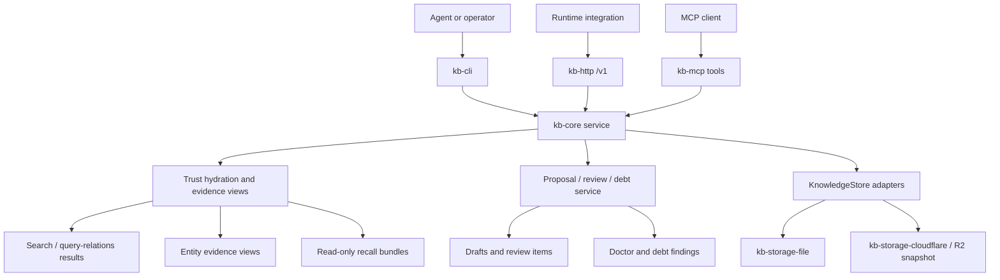
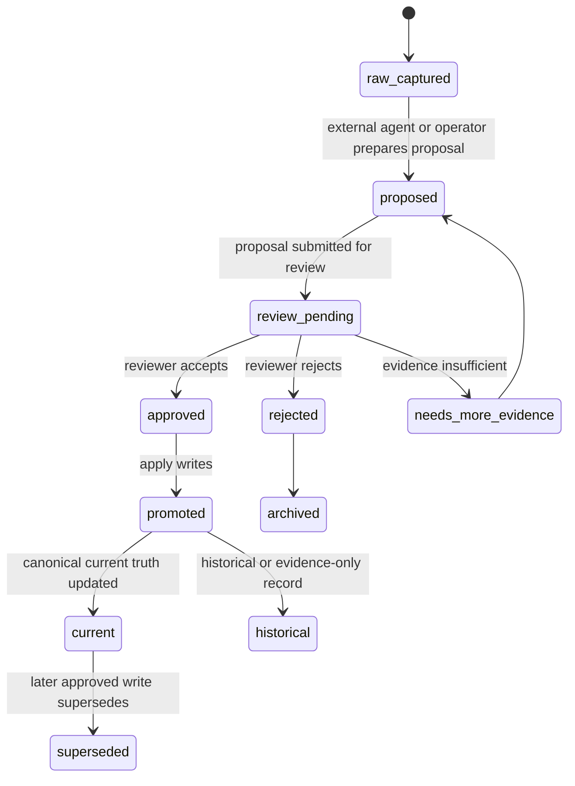

# feat: Add KB trust substrate

## Summary

Build the medium/high philosophy-match operational-memory ideas as a phased trust substrate: status-aware retrieval, current-truth evidence views, proposal-first promotion, review/debt queues, decision records, and read-only recall bundles. The plan keeps the core product boundary intact: KB stores evidence, state, validation, retrieval, and reviewable contracts; agents and operators keep judgment, scheduling, and final arbitration.

---

## Problem Frame

The current KB is already a durable context layer with entities, sources, events, drafts, relations, optional freshness metadata, and canonical HTTP/MCP/CLI surfaces. The gap is that agents still receive mostly search hits and structured records, not a clear operational memory view of what is current, what is raw evidence, what is stale or superseded, what conflicts, and what needs review.

This plan turns existing primitives into an explicit trust substrate without making KB a hidden autonomous memory brain. The implementation should make trust state visible and actionable while avoiding auto-merge, auto-arbitration, or runtime-owned context injection.

---

## Requirements

**Trust-aware retrieval**

- R1. Search and relation-query results expose an additive trust envelope that labels freshness, supersession, source lineage, evidence role, confidence, and caveats without removing existing response fields.
- R2. Retrieval supports caller intent for current, historical, mixed, and evidence-only views without silently hiding useful historical records.
- R3. Trust labels remain visible through HTTP, MCP, and CLI JSON output, with capabilities advertising the new contract version.

**Canonical evidence views**

- R4. Entity reads can return a current-truth evidence view that separates current claims, supporting sources, timeline/events, relation evidence, raw or unpromoted evidence, superseded material, and open questions.
- R5. Unsupported or weakly supported current-truth claims are flagged rather than treated as equally trusted facts.
- R6. Decision entities have a first-class view for rationale, tradeoffs, rejected alternatives, effective dates, owners, status, evidence, and supersession.

**Proposal-first writes and review**

- R7. Low-friction raw capture remains available, but raw evidence does not become canonical current truth unless explicitly promoted through a reviewed proposal or existing structured write.
- R8. Promotion and review flows are auditable: reviewer/action metadata, source IDs, target IDs, status transitions, and warnings survive export/import.
- R9. Conflict, duplicate, stale, unsupported, and low-provenance findings are surfaced as review/debt items; KB proposes and tracks review work but does not decide truth by itself.

**Ambient recall boundary**

- R10. Recall bundles are read-only API results with citations, trust labels, token budgeting, and safe truncation rules; they do not write memory or decide when an agent should inject them. Per-record redaction is limited to metadata that exists today or is explicitly added later.
- R11. Agent/runtime integrations can choose recall policy independently while consuming the same trust-aware core contract.

**Operations, release, and compatibility**

- R12. Existing minimal `remember`, `record`, `relate`, `annotate`, `search`, and `query-relations` payloads keep working.
- R13. Public contract changes are additive or feature-gated where possible; package versions, dependency ranges, docs, and `CHANGELOG.md` are updated before release communication.
- R14. Verification covers core model/service behavior, HTTP/MCP/CLI parity, storage/export round trips, auth scopes, and benchmark posture where retrieval/ranking behavior changes.

---

## Scope Boundaries

### In Scope

- Additive trust metadata and response envelopes in `kb-core`.
- Evidence-oriented entity and decision views.
- Proposal/review/debt state that is explicit, inspectable, and exportable.
- HTTP/MCP/CLI surfaces for reading trust state and performing authorized review/promotion operations.
- Docs, recipes, package versions, changelog, and tests for public surfaces.

### Deferred to Follow-Up Work

- LLM-assisted extraction from arbitrary raw notes into proposed facts. This plan should support externally prepared proposals, not build an extractor.
- Ranking changes that materially alter benchmark posture beyond trust-label hydration. If implementation proves ranking must change, refresh benchmark scorecards under the repo's benchmark discipline.
- Per-audience canonical projections. Shared evidence and one canonical view come first.
- Per-record ACL/privacy classification beyond existing route scopes. This plan should not imply a full data-loss-prevention system.
- Fact incident-response workflow. Debt/review items provide the substrate; incident process can be layered later.
- Expiry-by-default policies. Freshness/status fields should support future expiry rules without imposing them globally now.

### Outside This Product's Identity

- KB-owned agent orchestration, scheduling, or ambient injection policy.
- Hidden auto-merge, auto-delete, or auto-arbitration of truth.
- Treating chat transcripts as memory without explicit evidence capture and promotion.
- Replacing application databases or becoming a generic vector database.

---

## Assumptions

- The trust substrate should prefer additive response fields and new routes over breaking existing contracts.
- Existing metadata `freshnessStatus`, `supersedes`, `lastReviewedAt`, `rawSourceRef`, relation temporal fields, drafts, and doctor issues are leverage points, not final product shape.
- If a storage interface extension would break third-party adapters, it should be optional or introduced behind a compatibility layer before becoming required in a later major release.
- Review/debt state should round-trip through Cloudflare/R2 and file-backed stores because deployed `kb-http` is the canonical production path.

---

## High-Level Technical Design

### Component topology



The core service owns the vocabulary and hydrated outputs. HTTP, MCP, and CLI expose those outputs without inventing separate trust semantics. Storage adapters persist the new review/debt state, or the service derives it from existing state when persistence is not available.

### Raw-to-canonical promotion state



KB tracks the state and applies authorized writes. It does not infer the proposal or decide whether the proposal is true without an external actor.

### Trust-aware read flow

```mermaid
sequenceDiagram
  participant Caller
  participant Surface as HTTP/MCP/CLI
  participant Service as kb-core service
  participant Store as KnowledgeStore
  Caller->>Surface: search/query/evidence/recall request
  Surface->>Service: typed input + auth context
  Service->>Store: load entities, sources, events, links, review state
  Service->>Service: retrieve candidates and hydrate trust envelope
  Service->>Service: attach caveats, evidence, debt, and truncation labels
  Service-->>Surface: additive response with trust metadata
  Surface-->>Caller: JSON result; no mutation for read flows
```

---

## Key Technical Decisions

- KTD1. **Separate freshness from currentness:** `freshnessStatus` describes review freshness; current/historical/superseded/raw/canonical status is a separate trust classification. This avoids overloading the existing `fresh | needs_review | stale` enum with operational truth state.
- KTD2. **Use additive trust envelopes first:** Existing search result fields remain intact. New fields should be optional/additive so current clients continue working while upgraded clients can make trust-aware choices.
- KTD3. **Promotions are explicit mutations:** Raw captures and proposals can be low-friction, but canonical current-truth writes happen through an explicit reviewed promotion or existing `record` path. This preserves the write-quality boundary without blocking capture.
- KTD4. **Review and debt are substrate state, not agent reasoning:** KB may track review items and deterministic debt findings; external agents/operators decide whether records are truly stale, duplicate, contradictory, or ready to merge.
- KTD5. **Decision records use the existing entity model:** The existing `decision` entity kind should be strengthened with typed conventions and helper views before inventing a separate decision store.
- KTD6. **Recall bundles are read-only derived views:** Bundles package governed retrieval, evidence, and caveats for integrations. They do not schedule themselves, inject prompts, or write memory.
- KTD7. **Storage compatibility is part of the design:** If review/debt state needs new store methods, introduce them as optional capabilities or with compatibility fallbacks before requiring all adapters to implement them.
- KTD8. **Public release is at least a minor bump:** Additive routes, commands, schemas, MCP tools, and exports are public capabilities. If implementation makes `KnowledgeStore` or response contracts breaking, reclassify to major before release.

---

## Implementation Units

### U1. Define trust vocabulary and compatibility contract

- **Goal:** Add core types and helpers for trust envelopes, evidence roles, currentness, review state, debt state, and recall bundle shapes without changing behavior yet.
- **Requirements:** R1, R2, R8, R9, R10, R12, R13.
- **Dependencies:** None.
- **Files:**
  - `packages/kb-core/src/types.ts`
  - `packages/kb-core/src/service-helpers.ts`
  - `packages/kb-core/src/index.ts`
  - `tests/kb-metadata.test.ts`
  - `tests/kb-relations.test.ts`
- **Approach:**
  - Introduce a small set of exported types such as trust envelope, evidence role, currentness status, review item, debt item, proposal state, decision view, and recall bundle.
  - Keep existing `KnowledgeFreshnessStatus` intact and model currentness separately.
  - Add pure helpers that compute trust labels from entity/source/link/event state: superseded, stale, raw/unpromoted, reviewed, unsupported, historical, ambiguous, and source-backed.
  - Avoid making trust helpers depend on HTTP, CLI, or MCP concerns.
- **Patterns to follow:** Existing `KnowledgeSearchResult`, `KnowledgeDoctorIssueDetail`, `KnowledgeRelationQueryResult`, and relation temporal helpers in `packages/kb-core/src/types.ts` and `packages/kb-core/src/service-helpers.ts`.
- **Test scenarios:**
  - Happy path: a fresh reviewed entity with source IDs produces a current/canonical/source-backed trust envelope.
  - Edge case: an entity that supersedes another record and has `freshnessStatus=stale` produces separate supersession and freshness labels.
  - Edge case: a source with `rawSourceRef` but no promotion is labeled raw evidence, not canonical truth.
  - Error path: unknown freshness or missing source references surfaces a caveat instead of throwing during read hydration.
  - Compatibility: existing serialized entity/source documents without new fields still parse and hydrate with conservative defaults.
- **Verification:** Types compile, helper tests pass, and no public route or command behavior changes in this unit.

### U2. Hydrate trust envelopes in search and relation results

- **Goal:** Make retrieval results visibly trust-aware while preserving existing search/query behavior.
- **Requirements:** R1, R2, R3, R12, R14.
- **Dependencies:** U1.
- **Files:**
  - `packages/kb-core/src/types.ts`
  - `packages/kb-core/src/service.ts`
  - `packages/kb-core/src/service-helpers.ts`
  - `packages/kb-http/src/server.ts`
  - `packages/kb-mcp/src/tools.ts`
  - `packages/kb-cli/src/index.ts`
  - `tests/kb-relations.test.ts`
  - `tests/kb-http.test.ts`
  - `tests/kb-mcp.test.ts`
  - `tests/kb-cli.test.ts`
- **Approach:**
  - Add optional trust metadata to `KnowledgeSearchResult` and relation query results.
  - Hydrate trust metadata after lexical/graph retrieval so ranking logic stays stable in the first pass.
  - Add optional input filters or intent flags for current/historical/evidence modes only after labels exist and have tests.
  - Advertise trust-envelope support through capabilities so remote clients can feature-detect.
  - Keep old fields such as `sourceIds`, `confidence`, `ambiguous`, `reason`, and `excerpt` unchanged.
- **Execution note:** Start with characterization tests proving old `/v1/search`, MCP `search`, and CLI `search` outputs still contain existing fields.
- **Patterns to follow:** `KnowledgeBaseService.search`, `KnowledgeBaseService.queryRelations`, MCP tool schemas, CLI schema rendering, and existing relation `currentOnly` / `asOf` behavior.
- **Test scenarios:**
  - Happy path: `search` returns the same top result IDs as before plus a trust envelope with source IDs, currentness, freshness, and caveats.
  - Happy path: `query-relations` returns traversed links and result trust labels respecting existing `currentOnly` and `asOf` behavior.
  - Edge case: a superseded/stale record is labeled as such but remains visible in mixed/historical intent.
  - Edge case: token/query modes that degrade from graph to lexical still include trust metadata.
  - Compatibility: mocked HTTP service responses and CLI JSON parsing still pass for clients that ignore the new fields.
  - Integration: MCP `search` and `query_relations` structured content expose trust metadata consistently with HTTP.
- **Verification:** Targeted core, HTTP, MCP, and CLI tests pass; retrieval benchmark snapshots are unchanged or any change is explicitly measured.

### U3. Add entity current-truth evidence views

- **Goal:** Provide a compact read path that answers “what should I use as canonical context, and why?” for an entity.
- **Requirements:** R4, R5, R6, R11, R14.
- **Dependencies:** U1, U2.
- **Files:**
  - `packages/kb-core/src/types.ts`
  - `packages/kb-core/src/service.ts`
  - `packages/kb-core/src/service-helpers.ts`
  - `packages/kb-http/src/server.ts`
  - `packages/kb-mcp/src/tools.ts`
  - `packages/kb-cli/src/index.ts`
  - `tests/kb-metadata.test.ts`
  - `tests/kb-http.test.ts`
  - `tests/kb-mcp.test.ts`
  - `tests/kb-cli.test.ts`
- **Approach:**
  - Add a service method that builds an entity evidence view from the entity document, source documents, events, links, and debt/review findings when available.
  - Start with line/block-level `currentTruth` evidence mapping rather than pretending to have perfect fact-level provenance. Unsupported lines should be flagged as unsupported or weakly supported.
  - Separate sections for current truth, sources/evidence, events/timeline, relations, raw/unpromoted evidence, superseded/historical records, open questions, and review/debt warnings.
  - Add read surfaces such as HTTP entity evidence route, MCP tool, and CLI read command/schema.
- **Patterns to follow:** Existing `/v1/entities/:id`, `related`, `links`, `traverse`, `doctor`, and CLI `get/related/links/traverse` commands.
- **Test scenarios:**
  - Happy path: an entity with current truth, source IDs, events, and links returns all evidence sections with stable IDs.
  - Edge case: one current-truth line has no source support and is flagged without failing the whole view.
  - Edge case: a current entity cites a superseded source; the view labels the source as superseded/historical.
  - Error path: unknown entity ID returns the existing not-found style error through HTTP/CLI/MCP.
  - Integration: HTTP, MCP, and CLI evidence views expose the same structured shape.
  - Security/governance: evidence view does not leak operator-only review details through read-only scopes unless those fields are explicitly classified as read-safe.
- **Verification:** Evidence views answer canonical/current/evidence questions from one call and leave existing entity `get` behavior unchanged.

### U4. Implement proposal-first promotion workflow

- **Goal:** Support raw capture followed by explicit proposal, review, and promotion into canonical state.
- **Requirements:** R7, R8, R9, R12, R14.
- **Dependencies:** U1, U3.
- **Files:**
  - `packages/kb-core/src/types.ts`
  - `packages/kb-core/src/store.ts`
  - `packages/kb-core/src/snapshot-store.ts`
  - `packages/kb-core/src/service.ts`
  - `packages/kb-storage-file/src/file-store.ts`
  - `packages/kb-storage-cloudflare/src/r2-store.ts`
  - `packages/kb-http/src/server.ts`
  - `packages/kb-http/src/route-auth.ts`
  - `packages/kb-cli/src/index.ts`
  - `tests/kb-metadata.test.ts`
  - `tests/kb-http.test.ts`
  - `tests/kb-cli.test.ts`
  - `tests/kb-storage-cloudflare.test.ts`
- **Approach:**
  - Introduce proposal state for externally prepared durable writes: target entity/source IDs, proposed facts, evidence source IDs, reviewer status, warnings, and intended operation.
  - Prefer optional store capabilities for proposal/review state, with service fallbacks where practical, to avoid an accidental major break for custom store implementors.
  - Add promotion APIs that apply approved proposals through existing `record`, `remember`, `relate`, and `annotate` semantics rather than duplicating write logic.
  - Ensure raw source capture remains a source/evidence write and does not update current truth unless the caller explicitly provides structured entity facts through an existing write path or an approved promotion.
  - Use auth scopes so proposal submission is write-scoped and review/apply operations are operator-scoped if they can affect canonical truth.
- **Execution note:** Implement state-machine tests before service mutation code because the safety boundary is the product feature.
- **Patterns to follow:** Existing drafts routes, `consolidate`, entity locks, `KnowledgeMutationResult`, file store JSON persistence, and R2 canonical snapshot grouping.
- **Test scenarios:**
  - Happy path: raw source is captured, proposal is submitted, reviewer approves, promotion applies a source-backed current-truth update.
  - Edge case: duplicate raw source capture is idempotent or becomes a duplicate proposal/debt item with a clear status.
  - Edge case: proposal cites a missing source ID and cannot be approved/applied without a warning or validation failure.
  - Error path: promotion partially fails; the proposal remains recoverable and canonical truth is not silently half-updated.
  - Concurrency: stale proposal/review updates fail safely when target records changed since proposal creation.
  - Auth: read-only tokens cannot submit or approve promotions; write tokens cannot perform operator-only approval if that boundary is chosen.
  - Storage: file and Cloudflare/R2 stores round-trip proposals/review state through export/rebuild.
- **Verification:** Raw capture and promotion semantics are visibly separate in tests and docs.

### U5. Add review queue and memory debt ledger

- **Goal:** Make stale, conflicting, duplicate, unsupported, low-provenance, and dangling memory issues visible and triageable.
- **Requirements:** R8, R9, R13, R14.
- **Dependencies:** U1, U4.
- **Files:**
  - `packages/kb-core/src/types.ts`
  - `packages/kb-core/src/store.ts`
  - `packages/kb-core/src/snapshot-store.ts`
  - `packages/kb-core/src/service.ts`
  - `packages/kb-storage-file/src/file-store.ts`
  - `packages/kb-storage-cloudflare/src/r2-store.ts`
  - `packages/kb-http/src/server.ts`
  - `packages/kb-http/src/route-auth.ts`
  - `packages/kb-cli/src/index.ts`
  - `packages/kb-cli/recipes/agent-maintenance-review.md`
  - `packages/kb-cli/recipes/agent-stale-knowledge-review.md`
  - `tests/kb-metadata.test.ts`
  - `tests/kb-http.test.ts`
  - `tests/kb-cli.test.ts`
  - `tests/kb-storage-cloudflare.test.ts`
- **Approach:**
  - Model review items with explicit state: open, assigned/in_review, approved, applied, resolved, rejected, snoozed, duplicate, blocked, invalidated, reopened.
  - Model debt items as either derived findings from `doctor`/trust hydration or persisted triage records linked to targets and review items.
  - Reuse existing `KnowledgeDoctorIssueDetail` shape where possible: code, severity, targets, related IDs, and next action.
  - Deduplicate findings so the same issue does not appear separately as doctor issue, debt item, and review item without linking.
  - Keep final resolution human/agent-owned; KB tracks transitions and applies authorized writes only when explicitly asked.
- **Patterns to follow:** `doctor` issue details, conflicts operator help, drafts routes, and route auth scope conventions.
- **Test scenarios:**
  - Happy path: doctor detects missing source/duplicate alias/contradictory relation and the ledger exposes linked debt items.
  - Happy path: a review item is created, assigned, approved, applied, and resolved with audit metadata.
  - Edge case: target entity/source/event is deleted after debt detection; item becomes invalidated/archived rather than broken.
  - Edge case: reviewer rejects an item; it no longer surfaces as urgent but remains auditable.
  - Edge case: batch review partially applies and leaves recoverable state for failed items.
  - Auth: read/write/operator scopes map correctly for listing, creating, updating, and applying review items.
  - Export/import: review/debt state round-trips or is explicitly derived and documented if not persisted.
- **Verification:** Operators can run a weekly maintenance pass from ledger/review surfaces without relying on hidden automation.

### U6. Strengthen decision records with rationale and supersession views

- **Goal:** Capture decisions as operational memory: what was decided, why, alternatives rejected, when it applies, and what supersedes it.
- **Requirements:** R4, R5, R6, R8, R14.
- **Dependencies:** U1, U3, U5.
- **Files:**
  - `packages/kb-core/src/types.ts`
  - `packages/kb-core/src/documents.ts`
  - `packages/kb-core/src/service.ts`
  - `packages/kb-core/src/relations.ts`
  - `packages/kb-http/src/server.ts`
  - `packages/kb-mcp/src/tools.ts`
  - `packages/kb-cli/src/index.ts`
  - `packages/kb-cli/recipes/proposal-format.md`
  - `docs/consumer-quickstart.md`
  - `tests/kb-metadata.test.ts`
  - `tests/kb-relations.test.ts`
  - `tests/kb-http.test.ts`
  - `tests/kb-mcp.test.ts`
  - `tests/kb-cli.test.ts`
- **Approach:**
  - Keep decisions as `KnowledgeEntityKind = 'decision'`, but add typed conventions for fields such as status, decidedAt/effectiveAt, owner/approver, rationale, alternatives, evidence source IDs, supersedes, supersededBy, and review date.
  - Render decision information through the entity evidence view and optional decision-focused helper route/tool/command.
  - Use relation temporal fields (`validFrom`, `validTo`, `status`, `supersededBy`) for decision applicability where relations encode scope.
  - Avoid creating separate decision truth outside entity/source/event/link state.
- **Patterns to follow:** Existing entity document rendering/parsing, `decision` entity kind, events, relation temporal state, and current/historical relation query logic.
- **Test scenarios:**
  - Happy path: accepted/current decision view includes rationale, alternatives, evidence, owner, effective date, and currentness.
  - Edge case: decision is accepted but not yet effective; current and as-of views differ correctly.
  - Edge case: reversed vs superseded decisions are labeled distinctly.
  - Edge case: two accepted decisions conflict; debt/review surfaces flag the conflict without choosing a winner.
  - Integration: decision records are searchable and relation-queryable without special-casing benchmark phrasing.
  - Round trip: decision metadata renders/parses through markdown documents and export/import.
- **Verification:** Agents can answer “what did we decide and why?” from a decision view with citations.

### U7. Add read-only recall bundle API for integrations

- **Goal:** Give agents/runtimes a compact, cited, trust-aware memory packet while keeping injection policy outside KB.
- **Requirements:** R1, R2, R3, R10, R11, R12, R14.
- **Dependencies:** U2, U3, U5, U6.
- **Files:**
  - `packages/kb-core/src/types.ts`
  - `packages/kb-core/src/service.ts`
  - `packages/kb-core/src/service-helpers.ts`
  - `packages/kb-http/src/server.ts`
  - `packages/kb-http/src/route-auth.ts`
  - `packages/kb-mcp/src/tools.ts`
  - `packages/kb-cli/src/index.ts`
  - `packages/kb-flue-adapter/src/runtime-contract.ts`
  - `packages/kb-flue-adapter/src/command.ts`
  - `tests/kb-http.test.ts`
  - `tests/kb-mcp.test.ts`
  - `tests/kb-cli.test.ts`
  - `tests/kb-flue-adapter.test.ts`
- **Approach:**
  - Add a core read method that accepts purpose, query/scope, max token or max character budget, temporal focus, and optional entity IDs.
  - Build bundles from governed search/evidence views: canonical summary, relevant decisions, relation context, supporting citations, caveats, and debt/review warnings.
  - Preserve citation/trust labels under truncation by dropping whole claims rather than clipping away evidence labels.
  - Expose as read-only HTTP route and MCP tool; CLI exposure may be a read command but must be documented as a bundle generator, not an orchestration loop.
  - If Flue uses the bundle, the adapter requests it explicitly and decides injection timing outside KB.
- **Patterns to follow:** Existing `search`, `query-relations`, MCP tool descriptors, HTTP route auth, and Flue runtime command contract.
- **Test scenarios:**
  - Happy path: recall bundle includes current facts, decisions, citations, trust labels, and caveats for a query.
  - Edge case: token budget is too small; bundle drops lower-priority claims while preserving citations on included claims.
  - Edge case: stale/superseded facts included for historical intent are labeled, not presented as current.
  - Edge case: future restricted/redacted source metadata, if present, is preserved as a label rather than stripped by bundle formatting.
  - Error path: read-only scope can request bundles; no write, review, or promotion state transition occurs.
  - Integration: HTTP and MCP bundle shapes match; CLI output is parseable JSON.
  - Flue: adapter can request a bundle without changing existing runtime command compatibility.
- **Verification:** Recall bundles are useful as ambient context inputs but have no autonomous trigger or mutation path.

### U8. Update public docs, versions, changelog, and verification rails

- **Goal:** Release the trust substrate responsibly across public packages and docs.
- **Requirements:** R3, R11, R12, R13, R14.
- **Dependencies:** U1, U2, U3, U4, U5, U6, U7.
- **Files:**
  - `package.json`
  - `packages/kb-core/package.json`
  - `packages/kb-http/package.json`
  - `packages/kb-mcp/package.json`
  - `packages/kb-cli/package.json`
  - `packages/kb-storage-file/package.json`
  - `packages/kb-storage-cloudflare/package.json`
  - `packages/kb-flue-adapter/package.json`
  - `README.md`
  - `CHANGELOG.md`
  - `docs/consumer-quickstart.md`
  - `docs/product/kb-agent-improvement-support.md`
  - `docs/product/cloudflare-first-compounding-kb.md`
  - `docs/operations/kb-benchmark.md`
  - `packages/kb-cli/README.md`
  - `packages/kb-http/README.md`
  - `packages/kb-mcp/README.md`
  - `tests/kb-cli-docs.test.ts`
  - `tests/kb-skills.test.ts`
- **Approach:**
  - State intended semver before implementation release. Expected bump is minor for additive fields/routes/tools/commands; reclassify to major if required store methods or response shape changes break consumers.
  - Update local package dependency ranges for changed packages.
  - Add changelog entry with feature summary, customer-visible impact, deployment status, human testing status, and iteration status.
  - Update docs to explain trust status, evidence views, promotion/review, decision records, recall bundles, and the no-auto-arbitration boundary.
  - Run the repo minimum verification plus targeted package tests. If retrieval/ranking behavior changes materially, refresh required benchmark rails and scorecards per repo discipline.
- **Patterns to follow:** Existing release discipline in `AGENTS.md`, HTTP/MCP README route/tool lists, CLI docs tests, and benchmark documentation.
- **Test scenarios:**
  - Docs tests verify new commands/routes/tools are documented and old help text still preserves agent/operator boundary language.
  - Package dependency tests or build verify changed workspaces compile against updated ranges.
  - Changelog entry includes all required fields.
  - Smoke tests cover HTTP and MCP trust-aware read paths.
- **Verification:** `npm test`, `npm run typecheck`, targeted package tests, MCP smoke where surfaces changed, and benchmark runs if retrieval quality posture changes.

---

## Acceptance Examples

- AE1. Given a source-backed current vendor fact and an older superseded note, when an agent searches the vendor, then the result includes both relevance and trust metadata showing which record is current and which is historical/superseded.
- AE2. Given an entity whose `currentTruth` includes one unsupported line, when an operator requests the evidence view, then the unsupported line is flagged without suppressing supported facts.
- AE3. Given a raw meeting note source, when an agent captures it, then it is available as raw evidence but does not alter current truth until a proposal is approved and promoted.
- AE4. Given two active singular relation claims that conflict, when the operator lists debt/review items, then KB surfaces a review candidate and does not pick the winner.
- AE5. Given a decision that supersedes a prior decision, when an agent asks for the current decision, then the current decision includes rationale and evidence while the prior decision remains inspectable as historical context.
- AE6. Given a runtime requests a recall bundle with a small token budget, when KB returns the bundle, then every included claim retains citation/trust labels and lower-priority claims are omitted rather than uncited.

---

## System-Wide Impact

- **Core model:** Adds trust/proposal/review/debt/recall shapes to the exported `kb-core` type surface.
- **Storage:** May require new persisted state for proposals and review/debt records across snapshot, file, and Cloudflare/R2 stores. Design this carefully to avoid accidental adapter breakage.
- **HTTP/MCP/CLI:** Adds public read and operator surfaces; route auth and tool scopes must be explicit.
- **Flue adapter:** Recall bundle support is useful but must stay a caller-controlled read contract.
- **Benchmarks:** Trust-label hydration should not change ranking by itself. Any ranking/default filtering change requires benchmark reruns and scorecard updates.
- **Docs/release:** Public package versions and docs must move with the API surface.

---

## Risks & Mitigations

| Risk | Mitigation |
|---|---|
| Trust fields imply more certainty than KB has | Use explicit caveats and separate currentness, freshness, evidence role, and confidence. |
| Search response change breaks clients | Add optional fields and feature flags; preserve existing fields and route semantics. |
| Store interface changes become a breaking public API | Use optional store capabilities or compatibility fallbacks, then reclassify semver if required methods become mandatory. |
| Review queues become noisy | Deduplicate doctor/debt/review findings and support snooze/reject/wontfix states. |
| Promotion flow hides auto-arbitration | Require explicit reviewer/apply transitions and source IDs for canonical updates. |
| Recall bundle becomes orchestration by another name | Keep it read-only and caller-triggered; docs must say integrations own injection policy. |
| Retrieval/ranking quality shifts unnoticed | Characterize existing result IDs first; run benchmark rails if defaults/ranking change. |
| Sensitive evidence leaks through bundles or excerpts | Preserve existing auth scopes, avoid adding per-record ACL claims this plan cannot enforce, and use truncation rules that drop whole claims when citations cannot fit. |

---

## Documentation / Operational Notes

- Update docs to preserve the product boundary phrase: “Agents think. KB stores, validates, retrieves, relates, and exposes evidence.”
- Document trust vocabulary with examples: raw evidence, proposed, reviewed, current, historical, superseded, stale, unsupported, conflicting.
- Add operator workflow examples for weekly memory hygiene: inspect debt, review proposals, approve/reject, verify evidence view.
- Add agent recipe examples for producing proposals without implying KB runs the recipe.
- Update HTTP, MCP, and CLI documentation in the same change that adds public routes/tools/commands.
- Changelog entry must include customer-visible impact, deployment status, human testing status, and iteration status.

---

## Sources & Research

- `STRATEGY.md` — compounding knowledge model, Cloudflare-first runtime, operational adoption, verification and trust.
- `README.md` — product direction, package boundaries, trust model, agent operating protocol, and explicit non-goals.
- `docs/product/kb-agent-improvement-support.md` — product boundary and support matrix for agent-owned improvement workflows.
- `docs/superpowers/plans/2026-05-11-kb-provenance-supersession-freshness.md` — prior narrow metadata plan and constraints.
- `packages/kb-core/src/types.ts` — existing entities, sources, events, links, drafts, search results, workspace capabilities, and export snapshot.
- `packages/kb-core/src/service.ts` — current read/write/service orchestration, `doctor`, search, relation query, drafts, and consolidation.
- `packages/kb-http/src/server.ts` and `packages/kb-http/src/route-auth.ts` — canonical route dispatch and scope mapping.
- `packages/kb-mcp/src/tools.ts` — MCP tool catalog and scope filtering.
- `packages/kb-cli/src/index.ts` — CLI help, schemas, and operator/agent surface separation.
- `tests/kb-metadata.test.ts`, `tests/kb-relations.test.ts`, `tests/kb-http.test.ts`, `tests/kb-mcp.test.ts`, `tests/kb-cli.test.ts` — current behavioral and contract test patterns.
- External grounding from the ideation pass: governed agent memory patterns consistently emphasize provenance, lifecycle/freshness, conflict review, supersession, and human governance over hidden autonomous truth arbitration.
